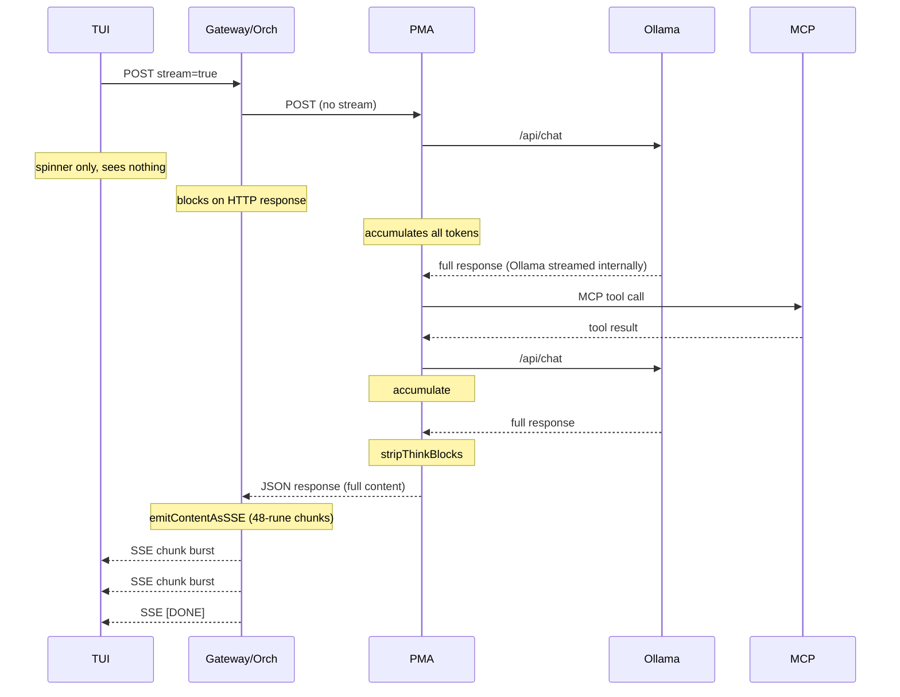
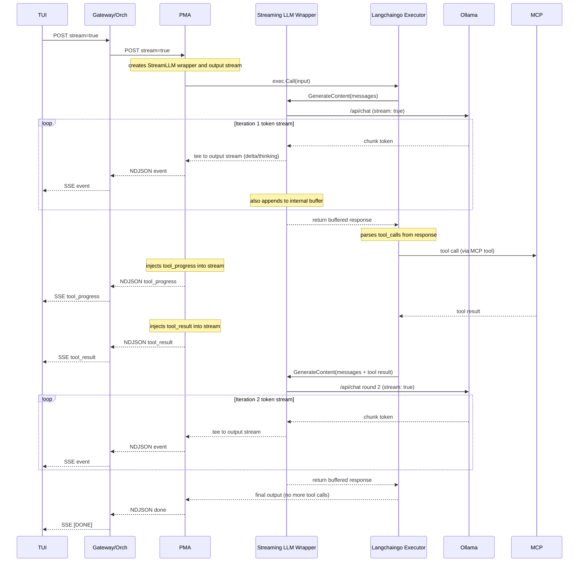

# PMA-To-TUI Streaming Assessment

## Purpose

This document assesses the current streaming architecture between PMA, the orchestrator gateway, and the cynork TUI.
It evaluates the root cause of the perceived "buffer then deliver" behavior and analyzes the feasibility of having PMA replay the LLM token stream in real time to the TUI while injecting its own agent actions into that stream.

## Executive Summary

The user's hypothesis is confirmed: for the primary production configuration (capable model + MCP gateway), PMA fully processes the LLM output before returning anything to the orchestrator or TUI.
The LLM generates tokens in real time (Ollama streams by default), but PMA's langchain agent executor is a blocking call that accumulates the complete response, performs multi-iteration tool loops, strips think blocks, and only then returns the final string.
The TUI receives nothing during this process, which can take 60-180 seconds.

True token-by-token streaming exists only for a secondary path (direct inference with non-capable/smoke models that bypass the langchain agent loop), which is not the intended production configuration.

## Spec Expectations vs. Implementation Reality

This section compares the normative streaming requirements against the actual implementation behavior.

### What the Specs Require

The following normative requirements and spec sections mandate real-time streaming from PMA through to the TUI:

- **REQ-PMAGNT-0118:** PMA MUST support incremental assistant-output streaming on the standard interactive path instead of buffering all visible text until the full turn completes.
- **REQ-USRGWY-0149:** The gateway MUST support streaming chat responses with `stream=true`.
- **REQ-CLIENT-0209:** The cynork TUI MUST request streaming by default and MUST expect real token-by-token streaming.
- **CYNAI.PMAGNT.StreamingAssistantOutput:** PMA MUST emit visible assistant text incrementally when the selected inference adapter exposes incremental output.
  PMA MUST keep hidden thinking separate.
  When structured progress is available, PMA SHOULD surface tool-progress updates.
- **CYNAI.CLIENT.CynorkTui (Document Overview):** "The TUI expectation is real token-by-token streaming from the gateway: visible assistant text MUST arrive as incremental deltas, not as a single buffered payload at completion."
- **CYNAI.CLIENT.CynorkTui.GenerationState:** "The TUI expects real token-by-token streaming: the gateway MUST deliver visible assistant text as incremental token deltas on the standard streaming path."

### What the Implementation Does

PMA has two inference paths, both failing to meet the streaming mandate in the primary configuration:

#### Path 1: Langchain Agent Executor (Capable Models + MCP)

This is the primary production path for `cynodeai.pm` chat with capable models (qwen3:8b, qwen2.5:14b, etc.).

- `getCompletionContent()` calls `runCompletionWithLangchainWithTimeout()`.
- `runCompletionWithLangchain()` creates a `langchaingo` `OpenAIFunctionsAgent` + `Executor`.
- `exec.Call()` is a **fully blocking call** that runs: LLM inference => extract tool calls => execute tools via MCP => LLM inference with tool results => ... repeat up to `pmaMaxIterations=3` => return final output.
- The entire agent loop produces a single `map[string]any` output at the end.
- `extractOutput()` strips think blocks and returns a string.
- **No streaming occurs.**
  Zero bytes reach the orchestrator or TUI until the full multi-iteration agent loop completes.

The `canStreamCompletion()` guard explicitly prevents streaming for this path:

```go
func canStreamCompletion(req *InternalChatCompletionRequest) bool {
    mcpClient := NewMCPClient()
    model := os.Getenv("INFERENCE_MODEL")
    if model == "" { model = pmaDefaultModel }
    return mcpClient.BaseURL == "" || !isCapableModel(model)
}
```

Streaming is only allowed when MCP is unconfigured OR the model is non-capable.
The intended production configuration (capable model + MCP) always returns `false`.

#### Path 2: Direct Ollama Inference (Small/smoke Models or No MCP)

Two variants exist:

1. **`callInference()` (non-streaming):** Opens a streaming connection to Ollama (`stream: true`), but reads and accumulates ALL chunks into a `strings.Builder`, strips think blocks, and returns the complete string.
   The streaming from Ollama is consumed internally by PMA and never forwarded.

2. **`streamCompletionToWriter()` (streaming):** Actually passes through token-by-token NDJSON deltas to the HTTP response writer.
   This is the only path that achieves real streaming.

However, `streamCompletionToWriter()` is only reached when `canStreamCompletion()` returns `true`, i.e., only for non-capable models or when MCP is not configured.

#### Orchestrator Behavior

The orchestrator handler `ChatCompletions()` has two streaming paths:

1. **`completeViaPMAStream()`:** Sends `stream=true` to PMA, reads NDJSON deltas, relays them as SSE `data:` events.
   This works correctly when PMA actually streams (Path 2 streaming variant).

2. **`emitContentAsSSE()` (degraded mode):** Takes the complete content string from the non-streaming `completeViaPMA()` / `routeAndComplete()` path and simulates streaming by splitting into 48-rune chunks.
   This is what happens in the primary configuration because PMA blocks until completion, then the orchestrator simulates incremental delivery.

The degraded mode fires all 48-rune chunks in a tight loop with no delay, so the TUI receives them essentially all at once after the full wait, not as a progressive token stream.

**`emitContentAsSSE` is unacceptable and must be removed.**
It violates the normative streaming requirements in multiple ways:

- It delivers zero progressive feedback during the entire inference window (60-180 seconds).
  The user sees only a spinner.
- The chunking is cosmetic: all chunks arrive within milliseconds of each other because there is no inter-chunk delay and no real incremental source.
  The TUI cannot distinguish this from receiving the full payload at once.
- It creates a false architectural assumption that the streaming contract is satisfied, masking the real gap (PMA does not stream).
- It violates the spec's own language: "The gateway MUST NOT buffer the entire visible assistant answer and emit it only at completion on the standard streaming path" (CYNAI.USRGWY.OpenAIChatApi.Streaming).
  Emitting the entire answer as post-hoc chunks is semantically identical to buffering it.
- When the client requests `stream=true` and the upstream cannot provide true deltas, the spec requires bounded in-progress status events so the TUI can degrade gracefully, not fake chunking of a complete payload.

This function must be removed from the orchestrator.
Any path that currently falls through to `emitContentAsSSE` must instead either provide true upstream streaming or return a non-streaming JSON response and let the TUI handle the single-payload case directly (which it already supports via the `sendResult` / non-streaming fallback path).

## End-To-End Flow Diagram (Current State)

The following shows what happens for a chat message with `model=cynodeai.pm`, a capable inference model, and MCP configured (the standard production path):



Total wall time with a capable model: 60-180 seconds with zero visible progress on the TUI.

## Analysis of Proposed "Stream-Through With Langchaingo" Architecture

The proposal is to keep langchaingo as the agent orchestration layer while adding a streaming pass-through that relays LLM tokens to the TUI in real time.
PMA would tee each LLM call: tokens stream to the client immediately while also being buffered for langchaingo's synchronous consumption.
Between LLM calls, PMA injects agent-side events (tool calls, tool results, progress) into the same stream.
The stream protocol must also support retroactive overwrites to handle token leakage and secret redaction.

### Core Idea: Streaming LLM Wrapper for Langchaingo

Langchaingo's `agents.Executor.Call()` is synchronous and blocking.
It drives LLM calls through a `llms.Model` interface and expects the complete response back before deciding on tool calls and next iterations.
The key insight is that PMA can provide a custom `llms.Model` implementation that internally:

1. Opens a real streaming connection to Ollama.
2. Tees each arriving token to both an output stream (forwarded to the TUI) and an internal buffer.
3. Applies a state machine to classify tokens as visible text, thinking content, or control tokens (think tags, tool-call markers) and routes them to the appropriate stream event type.
4. When the LLM response completes, returns the full buffered content to langchaingo exactly as the current blocking call would.

From langchaingo's perspective, nothing changes: it calls the LLM, gets a complete response, parses tool calls, executes tools, and iterates.
From the TUI's perspective, tokens arrive in real time during each LLM call, with agent-injected events (tool progress, tool results) appearing between calls.

### Proposed Flow



### Stream Overwrite Semantics

A critical requirement is that the stream must support retroactive replacement of previously-sent content.
The existing `cynodeai.amendment` SSE event type provides a precedent, but the mechanism needs to be a first-class part of the PMA-level NDJSON protocol, not only a gateway-level concern.

#### Why Overwrites Are Needed

- **Think-block token leakage:** When tokens arrive one at a time, PMA may forward `<` then `t` then `h` as visible text before accumulating enough to recognize `<think>`.
  Once the tag is detected, those leaked bytes must be retroactively removed from the client's visible text.
- **Tool-call token leakage:** Similar to think blocks.
  If the model emits `<tool_call>` tokens and PMA forwards some before detection, those must be overwritten.
- **Secret redaction:** PMA or the gateway may detect a secret pattern only after several tokens have already been streamed.
  The overwrite replaces the affected range with `SECRET_REDACTED`.
- **Agent output correction:** If langchaingo's post-processing modifies the final output (e.g., the `looksLikeUnexecutedToolCall` fallback rewrites the response), the overwrite replaces the entire streamed content with the corrected version.

#### Overwrite Event Design

The NDJSON stream needs an overwrite event that tells the consumer to replace previously-accumulated visible text:

- `{"overwrite": {"content": "...", "reason": "think_tag_leaked"}}` replaces the entire accumulated visible text for the current LLM iteration with the corrected content.
- `{"overwrite": {"content": "...", "reason": "secret_redaction", "kinds": ["api_key"]}}` replaces with redacted content.
- `{"overwrite": {"content": "...", "reason": "agent_correction"}}` replaces with langchaingo's corrected output.

The orchestrator relays these as SSE amendment events (extending the existing `cynodeai.amendment` type).
The TUI already handles amendment events by replacing its in-flight accumulated text, so the client-side change is minimal.

#### Overwrite Scope

Overwrites apply to the visible text accumulated **within the current agent iteration**, not across the entire multi-iteration stream.
Each LLM call within the agent loop starts a fresh accumulation scope.
This keeps the overwrite semantics simple: the consumer replaces its buffer for the current chunk of visible text, not a complex offset-based patch across the entire transcript.

### Challenges and Considerations

The following subsections detail the technical challenges this architecture must address.

#### 1. Streaming LLM Wrapper Implementation

The custom `llms.Model` wrapper must satisfy langchaingo's interface contract while adding the tee behavior.
Key considerations:

- The wrapper opens a streaming Ollama HTTP connection, reads NDJSON chunks, forwards events to the output stream, and accumulates the response.
- The wrapper must correctly handle Ollama's `message.tool_calls` field: when present, the tool-call payload goes to the buffer (for langchaingo to parse) but does NOT go to the visible-text output stream.
- The wrapper returns the full `llms.ContentResponse` (or equivalent) to langchaingo with the complete text and any tool-call data, just as the current blocking path does.
- The wrapper must propagate context cancellation so that Ctrl+C in the TUI cancels the Ollama connection.

The existing `streamCompletionToWriter()` and `readInferenceStream()` functions in `agents/internal/pma/chat.go` already demonstrate the Ollama streaming chunk parsing.
The wrapper reuses that logic.

#### 2. Think-Block State Machine

PMA currently strips `<think>...</think>` blocks post-hoc using `stripThinkBlocks()`.
In the streaming wrapper, a state machine classifies each token as it arrives:

- **Normal state:** tokens go to the visible-text output stream.
- **Potential-tag state:** when a `<` arrives, the state machine buffers tokens until it can determine whether a `<think>` or `</think>` tag is forming.
  Nothing is emitted to the output stream during this ambiguous window.
- **Thinking state:** tokens between `<think>` and `</think>` go to the thinking output stream (separate NDJSON event type).
- **Tag-rejected state:** if the buffered tokens do not form a recognized tag, they are flushed to the visible-text stream as a batch.

When a partial tag has already leaked (e.g., the state machine was not engaged for some edge case), the overwrite mechanism corrects the visible text retroactively.

Edge cases:

- Tags split across tokens (e.g., `<thi` then `nk>`).
- Nested or malformed tags.
- Unterminated `<think>` at end of stream (drop the partial tag content).
- The state machine operates only on the character stream, not on JSON structure, so it is model-agnostic.

#### 3. Tool-Call and Tool-Result Injection

Between langchaingo iterations, PMA injects events into the output stream:

- When langchaingo invokes an MCP tool (via the `MCPTool.Call()` method), PMA emits a `tool_progress` event before the call and a `tool_result` event after.
- The `MCPTool` implementation already exists; the change is to wrap it so it emits stream events around the actual call.
- These injected events are interleaved with LLM token events in the same NDJSON stream, maintaining a single ordered timeline for the TUI.

#### 4. Multi-Iteration Streaming

Each langchaingo iteration triggers a new LLM call through the streaming wrapper.
The output stream sees:

- Iteration 1: thinking events => visible-text deltas => (optional overwrite if leakage detected).
- Injected: tool_progress => tool_result.
- Iteration 2: thinking events => visible-text deltas => (optional overwrite).
- Injected: tool_progress => tool_result (if more tools).
- Iteration N (final): thinking events => visible-text deltas => done.

The TUI renders this as a progressive multi-phase assistant turn: text appears, then tool activity, then more text, etc.

#### 5. Wire Format Changes

The PMA internal NDJSON stream format extends to:

- `{"delta": "..."}` for visible text tokens.
- `{"thinking": "..."}` for thinking/reasoning tokens.
- `{"tool_progress": {"state": "calling"|"waiting"|"result", "tool": "...", "preview": "..."}}` for tool activity.
- `{"overwrite": {"content": "...", "reason": "...", "kinds": [...]}}` for retroactive replacement of accumulated visible text.
- `{"done": true}` for stream termination.

The orchestrator maps these to SSE events:

- `delta` => standard `data:` SSE with `choices[0].delta.content`.
- `thinking` => SSE with a thinking-specific event type or field.
- `tool_progress` => SSE with a tool-progress event type.
- `overwrite` => `event: cynodeai.amendment` SSE (extends the existing contract).
- `done` => `data: [DONE]` terminal event.

#### 6. Orchestrator Accumulator Buffer and Secret Redaction

The streaming architecture requires three distinct buffers, each with a different purpose.
The orchestrator's own accumulator is the most important to get right because it is the authoritative redaction layer.

**Buffer 1 -- PMA streaming LLM wrapper buffer.**
Tees tokens to both the output NDJSON stream and an internal `strings.Builder`.
The buffer feeds langchaingo's synchronous interface and enables PMA-level opportunistic secret scanning after each LLM iteration.
PMA-level secret detection is best-effort: it catches obvious patterns (e.g., `sk-` prefix) early and emits an overwrite event, reducing the window of leaked-token visibility for the user.

**Buffer 2 -- Orchestrator/gateway accumulator buffer.**
This is already specified in [CYNAI.USRGWY.OpenAIChatApi.StreamingRedactionPipeline](../tech_specs/openai_compatible_chat_api.md#spec-cynai-usrgwy-openaichatapi-streamingredactionpipeline).
The handler goroutine maintains its own `strings.Builder` that accumulates every visible-text delta it relays to the client SSE stream.
After the upstream PMA stream terminates (channel close from the reader goroutine), the handler runs the authoritative secret scanner on the full accumulated text **before** emitting the terminal `[DONE]` event.
If the scanner detects secrets, the handler emits a `cynodeai.amendment` SSE event with the full redacted content and persists only the redacted version.
This buffer is the authoritative guarantee: even if PMA's opportunistic scan missed something, the gateway catches it here.

Key points from the existing spec that apply to the streaming-through model:

- The orchestrator accumulator MUST append every visible-text delta that it relays, including deltas that arrived from PMA's NDJSON stream.
- When the orchestrator receives an overwrite event from PMA (e.g., PMA-level secret detection or think-tag leakage correction), the orchestrator MUST replace its own accumulator content to match, then relay the overwrite as a `cynodeai.amendment` SSE event.
  Otherwise the gateway's post-stream scanner would scan stale pre-overwrite text.
- The orchestrator's post-stream secret scan runs on whatever the accumulator holds after all PMA events have been processed and all PMA-level overwrites have been applied.
- The two-goroutine architecture (handler goroutine + reader goroutine) and the channel-based synchronization model from the existing spec remain unchanged.
  The reader goroutine reads PMA NDJSON instead of direct-inference SSE, but the handler goroutine's accumulate-relay-scan-persist sequence is the same.

**Buffer 3 -- TUI in-flight buffer.**
The TUI's `streamBuf` (`strings.Builder` in `Model`) accumulates visible text from deltas and replaces on amendment.
This is display-only and is not a redaction layer.

The three layers are complementary: PMA catches leakage early (smaller leaked-token window), the orchestrator provides the authoritative post-stream guarantee (nothing persisted unredacted), and the TUI displays the corrected content.

**`runtime/secret` protection for stream buffers.**
All three buffers accumulate LLM output that may contain secrets before redaction removes them.
Per [REQ-STANDS-0133](../requirements/stands.md#req-stands-0133), Go code that handles secrets MUST use `runtime/secret` (`secret.Do`) when available so that temporaries (registers, stack, heap) are erased.
The stream buffers fall under this requirement because the accumulated text is secret-bearing until the redaction scan proves otherwise.

Design constraints from `runtime/secret`:

- `secret.Do(f)` **panics if `f` starts new goroutines**, so the `secret.Do` scope cannot wrap the entire streaming flow (which uses reader + handler goroutines).
  Instead, it must wrap the narrower code paths that read from or write to the buffer contents.
- Stack and register temporaries are erased before `secret.Do` returns.
  Heap allocations made inside `f` are erased when the GC determines them unreachable.
- The `strings.Builder` internal byte slice is heap-allocated, so after the `secret.Do` block returns and the builder goes out of scope, the GC will zero the backing memory.
  However, `strings.Builder` may have grown and abandoned earlier backing arrays during `WriteString` reallocation; those orphaned slices are also GC-erased under `secret.Do`.

Where `secret.Do` blocks are needed:

- **PMA (Buffer 1):** The streaming LLM wrapper's `Call()` method (the `llms.Model` implementation) is invoked synchronously by langchaingo and does not spawn goroutines itself.
  Wrapping the body of `Call()` in `secret.Do` protects the internal `strings.Builder` accumulator and any local variables that held partial token content.
  The NDJSON writes to the output stream happen via channel sends inside `Call()`, which are permitted (no goroutine creation).
- **Orchestrator (Buffer 2):** The handler goroutine's accumulate-scan-persist sequence is a linear block that runs after each delta relay and again at stream termination.
  The post-stream scan and persist block (read accumulator, run scanner, emit amendment, persist redacted content) should be wrapped in `secret.Do`.
  The delta-append path is called per-token and should also run inside `secret.Do` (the call is cheap; `secret.Do` overhead is minimal for short-lived scopes).
- **TUI (Buffer 3):** The `applyStreamDelta` method that appends to `streamBuf` and the amendment-replacement path should be wrapped in `secret.Do`.
  The TUI's buffer is display-only and not persisted, but the in-memory content is still secret-bearing until amendment replaces it.

Fallback (per REQ-STANDS-0133): when `runtime/secret` is not available (unsupported platform or build without `GOEXPERIMENT=runtimesecret`), implementations MUST use best-effort secure erasure (e.g., zeroing the `strings.Builder`'s backing slice via `Reset()` + overwrite before dropping the reference).
The project already uses a build-tag-gated `runWithSecret()` wrapper pattern in `worker_node/internal/securestore/` that can be replicated for the streaming buffers.

#### 7. Langchaingo Agent Output Correction

The current code has a `looksLikeUnexecutedToolCall()` check that detects when langchaingo returns a preamble describing a tool call it never executed, and falls back to direct inference.
In the streaming model:

- The streaming wrapper has already forwarded the preamble tokens to the TUI.
- If `looksLikeUnexecutedToolCall()` triggers after langchaingo returns, PMA emits an overwrite event that replaces the entire streamed content with the direct-inference result.
- The TUI sees: partial preamble text streaming in => overwrite event replaces it => correct answer appears.

This is the canonical example of why the overwrite mechanism is essential at the PMA level, not just at the gateway level.

## Gap Summary

- **Area:** PMA streaming (langchain path)
  - spec expectation: Incremental token deltas during each LLM call
  - current state: Fully blocking; langchaingo's `llms.Model` uses non-streaming Ollama calls
  - gap: Critical (addressed by streaming LLM wrapper)
- **Area:** PMA streaming (direct path)
  - spec expectation: Incremental deltas
  - current state: Streams but strips think blocks post-hoc
  - gap: Partial
- **Area:** Think separation in stream
  - spec expectation: Separate during streaming
  - current state: Post-hoc strip only
  - gap: Gap (addressed by streaming state machine)
- **Area:** Tool progress and tool result events
  - spec expectation: Emit distinct non-prose events
  - current state: Not emitted
  - gap: Gap (addressed by MCP tool wrapper injection)
- **Area:** Stream overwrite semantics
  - spec expectation: Retroactive correction of leaked tokens (think tags, tool-call markers, secrets)
  - current state: Only gateway-level `cynodeai.amendment` exists for post-stream redaction; no PMA-level or mid-stream overwrite
  - gap: Gap (new capability required)
- **Area:** `emitContentAsSSE` fake streaming
  - spec expectation: Real incremental deltas or honest non-streaming
  - current state: Post-hoc chunking of buffered payload, zero progressive feedback, violates streaming spec
  - gap: Critical (must be removed)
- **Area:** Gateway streaming relay
  - spec expectation: Token-by-token relay with overwrite support
  - current state: Works for direct deltas; degrades for langchain; relays `cynodeai.amendment` but not PMA-level overwrites
  - gap: Partial
- **Area:** Orchestrator accumulator buffer
  - spec expectation: Gateway maintains its own `strings.Builder` that accumulates every relayed visible-text delta; applies PMA-level overwrites to its own buffer; runs authoritative post-stream secret scan on the accumulated content before emitting `[DONE]`
  - current state: Spec defines the accumulator and post-stream scan (StreamingRedactionPipeline); implementation exists for the non-PMA streaming path but does not handle PMA overwrite events or update its own accumulator on overwrites
  - gap: Partial (overwrite-aware accumulation is new; post-stream scan logic exists)
- **Area:** TUI streaming consumption
  - spec expectation: Incremental deltas with in-place replacement on overwrite
  - current state: Handles deltas and `cynodeai.amendment` already
  - gap: Ready (minimal extension for new event types)
- **Area:** Secret redaction pipeline (PMA-level opportunistic scan)
  - spec expectation: PMA emits overwrites when it detects secrets in its own buffer; reduces leaked-token window
  - current state: Does not exist
  - gap: Gap (new capability)
- **Area:** Secret redaction pipeline (gateway authoritative scan)
  - spec expectation: Post-stream redaction at gateway using the orchestrator accumulator; emits `cynodeai.amendment` before `[DONE]`; persists only redacted content
  - current state: Gateway post-stream redaction works for non-PMA paths; needs extension to consume PMA-stream NDJSON events and maintain correct accumulator state across PMA overwrites
  - gap: Partial (accumulator update on PMA overwrites is new)
- **Area:** Wire format for agent events
  - spec expectation: Delta, thinking, tool_progress, overwrite, done
  - current state: Only text delta and done exist
  - gap: Gap
- **Area:** `runtime/secret` protection for stream buffers
  - spec expectation: All three stream buffers (PMA wrapper, orchestrator accumulator, TUI in-flight) MUST run secret-bearing code paths inside `secret.Do` per REQ-STANDS-0133
  - current state: `runtime/secret` is used only in `worker_node/internal/securestore/`; no stream buffer code uses it
  - gap: Gap (new `secret.Do` scoping needed in PMA, orchestrator, and TUI)

## Implementation Effort Estimate

This section breaks the work into three phases: streaming LLM wrapper, stream overwrites, and full structured parts.

### Streaming LLM Wrapper and Core Protocol (Phase 1)

Add real-time token streaming to the langchaingo path without replacing the agent executor.

#### Phase 1 Components

1. **Streaming `llms.Model` wrapper:** Custom implementation of the langchaingo LLM interface that opens a streaming Ollama connection, tees tokens to both an output stream and an internal buffer, and returns the buffered response to langchaingo when the LLM call completes.
   Reuses chunk-parsing logic from the existing `streamCompletionToWriter()` and `readInferenceStream()`.
2. **Think-block state machine:** Inline token classifier that routes arriving tokens to the correct NDJSON event type (visible delta vs. thinking) and buffers ambiguous partial tags until resolved.
3. **MCP tool wrapper:** Wraps the existing `MCPTool.Call()` to inject `tool_progress` and `tool_result` NDJSON events into the output stream around the actual MCP call.
4. **Extended NDJSON wire format:** Add `thinking`, `tool_progress`, and `done` event types alongside the existing `delta`.
5. **Orchestrator relay and accumulator update:** Map PMA's extended NDJSON events to SSE event types for the TUI (thinking deltas, tool progress, done).
   The relay handler must also maintain its own `strings.Builder` accumulator that appends every visible-text delta it forwards, matching the existing StreamingRedactionPipeline spec.
   The post-stream secret scan runs on this accumulator before emitting `[DONE]`.
6. **Remove `emitContentAsSSE`:** Delete the fake-streaming function and all code paths that fall through to it.
7. **`runtime/secret` wrapping for all stream buffers:** Per REQ-STANDS-0133, all three buffers (PMA wrapper accumulator, orchestrator accumulator, TUI in-flight buffer) must run secret-bearing code paths inside `secret.Do` (or the build-tag-gated `runWithSecret` wrapper).
   This includes: PMA's `llms.Model.Call()` body, orchestrator's per-delta append and post-stream scan block, and TUI's `applyStreamDelta` and amendment-replacement paths.
   The existing `runWithSecret` pattern from `worker_node/internal/securestore/` should be extracted to `go_shared_libs` so all three modules can import it.

Estimated effort: 2-3 focused implementation rounds.
The TUI side needs minimal changes since it already handles deltas and amendment events.

### Stream Overwrite Semantics (Phase 2)

Add retroactive content replacement to the PMA NDJSON protocol and propagate it through the gateway and TUI.

#### Phase 2 Components

1. **PMA-level overwrite event:** `{"overwrite": {"content": "...", "reason": "...", "kinds": [...]}}` in the NDJSON stream, emitted when the state machine detects leaked think/tool tags or when `looksLikeUnexecutedToolCall()` triggers a fallback.
2. **PMA-level opportunistic secret scan:** Lightweight pattern check on accumulated visible text after each LLM iteration; emits an overwrite if secrets are detected before the gateway's post-stream scan.
3. **Gateway relay of PMA overwrites and accumulator sync:** Map PMA `overwrite` events to `event: cynodeai.amendment` SSE events, extending the existing amendment contract.
   Critically, the orchestrator must also apply the overwrite to its own accumulator buffer so the post-stream secret scan operates on the corrected text, not stale pre-overwrite content.
   The gateway's post-stream redaction pipeline remains as the authoritative final pass.
4. **TUI overwrite handling:** Already substantially implemented via the existing `cynodeai.amendment` / `ChatStreamDelta.Amendment` path.
   Needs minor extension to handle multiple overwrites per turn (current code assumes at most one).

Estimated effort: 1-2 focused implementation rounds after Phase 1.

### Full Structured Streaming Parts (Phase 3)

Extend to emit structured assistant-turn parts (text, thinking, tool_call, tool_result) as discrete stream events that the TUI renders as distinct transcript items during streaming, not just at reconciliation.

Estimated effort: 1-2 additional rounds after Phase 2.

## Recommendations

1. **Remove `emitContentAsSSE` immediately.**
   This function is a spec-violating workaround that masks the real streaming gap.
   Any code path that currently falls through to it must instead return a non-streaming JSON response (the TUI already handles non-streaming via `sendResult`).
   Once real PMA streaming exists, the degraded path is unnecessary.

2. **Build the streaming LLM wrapper around langchaingo, not as a replacement.**
   Langchaingo remains the agent orchestration layer.
   The streaming wrapper implements `llms.Model`, tees tokens to the output stream while buffering for langchaingo, and injects agent events between iterations.
   This preserves all existing agent logic (tool-call parsing, iteration control, MCP integration) while adding real-time streaming.

3. **Make stream overwrites a first-class protocol concern.**
   Token leakage from think blocks, tool-call markers, and secrets is inherent to streaming through a state machine that classifies tokens incrementally.
   The overwrite event must exist at the PMA NDJSON level, not only at the gateway SSE level, so that every consumer in the chain can handle retroactive corrections.

4. **Phase the work: streaming first, overwrites second, structured parts third.**
   Phase 1 alone eliminates the "60-180 second dead screen" problem.
   Phase 2 hardens the streaming path against leakage.
   Phase 3 adds rich transcript rendering during streaming.

5. **Extend the PMA internal protocol formally in a spec update before implementing.**
   Define the NDJSON event types (delta, thinking, tool_progress, overwrite, done), their semantics, and the overwrite scoping rules so the orchestrator and TUI can be updated in parallel.

6. **Wrap stream buffers in `runtime/secret` from the start.**
   All three accumulator buffers hold LLM output that may contain secrets before redaction.
   Per REQ-STANDS-0133, their code paths must run inside `secret.Do` blocks.
   Extract the existing `runWithSecret` build-tag-gated wrapper from `worker_node/internal/securestore/` into `go_shared_libs` so PMA, orchestrator, and cynork can all import it.
   The `secret.Do` goroutine restriction requires scoping blocks to the buffer-touching code (accumulator append, scan, persist), not to the entire streaming flow.

7. **Preserve the existing non-streaming langchaingo path as a fallback.**
   The current blocking path (`runCompletionWithLangchain` => `callInference` fallback) should remain available for edge cases (streaming wrapper failure, model incompatibility) and can be selected via a configuration toggle or automatic fallback on streaming error.

## Related Documents

- [CYNAI.PMAGNT.StreamingAssistantOutput](../tech_specs/cynode_pma.md#spec-cynai-pmagnt-streamingassistantoutput)
- [CYNAI.CLIENT.CynorkTui.GenerationState](../tech_specs/cynork_tui.md#spec-cynai-client-cynorktui-generationstate)
- [CYNAI.USRGWY.OpenAIChatApi.Streaming](../tech_specs/openai_compatible_chat_api.md#spec-cynai-usrgwy-openaichatapi-streaming)
- [CYNAI.USRGWY.OpenAIChatApi.StreamingRedactionPipeline](../tech_specs/openai_compatible_chat_api.md#spec-cynai-usrgwy-openaichatapi-streamingredactionpipeline)
- [REQ-PMAGNT-0118](../requirements/pmagnt.md#req-pmagnt-0118)
- [REQ-USRGWY-0149](../requirements/usrgwy.md#req-usrgwy-0149)
- [REQ-CLIENT-0209](../requirements/client.md#req-client-0209)
- [REQ-STANDS-0133](../requirements/stands.md#req-stands-0133)
