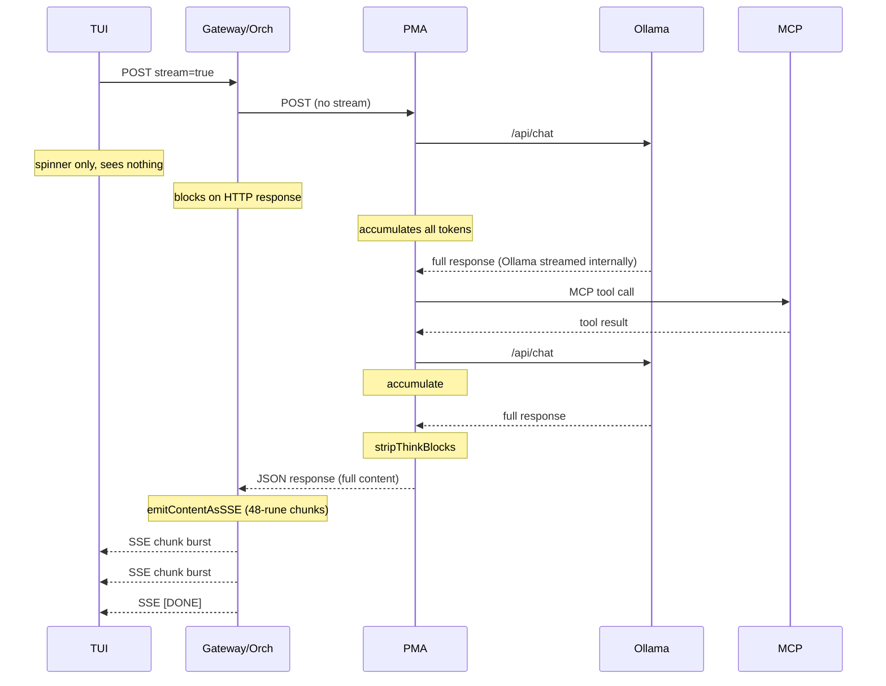
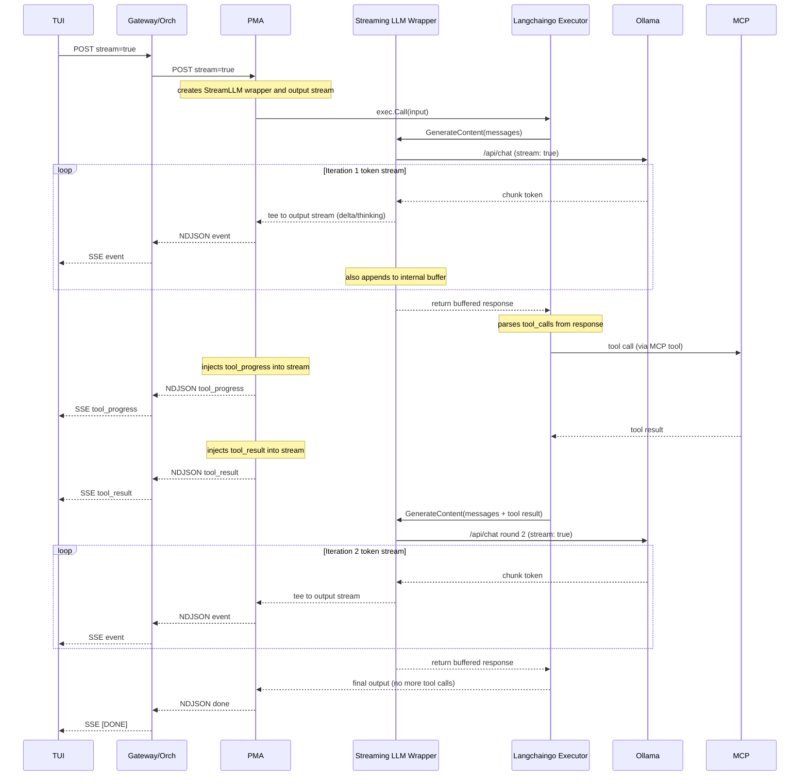

# PMA-To-TUI Streaming Assessment

## Purpose

This document assesses the current streaming architecture between PMA, the orchestrator gateway, and the cynork TUI.
It evaluates the root cause of the perceived "buffer then deliver" behavior and analyzes the feasibility of having PMA replay the LLM token stream in real time to the TUI while injecting its own agent actions into that stream.

## Executive Summary

The user's hypothesis is confirmed: for the primary production configuration (capable model + MCP gateway), PMA fully processes the LLM output before returning anything to the orchestrator or TUI.
The LLM generates tokens in real time (Ollama streams by default), but PMA's langchain agent executor is a blocking call that accumulates the complete response, performs multi-iteration tool loops, strips think blocks, and only then returns the final string.
The TUI receives nothing during this process, which can take 60-180 seconds.

True token-by-token streaming exists only for a secondary path (direct inference with non-capable/smoke models that bypass the langchain agent loop), which is not the intended production configuration.

## Spec Expectations vs. Implementation Reality

This section compares the normative streaming requirements against the actual implementation behavior.

### What the Specs Require

The following normative requirements and spec sections mandate real-time streaming from PMA through to the TUI:

- **REQ-PMAGNT-0118:** PMA MUST support incremental assistant-output streaming on the standard interactive path instead of buffering all visible text until the full turn completes.
- **REQ-USRGWY-0149:** The gateway MUST support streaming chat responses with `stream=true`.
- **REQ-CLIENT-0209:** The cynork TUI MUST request streaming by default and MUST expect real token-by-token streaming.
- **CYNAI.PMAGNT.StreamingAssistantOutput:** PMA MUST emit visible assistant text incrementally when the selected inference adapter exposes incremental output.
  PMA MUST keep hidden thinking separate.
  When structured progress is available, PMA SHOULD surface tool-progress updates.
- **CYNAI.CLIENT.CynorkTui (Document Overview):** "The TUI expectation is real token-by-token streaming from the gateway: visible assistant text MUST arrive as incremental deltas, not as a single buffered payload at completion."
- **CYNAI.CLIENT.CynorkTui.GenerationState:** "The TUI expects real token-by-token streaming: the gateway MUST deliver visible assistant text as incremental token deltas on the standard streaming path."

### What the Implementation Does

PMA has two inference paths, both failing to meet the streaming mandate in the primary configuration:

#### Path 1: Langchain Agent Executor (Capable Models + MCP)

This is the primary production path for `cynodeai.pm` chat with capable models (qwen3:8b, qwen2.5:14b, etc.).

- `getCompletionContent()` calls `runCompletionWithLangchainWithTimeout()`.
- `runCompletionWithLangchain()` creates a `langchaingo` `OpenAIFunctionsAgent` + `Executor`.
- `exec.Call()` is a **fully blocking call** that runs: LLM inference => extract tool calls => execute tools via MCP => LLM inference with tool results => ... repeat up to `pmaMaxIterations=3` => return final output.
- The entire agent loop produces a single `map[string]any` output at the end.
- `extractOutput()` strips think blocks and returns a string.
- **No streaming occurs.**
  Zero bytes reach the orchestrator or TUI until the full multi-iteration agent loop completes.

The `canStreamCompletion()` guard explicitly prevents streaming for this path:

```go
func canStreamCompletion(req *InternalChatCompletionRequest) bool {
    mcpClient := NewMCPClient()
    model := os.Getenv("INFERENCE_MODEL")
    if model == "" { model = pmaDefaultModel }
    return mcpClient.BaseURL == "" || !isCapableModel(model)
}
```

Streaming is only allowed when MCP is unconfigured OR the model is non-capable.
The intended production configuration (capable model + MCP) always returns `false`.

#### Path 2: Direct Ollama Inference (Small/smoke Models or No MCP)

Two variants exist:

1. **`callInference()` (non-streaming):** Opens a streaming connection to Ollama (`stream: true`), but reads and accumulates ALL chunks into a `strings.Builder`, strips think blocks, and returns the complete string.
   The streaming from Ollama is consumed internally by PMA and never forwarded.

2. **`streamCompletionToWriter()` (streaming):** Actually passes through token-by-token NDJSON deltas to the HTTP response writer.
   This is the only path that achieves real streaming.

However, `streamCompletionToWriter()` is only reached when `canStreamCompletion()` returns `true`, i.e., only for non-capable models or when MCP is not configured.

#### Orchestrator Behavior

The orchestrator handler `ChatCompletions()` has two streaming paths:

1. **`completeViaPMAStream()`:** Sends `stream=true` to PMA, reads NDJSON deltas, relays them as SSE `data:` events.
   This works correctly when PMA actually streams (Path 2 streaming variant).

2. **`emitContentAsSSE()` (degraded mode):** Takes the complete content string from the non-streaming `completeViaPMA()` / `routeAndComplete()` path and simulates streaming by splitting into 48-rune chunks.
   This is what happens in the primary configuration because PMA blocks until completion, then the orchestrator simulates incremental delivery.

The degraded mode fires all 48-rune chunks in a tight loop with no delay, so the TUI receives them essentially all at once after the full wait, not as a progressive token stream.

**`emitContentAsSSE` is unacceptable and must be removed.**
It violates the normative streaming requirements in multiple ways:

- It delivers zero progressive feedback during the entire inference window (60-180 seconds).
  The user sees only a spinner.
- The chunking is cosmetic: all chunks arrive within milliseconds of each other because there is no inter-chunk delay and no real incremental source.
  The TUI cannot distinguish this from receiving the full payload at once.
- It creates a false architectural assumption that the streaming contract is satisfied, masking the real gap (PMA does not stream).
- It violates the spec's own language: "The gateway MUST NOT buffer the entire visible assistant answer and emit it only at completion on the standard streaming path" (CYNAI.USRGWY.OpenAIChatApi.Streaming).
  Emitting the entire answer as post-hoc chunks is semantically identical to buffering it.
- When the client requests `stream=true` and the upstream cannot provide true deltas, the spec requires bounded in-progress status events so the TUI can degrade gracefully, not fake chunking of a complete payload.

This function must be removed from the orchestrator.
Any path that currently falls through to `emitContentAsSSE` must instead either provide true upstream streaming or return a non-streaming JSON response and let the TUI handle the single-payload case directly (which it already supports via the `sendResult` / non-streaming fallback path).

## End-To-End Flow Diagram (Current State)

The following shows what happens for a chat message with `model=cynodeai.pm`, a capable inference model, and MCP configured (the standard production path):



Total wall time with a capable model: 60-180 seconds with zero visible progress on the TUI.

## Analysis of Proposed "Stream-Through With Langchaingo" Architecture

The proposal is to keep langchaingo as the agent orchestration layer while adding a streaming pass-through that relays LLM tokens to the TUI in real time.
PMA would tee each LLM call: tokens stream to the client immediately while also being buffered for langchaingo's synchronous consumption.
Between LLM calls, PMA injects agent-side events (tool calls, tool results, progress) into the same stream.
The stream protocol must also support retroactive overwrites to handle token leakage and secret redaction.

### Core Idea: Streaming LLM Wrapper for Langchaingo

Langchaingo's `agents.Executor.Call()` is synchronous and blocking.
It drives LLM calls through a `llms.Model` interface and expects the complete response back before deciding on tool calls and next iterations.
The key insight is that PMA can provide a custom `llms.Model` implementation that internally:

1. Opens a real streaming connection to Ollama.
2. Tees each arriving token to both an output stream (forwarded to the TUI) and an internal buffer.
3. Applies a state machine to classify tokens as visible text, thinking content, or control tokens (think tags, tool-call markers) and routes them to the appropriate stream event type.
4. When the LLM response completes, returns the full buffered content to langchaingo exactly as the current blocking call would.

From langchaingo's perspective, nothing changes: it calls the LLM, gets a complete response, parses tool calls, executes tools, and iterates.
From the TUI's perspective, tokens arrive in real time during each LLM call, with agent-injected events (tool progress, tool results) appearing between calls.

### Proposed Flow



### Stream Overwrite Semantics

A critical requirement is that the stream must support retroactive replacement of previously-sent content.
The existing `cynodeai.amendment` SSE event type provides a precedent, but the mechanism needs to be a first-class part of the PMA-level NDJSON protocol, not only a gateway-level concern.

#### Why Overwrites Are Needed

- **Think-block token leakage:** When tokens arrive one at a time, PMA may forward `<` then `t` then `h` as visible text before accumulating enough to recognize `<think>`.
  Once the tag is detected, those leaked bytes must be retroactively removed from the client's visible text.
- **Tool-call token leakage:** Similar to think blocks.
  If the model emits `<tool_call>` tokens and PMA forwards some before detection, those must be overwritten.
- **Secret redaction:** PMA or the gateway may detect a secret pattern only after several tokens have already been streamed.
  The overwrite replaces the affected range with `SECRET_REDACTED`.
- **Agent output correction:** If langchaingo's post-processing modifies the final output (e.g., the `looksLikeUnexecutedToolCall` fallback rewrites the response), the overwrite replaces the entire streamed content with the corrected version.

#### Overwrite Event Design

The NDJSON stream needs an overwrite event that tells the consumer to replace previously-accumulated visible text:

- `{"overwrite": {"content": "...", "reason": "think_tag_leaked", "scope": "iteration", "iteration": 1}}` replaces the visible text for iteration 1 with the corrected content.
- `{"overwrite": {"content": "...", "reason": "secret_redaction", "scope": "iteration", "iteration": 2, "kinds": ["api_key"]}}` replaces iteration 2's text with redacted content.
- `{"overwrite": {"content": "...", "reason": "agent_correction", "scope": "turn"}}` replaces the entire turn's visible text with langchaingo's corrected output (DP-8).

The orchestrator relays these as SSE amendment events (extending the existing `cynodeai.amendment` type).
The TUI already handles amendment events by replacing its in-flight accumulated text, so the client-side change is minimal.

#### Overwrite Scope

Overwrites apply to the visible text accumulated **within the current agent iteration**, not across the entire multi-iteration stream (DP-2).
Each LLM call within the agent loop starts a fresh accumulation scope, signaled to the client by an `iteration_start` event.

The TUI MUST track iteration boundaries so it knows which segment of its accumulated `streamBuf` to replace on overwrite.
The `iteration_start` event carries the iteration number; the overwrite event carries the same number so the TUI can locate the correct segment.
This keeps overwrite payloads small (only the current iteration's text) and avoids unbounded offset-based patching.

### Challenges and Considerations

The following subsections detail the technical challenges this architecture must address.

#### 1. Streaming LLM Wrapper Implementation

The custom `llms.Model` wrapper must satisfy langchaingo's interface contract while adding the tee behavior.
Key considerations:

- The wrapper opens a streaming Ollama HTTP connection, reads NDJSON chunks, forwards events to the output stream, and accumulates the response.
- The wrapper must correctly handle Ollama's `message.tool_calls` field: when present, the tool-call payload goes to the buffer (for langchaingo to parse) but does NOT go to the visible-text output stream.
- The wrapper returns the full `llms.ContentResponse` (or equivalent) to langchaingo with the complete text and any tool-call data, just as the current blocking path does.
- The wrapper must propagate context cancellation so that Ctrl+C in the TUI cancels the Ollama connection.

The existing `streamCompletionToWriter()` and `readInferenceStream()` functions in `agents/internal/pma/chat.go` already demonstrate the Ollama streaming chunk parsing.
The wrapper reuses that logic.

#### 2. Think-Block and Tool-Call State Machine

PMA currently strips `<think>...</think>` blocks post-hoc using `stripThinkBlocks()`.
In the streaming wrapper, a state machine classifies each token as it arrives (DP-3, DP-4).
The state machine recognizes both think tags and tool-call markers.

- **Normal state:** tokens go to the visible-text output stream as `delta` events.
- **Potential-tag state:** when a `<` arrives, the state machine buffers tokens until it can determine whether a recognized tag (`<think>`, `</think>`, `<tool_call>`, `</tool_call>`, or model-specific equivalents) is forming.
  Nothing is emitted to the output stream during this ambiguous window.
- **Thinking state:** tokens between `<think>` and `</think>` go to the thinking output stream as `thinking` NDJSON events.
  Per DP-3, the full thinking content is relayed to the client (not suppressed or summarized).
  The TUI stores thinking content for the current turn and displays it when the user has "show thinking" enabled.
- **Tool-call state:** tokens between tool-call markers are suppressed from the visible-text stream and routed to a tool-call content buffer.
  Per DP-4, the TUI stores tool-call content and displays it when the user has "show tool output" enabled.
  This reduces reliance on the overwrite mechanism for tool-call leakage, which is frequent with function-calling models.
- **Tag-rejected state:** if the buffered tokens do not form a recognized tag, they are flushed to the visible-text stream as a batch.

When a partial tag has already leaked (e.g., the state machine was not engaged for some edge case), the overwrite mechanism corrects the visible text retroactively.

The recognized tag set MUST be configurable (defaulting to think + tool-call tags) so new model-specific tags can be added without code changes (DP-4).

Edge cases:

- Tags split across tokens (e.g., `<thi` then `nk>`).
- Nested or malformed tags.
- Unterminated `<think>` at end of stream (drop the partial tag content).
- Tool-call format variation across models (XML-style `<tool_call>`, JSON function-call blocks, etc.); the configurable tag set must accommodate both.
- The state machine operates only on the character stream, not on JSON structure, so it is model-agnostic.

#### 3. Tool-Call and Tool-Result Injection

Between langchaingo iterations, PMA injects events into the output stream:

- When langchaingo invokes an MCP tool (via the `MCPTool.Call()` method), PMA emits a `tool_progress` event before the call and a `tool_result` event after.
- The `MCPTool` implementation already exists; the change is to wrap it so it emits stream events around the actual call.
- These injected events are interleaved with LLM token events in the same NDJSON stream, maintaining a single ordered timeline for the TUI.

#### 4. Multi-Iteration Streaming

Each langchaingo iteration triggers a new LLM call through the streaming wrapper.
PMA emits an `iteration_start` event before each iteration so the TUI can track iteration boundaries (required for per-iteration overwrite scoping, DP-2).
The output stream sees:

- `iteration_start(1)` => thinking events => visible-text deltas => (optional overwrite targeting iteration 1).
- Injected: tool_progress => tool_result.
- `iteration_start(2)` => thinking events => visible-text deltas => (optional overwrite targeting iteration 2).
- Injected: tool_progress => tool_result (if more tools).
- `iteration_start(N)` (final) => thinking events => visible-text deltas => done.

The TUI renders this as a progressive multi-phase assistant turn: text appears, then tool activity, then more text, etc.
The TUI maintains per-iteration segment offsets in its `streamBuf` so that an overwrite for iteration K replaces only that iteration's text without affecting earlier iterations.

#### 5. Wire Format Changes

The PMA internal NDJSON stream format extends to:

- `{"delta": "..."}` for visible text tokens.
- `{"thinking": "..."}` for thinking/reasoning tokens (full content, per DP-3).
- `{"iteration_start": N}` for iteration boundary markers (per DP-2).
- `{"tool_call": {"name": "...", "arguments": "..."}}` for tool-call content detected by the state machine (per DP-4).
- `{"tool_progress": {"state": "calling"|"waiting"|"result", "tool": "...", "preview": "..."}}` for tool activity injected between langchaingo iterations.
- `{"overwrite": {"content": "...", "reason": "...", "scope": "iteration"|"turn", "iteration": N}}` for retroactive replacement of accumulated visible text; `scope` is `"iteration"` (replace one iteration's text, per DP-2) or `"turn"` (replace the entire turn's text, per DP-8).
- `{"done": true}` for stream termination.

The orchestrator maps these to SSE events per DP-1 (per-endpoint native format):

##### 5.1. `/v1/chat/completions` Endpoint

- `delta` => unnamed `data:` SSE with `choices[0].delta.content` (OpenAI CC compatible).
- `thinking` => `event: cynodeai.thinking_delta` with `data: {"content": "..."}`.
- `iteration_start` => `event: cynodeai.iteration_start` with `data: {"iteration": N}`.
- `tool_call` => `event: cynodeai.tool_call` with `data: {"name": "...", "arguments": "..."}`.
- `tool_progress` => `event: cynodeai.tool_progress` with `data: {"state": "...", "tool": "...", "preview": "..."}`.
- `overwrite` => `event: cynodeai.amendment` with `data: {"type": "overwrite", "content": "...", "reason": "...", "iteration": N}`.
- `done` => `data: [DONE]` terminal event.

###### 5.1.1. `/v1/responses` Endpoint

- `delta` => `response.output_text.delta` (OpenAI Responses compatible).
- `thinking` => `response.reasoning_summary_text.delta` where applicable; `event: cynodeai.thinking_delta` for full reasoning content.
- `iteration_start` => `event: cynodeai.iteration_start`.
- `tool_call` => `response.function_call_arguments.delta` / `.done` for standard tool calls; `event: cynodeai.tool_call` for MCP-specific tool calls.
- `tool_progress` => `event: cynodeai.tool_progress`.
- `overwrite` => `event: cynodeai.amendment`.
- `done` => `response.completed`.

Non-CyNodeAI-aware clients safely ignore all `cynodeai.*` named events and see only the standard text/tool/reasoning events they expect.

#### 6. Orchestrator Accumulator Buffer and Secret Redaction

The streaming architecture requires three distinct buffers, each with a different purpose.
The orchestrator's own accumulator is the most important to get right because it is the authoritative redaction layer.

**Buffer 1 -- PMA streaming LLM wrapper buffer.**
Tees tokens to both the output NDJSON stream and an internal `strings.Builder`.
The buffer feeds langchaingo's synchronous interface and enables PMA-level opportunistic secret scanning after each LLM iteration.
PMA-level secret detection is best-effort: it catches obvious patterns (e.g., `sk-` prefix) early and emits an overwrite event, reducing the window of leaked-token visibility for the user.

**Buffer 2 -- Orchestrator/gateway accumulator buffers.**
This is already specified in [CYNAI.USRGWY.OpenAIChatApi.StreamingRedactionPipeline](../tech_specs/openai_compatible_chat_api.md#spec-cynai-usrgwy-openaichatapi-streamingredactionpipeline).
The handler goroutine maintains three `strings.Builder` accumulators: one for visible text, one for thinking content, and one for tool-call content (DP-6).
After the upstream PMA stream terminates (channel close from the reader goroutine), the handler runs the authoritative secret scanner on **all three accumulators** before emitting the terminal `[DONE]` event.
If the scanner detects secrets in any accumulator, the handler emits `cynodeai.amendment` SSE events scoped to the affected content type and persists only the redacted versions.
This buffer set is the authoritative guarantee: even if PMA's opportunistic scan missed something, the gateway catches it here.

Key points from the existing spec that apply to the streaming-through model:

- The orchestrator MUST append every visible-text delta, thinking delta, and tool-call event that it relays to the corresponding accumulator (DP-6).
- When the orchestrator receives an overwrite event from PMA (e.g., PMA-level secret detection or think-tag leakage correction), the orchestrator MUST replace its own accumulator content to match, then relay the overwrite as a `cynodeai.amendment` SSE event.
  Per-iteration overwrites update the relevant segment; per-turn overwrites replace the entire accumulator (DP-8).
- The orchestrator's post-stream secret scan runs on all three accumulators after all PMA events have been processed and all PMA-level overwrites have been applied.
- The orchestrator MUST persist thinking content and tool-call content alongside visible text as part of the structured assistant turn (DP-7).
  Only the redacted versions are persisted.
- The two-goroutine architecture (handler goroutine + reader goroutine) and the channel-based synchronization model from the existing spec remain unchanged.
  The reader goroutine reads PMA NDJSON instead of direct-inference SSE, but the handler goroutine's accumulate-relay-scan-persist sequence is the same.

**Buffer 3 -- TUI in-flight buffer.**
The TUI's `streamBuf` (`strings.Builder` in `Model`) accumulates visible text from deltas and replaces on amendment.
This is display-only and is not a redaction layer.

The three layers are complementary: PMA catches leakage early (smaller leaked-token window), the orchestrator provides the authoritative post-stream guarantee (nothing persisted unredacted), and the TUI displays the corrected content.

**`runtime/secret` protection for stream buffers.**
All three buffers accumulate LLM output that may contain secrets before redaction removes them.
Per [REQ-STANDS-0133](../requirements/stands.md#req-stands-0133), Go code that handles secrets MUST use `runtime/secret` (`secret.Do`) when available so that temporaries (registers, stack, heap) are erased.
The stream buffers fall under this requirement because the accumulated text is secret-bearing until the redaction scan proves otherwise.

Design constraints from `runtime/secret`:

- `secret.Do(f)` **panics if `f` starts new goroutines**, so the `secret.Do` scope cannot wrap the entire streaming flow (which uses reader + handler goroutines).
  Instead, it must wrap the narrower code paths that read from or write to the buffer contents.
- Stack and register temporaries are erased before `secret.Do` returns.
  Heap allocations made inside `f` are erased when the GC determines them unreachable.
- The `strings.Builder` internal byte slice is heap-allocated, so after the `secret.Do` block returns and the builder goes out of scope, the GC will zero the backing memory.
  However, `strings.Builder` may have grown and abandoned earlier backing arrays during `WriteString` reallocation; those orphaned slices are also GC-erased under `secret.Do`.

Where `secret.Do` blocks are needed:

- **PMA (Buffer 1):** The streaming LLM wrapper's `Call()` method (the `llms.Model` implementation) is invoked synchronously by langchaingo and does not spawn goroutines itself.
  Wrapping the body of `Call()` in `secret.Do` protects the internal `strings.Builder` accumulator and any local variables that held partial token content.
  The NDJSON writes to the output stream happen via channel sends inside `Call()`, which are permitted (no goroutine creation).
- **Orchestrator (Buffer 2):** The handler goroutine's accumulate-scan-persist sequence is a linear block that runs after each delta relay and again at stream termination.
  The post-stream scan and persist block (read accumulator, run scanner, emit amendment, persist redacted content) should be wrapped in `secret.Do`.
  The delta-append path is called per-token and should also run inside `secret.Do` (the call is cheap; `secret.Do` overhead is minimal for short-lived scopes).
- **TUI (Buffer 3):** The `applyStreamDelta` method that appends to `streamBuf` and the amendment-replacement path should be wrapped in `secret.Do`.
  The TUI's buffer is display-only and not persisted, but the in-memory content is still secret-bearing until amendment replaces it.

Fallback (per REQ-STANDS-0133): when `runtime/secret` is not available (unsupported platform or build without `GOEXPERIMENT=runtimesecret`), implementations MUST use best-effort secure erasure (e.g., zeroing the `strings.Builder`'s backing slice via `Reset()` + overwrite before dropping the reference).
The project already uses a build-tag-gated `runWithSecret()` wrapper pattern in `worker_node/internal/securestore/` that can be replicated for the streaming buffers.

#### 7. Langchaingo Agent Output Correction

The current code has a `looksLikeUnexecutedToolCall()` check that detects when langchaingo returns a preamble describing a tool call it never executed, and falls back to direct inference.
In the streaming model:

- The streaming wrapper has already forwarded the preamble tokens to the TUI across potentially multiple iterations.
- If `looksLikeUnexecutedToolCall()` triggers after langchaingo returns, PMA emits a **turn-scoped** overwrite event (`"scope": "turn"`, per DP-8) that replaces the entire turn's visible text with the direct-inference result.
- The TUI sees: partial preamble text streaming in => turn-scoped overwrite replaces all accumulated visible text => correct answer appears.

This is the canonical example of why the overwrite mechanism is essential at the PMA level, not just at the gateway level.

#### 8. Heartbeat Fallback for Non-Streaming Paths

When PMA cannot provide real token streaming (streaming wrapper failure, unsupported model, explicit configuration toggle), the orchestrator MUST NOT fall back to a non-streaming JSON response or fake chunking (DP-5).
Instead, the orchestrator emits periodic `event: cynodeai.heartbeat` SSE events (e.g., every 5 seconds) with minimal metadata:

```json
{"elapsed_s": 15, "status": "processing"}
```

When the upstream PMA response completes, the orchestrator delivers the full content as a single visible-text delta followed by `[DONE]`.
The TUI renders heartbeat events as a progress indicator (e.g., "Still working... 15s") instead of a dead spinner.

This approach avoids forcing the TUI into a completely different non-streaming code path and gives the user periodic confirmation that the request is alive.
The heartbeat events are trivial to emit (a ticker in the handler goroutine) and trivial to consume (the TUI ignores them for content purposes).

## Resolved Decision Points

The following design decisions have been resolved and MUST be reflected in the canonical spec updates.

### DP-1: SSE Event Taxonomy -- Per-Endpoint Native Format

The gateway exposes two streaming endpoints with different industry-standard format expectations.
Each endpoint MUST speak its native format for standard content types, with CyNodeAI-specific extensions as additive named SSE events.

- **`POST /v1/chat/completions`:** Visible-text deltas use the standard OpenAI Chat Completions format (unnamed `data:` lines with `choices[0].delta.content`).
  Extensions use `cynodeai.*` named SSE event types: `event: cynodeai.thinking_delta`, `event: cynodeai.tool_progress`, `event: cynodeai.amendment`, `event: cynodeai.heartbeat`.
  Standard OpenAI CC client libraries see only the text deltas they expect; CyNodeAI-aware clients (TUI, web console) also handle the named events.
- **`POST /v1/responses`:** Uses the OpenAI Responses event model (`response.output_text.delta`, `response.function_call_arguments.delta`, `response.completed`, etc.).
  Thinking/reasoning uses `response.reasoning_summary_text.delta` where applicable.
  CyNodeAI-specific extensions (amendment, MCP tool progress) use `cynodeai.*` named events where OpenAI has no equivalent.
- **Rationale:** Maximizes interoperability.
  The CC endpoint works with standard OpenAI client libraries for text.
  The Responses endpoint follows the newer OpenAI pattern.
  CyNodeAI extensions are additive named events that non-aware clients safely ignore, following the precedent already set by `cynodeai.amendment`.

Industry alignment: both the OpenAI Responses API and Anthropic Messages API use named SSE `event:` lines for typed streaming events.
This approach aligns with that industry direction.

### DP-2: Overwrite Scope -- Per-Iteration

Overwrites apply to the visible text accumulated **within the current agent iteration**, not across the entire multi-iteration turn.
Each LLM call within the langchaingo agent loop starts a fresh accumulation scope for overwrite purposes.

- The overwrite event carries the corrected visible text for the current iteration only.
- The TUI MUST track iteration boundaries (signaled by the stream protocol) so it knows which portion of its accumulated buffer to replace on overwrite.
- This keeps overwrite payloads small and overwrite semantics simple: the consumer replaces a well-defined segment, not an unbounded offset-based patch.

### DP-3: Thinking Token Delivery -- Full Relay With Client-Side Storage

The orchestrator MUST relay full thinking/reasoning tokens to the client as `cynodeai.thinking_delta` events (CC endpoint) or via the standard reasoning event model (Responses endpoint).
The client MUST store thinking content for the current turn.

- The TUI MUST support a user-togglable "show thinking" mode.
  When enabled, thinking content is displayed in the transcript (e.g., in a visually distinct collapsed/expandable block).
  When disabled (the default), thinking content is hidden but still stored in the client-side turn data so toggling is instant.
- The thinking content MUST NOT be included in the visible-text accumulator for redaction or overwrite purposes; it has its own accumulation scope.
- This aligns with Anthropic's model (thinking as a first-class content block streamed to the client) and OpenAI's reasoning summary approach.

### DP-4: State Machine Tag Set -- Think and Tool-Call Tags

The streaming state machine MUST recognize both `<think>`/`</think>` and tool-call markers (model-specific: `<tool_call>`/`</tool_call>`, JSON function-call blocks, etc.).

- Think-tag content is routed to the thinking stream (per DP-3).
- Tool-call content is suppressed from the visible-text stream in real time and routed to a tool-call content buffer.
  The TUI MUST store tool-call content and MUST support a user-togglable "show tool output" configuration option.
  When enabled, tool-call invocations and results are displayed in the transcript as distinct items.
  When disabled (the default), they are hidden but stored so toggling is instant.
- The state machine MUST be extensible: the recognized tag set should be configurable (defaulting to think + tool-call) so new model-specific tags can be added without code changes.
- Detecting tool-call tags in the state machine reduces reliance on the overwrite mechanism for tool-call leakage, which is a frequent occurrence with function-calling models.

### DP-5: Fallback When PMA Cannot Stream -- Heartbeat SSE

When the upstream PMA path cannot provide real token streaming (streaming wrapper failure, unsupported model, configuration toggle), the orchestrator MUST NOT fall back to a non-streaming JSON response.
The orchestrator MUST use heartbeat-based SSE instead:

- The orchestrator emits periodic `event: cynodeai.heartbeat` SSE events (e.g., every 5 seconds) with minimal metadata (elapsed time, optional status text).
- When the upstream completes, the orchestrator delivers the full response as a single visible-text delta followed by `[DONE]`.
- The TUI renders the heartbeat events as a progress indicator (e.g., "Still working... 15s") instead of a dead spinner, then renders the full response when it arrives.
- This avoids forcing the TUI into a completely different non-streaming code path and gives the user periodic confirmation that the request is alive.

### DP-6: Secret Redaction Covers All Content Types

Thinking content and tool-call content MUST go through secret redaction, not only visible text.

- The orchestrator MUST maintain separate accumulators for thinking content and tool-call content alongside the visible-text accumulator.
- The post-stream secret scanner MUST scan all three accumulators before emitting `[DONE]`.
- If secrets are detected in thinking or tool-call content, the orchestrator MUST emit a `cynodeai.amendment` event scoped to that content type (using the `type` field to distinguish visible-text amendment from thinking-content amendment and tool-call-content amendment).
- PMA-level opportunistic scanning MUST also cover thinking and tool-call buffers, not only visible text.
- Rationale: the model may reason about an API key in its thinking block, or emit a secret as a tool-call argument.
  Since both content types are now persisted (DP-7) and relayed to clients, they must be redacted.

### DP-7: Thinking Content Persisted Server-Side

Thinking content MUST be persisted as part of the structured assistant turn in the chat thread, not treated as ephemeral.

- The orchestrator persists thinking content alongside visible text and tool-call content when writing the assistant message to the thread.
- On thread reload, the client can retrieve thinking content and display it if the user has "show thinking" enabled.
- Without server-side persistence, toggling "show thinking" after a session reconnect would show nothing, which is a confusing UX.
- Since thinking content is persisted, it MUST go through secret redaction (DP-6) before persistence.
- Tool-call content follows the same persistence model: stored as part of the structured turn, retrievable on reload, subject to redaction.

### DP-8: Overwrite Scope -- Iteration and Turn

The overwrite event MUST support two scopes: per-iteration (the default) and per-turn (for agent output correction and full-turn secret redaction).

- **Per-iteration** (`"scope": "iteration"`): replaces the visible text accumulated within the specified iteration only.
  Used for think-tag leakage correction, tool-call marker leakage, and per-iteration secret detection.
  This is the common case.
- **Per-turn** (`"scope": "turn"`): replaces the entire visible text accumulated across all iterations for the current assistant turn.
  Used when `looksLikeUnexecutedToolCall()` triggers an agent output correction after langchaingo returns, or when the gateway's post-stream secret scan detects secrets that span iteration boundaries.
- The NDJSON overwrite event carries the scope explicitly: `{"overwrite": {"content": "...", "reason": "...", "scope": "iteration", "iteration": N}}` or `{"overwrite": {"content": "...", "reason": "...", "scope": "turn"}}`.
- The TUI handles both: per-iteration overwrites replace the targeted segment; per-turn overwrites replace the entire `streamBuf`.
- The orchestrator accumulator handles both: per-iteration overwrites update the relevant segment of its accumulator; per-turn overwrites replace the entire accumulator content.

## Gap Summary

- **Area:** PMA streaming (langchain path)
  - spec expectation: Incremental token deltas during each LLM call
  - current state: Fully blocking; langchaingo's `llms.Model` uses non-streaming Ollama calls
  - gap: Critical (addressed by streaming LLM wrapper)
- **Area:** PMA streaming (direct path)
  - spec expectation: Incremental deltas
  - current state: Streams but strips think blocks post-hoc
  - gap: Partial
- **Area:** Think separation in stream
  - spec expectation: Separate during streaming
  - current state: Post-hoc strip only
  - gap: Gap (addressed by streaming state machine)
- **Area:** Tool progress and tool result events
  - spec expectation: Emit distinct non-prose events
  - current state: Not emitted
  - gap: Gap (addressed by MCP tool wrapper injection)
- **Area:** Stream overwrite semantics
  - spec expectation: Retroactive correction of leaked tokens (think tags, tool-call markers, secrets)
  - current state: Only gateway-level `cynodeai.amendment` exists for post-stream redaction; no PMA-level or mid-stream overwrite
  - gap: Gap (new capability required)
- **Area:** `emitContentAsSSE` fake streaming
  - spec expectation: Real incremental deltas or honest non-streaming
  - current state: Post-hoc chunking of buffered payload, zero progressive feedback, violates streaming spec
  - gap: Critical (must be removed)
- **Area:** Gateway streaming relay
  - spec expectation: Token-by-token relay with overwrite support
  - current state: Works for direct deltas; degrades for langchain; relays `cynodeai.amendment` but not PMA-level overwrites
  - gap: Partial
- **Area:** Orchestrator accumulator buffer
  - spec expectation: Gateway maintains its own `strings.Builder` that accumulates every relayed visible-text delta; applies PMA-level overwrites to its own buffer; runs authoritative post-stream secret scan on the accumulated content before emitting `[DONE]`
  - current state: Spec defines the accumulator and post-stream scan (StreamingRedactionPipeline); implementation exists for the non-PMA streaming path but does not handle PMA overwrite events or update its own accumulator on overwrites
  - gap: Partial (overwrite-aware accumulation is new; post-stream scan logic exists)
- **Area:** TUI streaming consumption
  - spec expectation: Incremental deltas with in-place replacement on overwrite
  - current state: Handles deltas and `cynodeai.amendment` already
  - gap: Ready (minimal extension for new event types)
- **Area:** Secret redaction pipeline (PMA-level opportunistic scan)
  - spec expectation: PMA emits overwrites when it detects secrets in its own buffer; reduces leaked-token window
  - current state: Does not exist
  - gap: Gap (new capability)
- **Area:** Secret redaction pipeline (gateway authoritative scan)
  - spec expectation: Post-stream redaction at gateway using the orchestrator accumulator; emits `cynodeai.amendment` before `[DONE]`; persists only redacted content
  - current state: Gateway post-stream redaction works for non-PMA paths; needs extension to consume PMA-stream NDJSON events and maintain correct accumulator state across PMA overwrites
  - gap: Partial (accumulator update on PMA overwrites is new)
- **Area:** Wire format for agent events
  - spec expectation: Delta, thinking, tool_progress, overwrite, done
  - current state: Only text delta and done exist
  - gap: Gap
- **Area:** `runtime/secret` protection for stream buffers
  - spec expectation: All three stream buffers (PMA wrapper, orchestrator accumulator, TUI in-flight) MUST run secret-bearing code paths inside `secret.Do` per REQ-STANDS-0133
  - current state: `runtime/secret` is used only in `worker_node/internal/securestore/`; no stream buffer code uses it
  - gap: Gap (new `secret.Do` scoping needed in PMA, orchestrator, and TUI)
- **Area:** Per-endpoint SSE format (DP-1)
  - spec expectation: CC endpoint uses OpenAI CC format for text + `cynodeai.*` named events for extensions; Responses endpoint uses OpenAI Responses event model + `cynodeai.*` extensions
  - current state: CC endpoint emits unnamed `data:` for text and `cynodeai.amendment` for redaction; Responses endpoint format is not fully defined for the extended event set
  - gap: Partial (CC text format exists; new event types and Responses endpoint mapping needed)
- **Area:** Per-iteration overwrite scoping (DP-2)
  - spec expectation: Overwrite events target a specific iteration; `iteration_start` events mark boundaries; TUI tracks per-iteration segment offsets
  - current state: No iteration boundary tracking in the stream protocol or TUI
  - gap: Gap (new protocol events and TUI iteration tracking)
- **Area:** TUI thinking content storage and display toggle (DP-3)
  - spec expectation: TUI stores full thinking content per turn; user-togglable "show thinking" mode for display
  - current state: Thinking content is stripped by PMA and never reaches the TUI
  - gap: Gap (new TUI storage, config option, and rendering)
- **Area:** TUI tool-call content storage and display toggle (DP-4)
  - spec expectation: TUI stores tool-call content; user-togglable "show tool output" config for display
  - current state: Tool-call content is not surfaced to the TUI
  - gap: Gap (new TUI storage, config option, and rendering)
- **Area:** Configurable state machine tag set (DP-4)
  - spec expectation: State machine tag set is configurable (default: think + tool-call); new tags addable without code changes
  - current state: `stripThinkBlocks()` is hardcoded for `<think>`/`</think>` only
  - gap: Gap (new configurable state machine)
- **Area:** Heartbeat fallback for non-streaming paths (DP-5)
  - spec expectation: Orchestrator emits periodic `cynodeai.heartbeat` SSE events when PMA cannot stream; TUI renders as progress indicator
  - current state: Falls through to `emitContentAsSSE` (fake chunking) or blocks silently
  - gap: Gap (new heartbeat mechanism replaces `emitContentAsSSE`)
- **Area:** Secret redaction for thinking and tool-call content (DP-6)
  - spec expectation: Orchestrator maintains separate accumulators for thinking and tool-call content; post-stream secret scanner covers all three accumulators; PMA opportunistic scan also covers all content types
  - current state: Only visible-text accumulator exists; thinking and tool-call content are not accumulated or scanned at the orchestrator
  - gap: Gap (new accumulators and scanner scope)
- **Area:** Thinking and tool-call content server-side persistence (DP-7)
  - spec expectation: Orchestrator persists thinking content and tool-call content as part of the structured assistant turn; client retrieves on thread reload
  - current state: Thinking content is stripped by PMA and never persisted; tool-call content is not surfaced or persisted
  - gap: Gap (new persistence path and structured-turn schema extension)
- **Area:** Turn-scoped overwrite support (DP-8)
  - spec expectation: Overwrite events support `"scope": "iteration"` (default) and `"scope": "turn"` (for agent correction and cross-iteration secret redaction); TUI and orchestrator handle both
  - current state: No overwrite mechanism exists at the PMA level; existing `cynodeai.amendment` is implicitly turn-scoped but only for post-stream redaction
  - gap: Gap (new scope field in overwrite protocol; TUI and orchestrator must handle both scopes)

## Implementation Effort Estimate

This section breaks the work into three phases: streaming LLM wrapper, stream overwrites, and full structured parts.

### Streaming LLM Wrapper and Core Protocol (Phase 1)

Add real-time token streaming to the langchaingo path without replacing the agent executor.

#### Phase 1 Components

1. **Streaming `llms.Model` wrapper:** Custom implementation of the langchaingo LLM interface that opens a streaming Ollama connection, tees tokens to both an output stream and an internal buffer, and returns the buffered response to langchaingo when the LLM call completes.
   Reuses chunk-parsing logic from the existing `streamCompletionToWriter()` and `readInferenceStream()`.
2. **Think-block and tool-call state machine (DP-3, DP-4):** Inline token classifier that routes arriving tokens to the correct NDJSON event type (visible delta, thinking, tool-call content) and buffers ambiguous partial tags until resolved.
   Recognizes both `<think>`/`</think>` and tool-call markers.
   Tag set MUST be configurable.
3. **Iteration boundary events (DP-2):** Emit `iteration_start` NDJSON events before each langchaingo iteration so clients can track per-iteration overwrite scopes.
4. **MCP tool wrapper:** Wraps the existing `MCPTool.Call()` to inject `tool_progress` and `tool_result` NDJSON events into the output stream around the actual MCP call.
5. **Extended NDJSON wire format:** Add `thinking`, `iteration_start`, `tool_call`, `tool_progress`, and `done` event types alongside the existing `delta`.
6. **Orchestrator relay, accumulator, and persistence update (DP-1, DP-6, DP-7):** Map PMA's extended NDJSON events to per-endpoint SSE event types.
   CC endpoint: OpenAI CC format for text + `cynodeai.*` named events for extensions.
   Responses endpoint: OpenAI Responses event model + `cynodeai.*` extensions.
   The relay handler must maintain three `strings.Builder` accumulators (visible text, thinking, tool-call) and append every relayed delta to the corresponding accumulator.
   The post-stream secret scan runs on all three accumulators before emitting `[DONE]`.
   Persist the redacted content for all three content types as part of the structured assistant turn.
7. **Remove `emitContentAsSSE` and add heartbeat fallback (DP-5):** Delete the fake-streaming function.
   Replace with a heartbeat mechanism: emit periodic `event: cynodeai.heartbeat` SSE events when the upstream PMA cannot stream, then deliver the full response as a single delta + done.
8. **`runtime/secret` wrapping for all stream buffers:** Per REQ-STANDS-0133, all three buffers (PMA wrapper accumulator, orchestrator accumulator, TUI in-flight buffer) must run secret-bearing code paths inside `secret.Do` (or the build-tag-gated `runWithSecret` wrapper).
   This includes: PMA's `llms.Model.Call()` body, orchestrator's per-delta append and post-stream scan block, and TUI's `applyStreamDelta` and amendment-replacement paths.
   The existing `runWithSecret` pattern from `worker_node/internal/securestore/` should be extracted to `go_shared_libs` so all three modules can import it.
9. **TUI thinking and tool-call content storage (DP-3, DP-4):** TUI stores full thinking content and tool-call content per turn.
   Add user-togglable "show thinking" and "show tool output" configuration options.
   When enabled, content is displayed in visually distinct transcript items; when disabled, content is hidden but stored for instant toggling.

Estimated effort: 3-4 focused implementation rounds.
The TUI requires more changes than originally estimated due to thinking/tool-call storage and display toggles.

### Stream Overwrite Semantics (Phase 2)

Add retroactive content replacement to the PMA NDJSON protocol and propagate it through the gateway and TUI.

#### Phase 2 Components

1. **PMA-level overwrite event with dual scope (DP-2, DP-8):** `{"overwrite": {"content": "...", "reason": "...", "scope": "iteration", "iteration": N}}` for per-iteration corrections (think/tool-tag leakage).
   `{"overwrite": {"content": "...", "reason": "agent_correction", "scope": "turn"}}` for full-turn replacement when `looksLikeUnexecutedToolCall()` triggers or cross-iteration secret redaction is needed.
2. **PMA-level opportunistic secret scan (DP-6):** Lightweight pattern check on accumulated visible text, thinking content, and tool-call content after each LLM iteration; emits an overwrite if secrets are detected in any content type before the gateway's post-stream scan.
3. **Gateway relay of PMA overwrites and accumulator sync:** Map PMA `overwrite` events to `event: cynodeai.amendment` SSE events, extending the existing amendment contract.
   Per-iteration overwrites update the relevant segment of the orchestrator's accumulator; per-turn overwrites replace the entire accumulator content (DP-8).
   The gateway's post-stream redaction pipeline remains as the authoritative final pass.
4. **TUI dual-scope overwrite handling (DP-2, DP-8):** Extend the existing `cynodeai.amendment` / `ChatStreamDelta.Amendment` path to support both per-iteration and per-turn scoped overwrites.
   Per-iteration: the TUI maintains per-iteration segment offsets in `streamBuf` and replaces only the targeted iteration's text.
   Per-turn: the TUI replaces the entire `streamBuf`.
   Needs extension to handle multiple overwrites per turn (current code assumes at most one).

Estimated effort: 1-2 focused implementation rounds after Phase 1.

### Full Structured Streaming Parts (Phase 3)

Extend to emit structured assistant-turn parts (text, thinking, tool_call, tool_result) as discrete stream events that the TUI renders as distinct transcript items during streaming, not just at reconciliation.

Estimated effort: 1-2 additional rounds after Phase 2.

## Recommendations

1. **Remove `emitContentAsSSE` and replace with heartbeat fallback (DP-5).**
   This function is a spec-violating workaround that masks the real streaming gap.
   Replace with periodic `event: cynodeai.heartbeat` SSE events when the upstream cannot stream, then deliver the full response as a single delta + done.
   The TUI renders heartbeats as a progress indicator instead of a dead spinner.

2. **Build the streaming LLM wrapper around langchaingo, not as a replacement.**
   Langchaingo remains the agent orchestration layer.
   The streaming wrapper implements `llms.Model`, tees tokens to the output stream while buffering for langchaingo, and injects agent events between iterations.
   This preserves all existing agent logic (tool-call parsing, iteration control, MCP integration) while adding real-time streaming.

3. **Use per-endpoint native SSE formats (DP-1).**
   The CC endpoint speaks OpenAI Chat Completions format for text deltas with `cynodeai.*` named events for extensions.
   The Responses endpoint speaks the OpenAI Responses event model with `cynodeai.*` extensions where OpenAI has no equivalent.
   This maximizes interoperability with standard client libraries and aligns with industry direction (both OpenAI Responses and Anthropic Messages APIs use named SSE event types).

4. **Relay full thinking content and tool-call content to clients (DP-3, DP-4).**
   Thinking tokens and tool-call content are first-class stream content, not suppressed.
   The TUI stores both and provides user-togglable "show thinking" and "show tool output" configuration options.
   This aligns with Anthropic's model (thinking as a streamed content block) and OpenAI's reasoning summary approach.

5. **Make stream overwrites a first-class protocol concern with dual scoping (DP-2, DP-8).**
   Token leakage from think blocks, tool-call markers, and secrets is inherent to streaming through a state machine.
   Per-iteration overwrites target a specific iteration (identified by `iteration_start` boundary events) for localized corrections.
   Per-turn overwrites replace the entire turn's content for agent output correction or cross-iteration secret redaction.
   The overwrite event must exist at the PMA NDJSON level, not only at the gateway SSE level.

6. **Scan all content types for secrets and persist all server-side (DP-6, DP-7).**
   Thinking content and tool-call content are secret-bearing and must go through the same redaction pipeline as visible text.
   The orchestrator maintains separate accumulators for each content type and scans all three post-stream.
   All three content types are persisted as part of the structured assistant turn (redacted versions only) so the client can retrieve them on thread reload.

7. **Phase the work: streaming first, overwrites second, structured parts third.**
   Phase 1 alone eliminates the "60-180 second dead screen" problem and delivers thinking/tool-call content to clients.
   Phase 2 hardens the streaming path against leakage with per-iteration overwrite scoping.
   Phase 3 adds rich transcript rendering during streaming.

8. **Extend the PMA internal protocol formally in a spec update before implementing.**
   Define the NDJSON event types (delta, thinking, iteration_start, tool_call, tool_progress, overwrite, done), their semantics, the per-iteration overwrite scoping rules, and the per-endpoint SSE mapping so the orchestrator and TUI can be updated in parallel.

9. **Wrap stream buffers in `runtime/secret` from the start.**
   All three accumulator buffers hold LLM output that may contain secrets before redaction.
   Per REQ-STANDS-0133, their code paths must run inside `secret.Do` blocks.
   Extract the existing `runWithSecret` build-tag-gated wrapper from `worker_node/internal/securestore/` into `go_shared_libs` so PMA, orchestrator, and cynork can all import it.
   The `secret.Do` goroutine restriction requires scoping blocks to the buffer-touching code (accumulator append, scan, persist), not to the entire streaming flow.

10. **Preserve the existing non-streaming langchaingo path as a fallback.**
   The current blocking path (`runCompletionWithLangchain` => `callInference` fallback) should remain available for edge cases (streaming wrapper failure, model incompatibility) and can be selected via a configuration toggle or automatic fallback on streaming error.

## Related Documents

- [CYNAI.PMAGNT.StreamingAssistantOutput](../tech_specs/cynode_pma.md#spec-cynai-pmagnt-streamingassistantoutput)
- [CYNAI.CLIENT.CynorkTui.GenerationState](../tech_specs/cynork_tui.md#spec-cynai-client-cynorktui-generationstate)
- [CYNAI.USRGWY.OpenAIChatApi.Streaming](../tech_specs/openai_compatible_chat_api.md#spec-cynai-usrgwy-openaichatapi-streaming)
- [CYNAI.USRGWY.OpenAIChatApi.StreamingRedactionPipeline](../tech_specs/openai_compatible_chat_api.md#spec-cynai-usrgwy-openaichatapi-streamingredactionpipeline)
- [REQ-PMAGNT-0118](../requirements/pmagnt.md#req-pmagnt-0118)
- [REQ-USRGWY-0149](../requirements/usrgwy.md#req-usrgwy-0149)
- [REQ-CLIENT-0209](../requirements/client.md#req-client-0209)
- [REQ-STANDS-0133](../requirements/stands.md#req-stands-0133)
- [CYNAI.USRGWY.ChatThreadsMessages](../tech_specs/chat_threads_and_messages.md)
