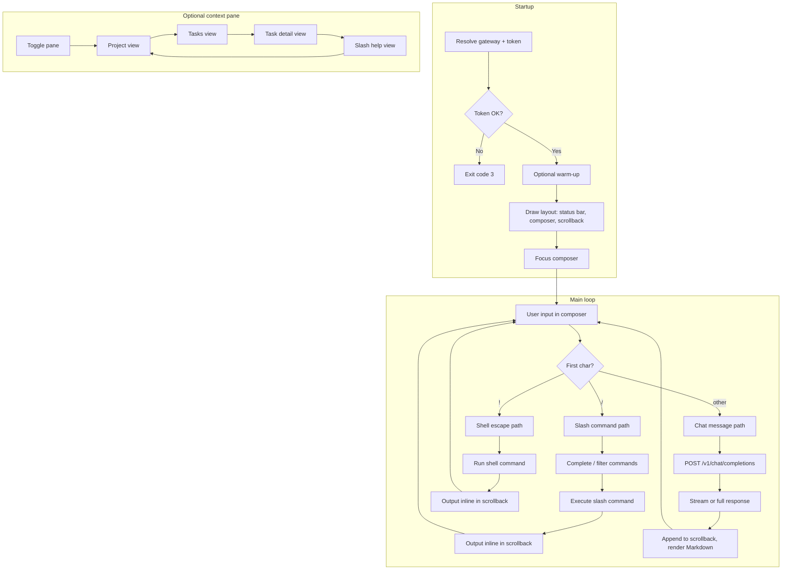
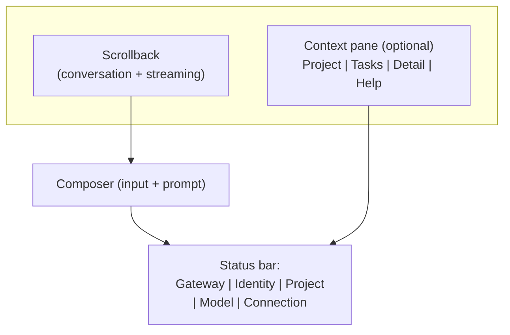
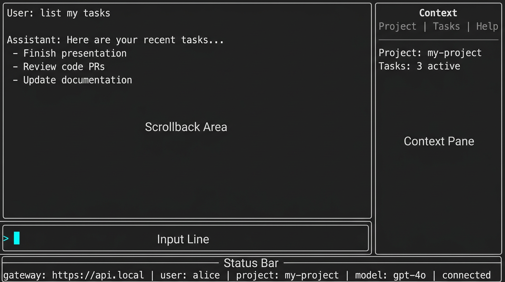

# Unified Spec Proposal: Chat QOL and Cynork Chat TUI

## 1 Summary

- **Date:** 2026-03-06
- **Purpose:** Single cohesive draft merging (1) chat quality-of-life (history, naming, summaries, archive) and (2) cynork chat as the primary TUI with shell deprecation.
- **Status:** Draft only; not yet merged into `docs/requirements/` or `docs/tech_specs/`.
- **Supersedes:** Drafts dated 2026-03-02 (chat QOL) and 2026-03-05 (cynork chat TUI upgrade recommendations).

Baseline references:

- [Chat Threads and Messages](../tech_specs/chat_threads_and_messages.md) (CYNAI.USRGWY.ChatThreadsMessages), [REQ-USRGWY-0130](../requirements/usrgwy.md#req-usrgwy-0130)
- [cli_management_app_commands_chat.md](../tech_specs/cli_management_app_commands_chat.md), [cli_management_app_shell_output.md](../tech_specs/cli_management_app_shell_output.md), [REQ-CLIENT-0161](../requirements/client.md) onward
- [OpenAI-Compatible Chat API](../tech_specs/openai_compatible_chat_api.md)

This document proposes requirements and spec extensions so that:

- Clients (Web Console and cynork) offer a better chat UX: visible history, thread names, optional summaries, and list behavior.
- `cynork chat` becomes the single interactive TUI (cursor-agent-like), with shell REPL deprecated or removed.

## 2 Scope

- **Gateway and data:** Thread title updates, optional thread summary, list sort/pagination/archive, and related API behavior.
- **Client (all chat UIs):** History list, rename, summary display.
- **Cynork-specific:** Chat as the only interactive surface; TUI layout and interaction (composer, panes, completion, status bar); deprecation/removal of `cynork shell`; local config and cache for chat TUI and completion data.

## 3 Proposed Requirements

The following requirement IDs are **proposed** and would live in the indicated requirements file if accepted.
Each entry uses the canonical format: requirement line, spec reference link(s) to the proposed Spec Item in this document, then requirement anchor.

### 3.1 Gateway and Data (USRGWY)

- **REQ-USRGWY-0132 (proposed):** The Data REST API for chat threads MUST support updating a thread's user-facing title.
  Clients MUST be able to set and change the display name of a thread without creating a new thread.
  The gateway MUST derive `user_id` from authentication and MUST allow updates only for threads owned by that user.
  [CYNAI.USRGWY.ChatThreadsMessages.ThreadTitle](#spec-cynai-usrgwy-chatthreadsmessages-threadtitle)
  

- **REQ-USRGWY-0133 (proposed):** The system MAY store an optional short summary for a chat thread (e.g. for list/sidebar display).
  If supported, the summary MUST be derived or set in a way that does not require storing plaintext secrets; any summary derived from message content MUST use redacted content only.
  Summary generation MAY be best-effort or asynchronous.
  [CYNAI.USRGWY.ChatThreadsMessages.ThreadSummary](#spec-cynai-usrgwy-chatthreadsmessages-threadsummary)
  

- **REQ-USRGWY-0134 (proposed):** List chat threads endpoints MUST support sort order by `updated_at` (default: descending) and MUST support pagination so clients can implement "chat history" lists of arbitrary size.
  [CYNAI.USRGWY.ChatThreadsMessages.HistoryList](#spec-cynai-usrgwy-chatthreadsmessages-historylist)
  

- **REQ-USRGWY-0135 (proposed):** The gateway MAY support soft-delete or archive state for chat threads so that users can hide threads from the default history list without losing data.
  If supported, list endpoints MUST allow filtering by visibility (e.g. active vs archived) and retention MUST still apply per existing policy.
  [CYNAI.USRGWY.ChatThreadsMessages.Archive](#spec-cynai-usrgwy-chatthreadsmessages-archive)
  

### 3.2 Client (Chat UX and History)

- **REQ-CLIENT-0178 (proposed):** Clients that provide a chat UI (e.g. Web Console, cynork chat) MUST expose a way for the user to view chat history (list of threads for the current user and project context).
  The list MUST show thread title (or a fallback such as first message preview or "Untitled") and SHOULD show last activity time.
  [CYNAI.USRGWY.ChatThreadsMessages.HistoryList](#spec-cynai-usrgwy-chatthreadsmessages-historylist)
  

- **REQ-CLIENT-0179 (proposed):** Clients that provide a chat UI MUST allow the user to rename the current thread (set or update title) and SHOULD allow renaming from the thread list.
  [CYNAI.USRGWY.ChatThreadsMessages.ThreadTitle](#spec-cynai-usrgwy-chatthreadsmessages-threadtitle)
  

- **REQ-CLIENT-0180 (proposed):** When the gateway provides a thread summary, clients SHOULD display it in the thread list or sidebar (e.g. tooltip or subtitle) to help users identify conversations without opening them.
  [CYNAI.USRGWY.ChatThreadsMessages.ThreadSummary](#spec-cynai-usrgwy-chatthreadsmessages-threadsummary)
  

### 3.3 Client (Cynork Chat as Primary TUI)

- **REQ-CLIENT-0181 (proposed):** The cynork CLI MUST provide a single interactive UI surface for chat.
  The interactive REPL mode (`cynork shell`) SHALL be deprecated or removed in favor of `cynork chat` as the primary TUI.
  [CYNAI.CLIENT.CynorkChat.TUILayout](#spec-cynai-client-cynorkchat-tuilayout)
  

- **REQ-CLIENT-0182 (proposed):** The cynork chat TUI SHOULD support a cursor-agent-like experience: multi-line input composer, scrollback with search and copy, persistent status bar (gateway, identity, project, model), and an optional context pane (project, tasks, slash help).
  Completion and fuzzy selection SHOULD be available for task identifiers, project selection, and model selection within chat.
  [CYNAI.CLIENT.CynorkChat.TUILayout](#spec-cynai-client-cynorkchat-tuilayout)
  [CYNAI.CLIENT.CynorkChat.Completion](#spec-cynai-client-cynorkchat-completion)
  

- **REQ-CLIENT-0183 (proposed):** Slash commands in cynork chat MUST provide parity with the command surface previously available in the shell REPL (tasks, status, whoami, nodes, prefs, skills, model, project).
  Shell escape (`!`) MAY remain required by default or MAY be gated behind an explicit flag (e.g. `--enable-shell`); the chosen behavior SHALL be specified in the cynork chat tech spec.
  [CYNAI.CLIENT.CynorkChat.TUILayout](#spec-cynai-client-cynorkchat-tuilayout)
  

- **REQ-CLIENT-0184 (proposed):** The cynork chat TUI MAY persist local configuration for TUI preferences (e.g. default model, composer single vs multi-line, context pane default visibility, keybinding overrides).
  If supported, config MUST use the same config file or config directory as the rest of cynork (see [CliConfigFileLocation](../tech_specs/cynork_cli.md#spec-cynai-client-cliconfigfilelocation)); config MUST NOT store secrets (tokens, passwords, or message content).
  [CYNAI.CLIENT.CynorkChat.LocalConfig](#spec-cynai-client-cynorkchat-localconfig)
  

- **REQ-CLIENT-0185 (proposed):** The cynork chat TUI MAY use a local cache for completion and list data (e.g. task ids, project ids, model ids, thread list metadata) to improve responsiveness of Tab completion and context pane.
  If supported, cache MUST be stored under a documented cache directory (e.g. XDG_CACHE_HOME); cache MUST NOT contain secrets (no tokens, no message content); cache SHOULD have a TTL or invalidation rule so stale data is refreshed.
  [CYNAI.CLIENT.CynorkChat.LocalCache](#spec-cynai-client-cynorkchat-localcache)
  

- **REQ-CLIENT-0186 (proposed):** When the user invokes a command via the shell escape `!`, the CLI MUST be interactive-subprocess safe: the TUI MUST suspend and give the subprocess the real TTY; when the subprocess exits, the CLI MUST restore the TUI and continue the session.
  [CYNAI.CLIENT.CynorkChat.TUILayout](#spec-cynai-client-cynorkchat-tuilayout) (Shell Escape and Interactive Subprocesses)
  

- **REQ-CLIENT-0187 (proposed):** When `cynork chat` is invoked without a usable login token (missing token, expired token, or gateway returns an authentication error), the chat TUI MUST offer an in-session login path rather than requiring the user to exit and re-run a command.
  The CLI MUST show a small login box (modal or overlay) with inputs for gateway URL, username, and password; gateway URL and username MUST be prepopulated when known (e.g. from config or last successful login); password MUST NOT be prepopulated and MUST be entered with secret input (no echo).
  After successful login, the CLI MUST resume the chat session.
  [CYNAI.CLIENT.CynorkChat.AuthRecovery](#spec-cynai-client-cynorkchat-authrecovery)
  

- **REQ-CLIENT-0188 (proposed):** The CLI SHOULD support a web-based login flow suitable for SSO (for example device-code style login or browser-based authorization) in addition to username/password login.
  This flow MUST avoid printing or persisting secrets to shell history or logs and MUST integrate with the existing token storage and credential-helper model.
  [CYNAI.CLIENT.CliWebLogin](#spec-cynai-client-cliweblogin)
  

## 4 Proposed Spec Additions (Gateway and Chat Data)

These would extend [Chat Threads and Messages](../tech_specs/chat_threads_and_messages.md) and related specs.
Each Spec Item below follows the mandatory structure: Spec ID anchor on the first bullet line, optional metadata, then contract content and Traces To.

### 4.1 Thread Title (Naming)

- Spec ID: `CYNAI.USRGWY.ChatThreadsMessages.ThreadTitle` 
- Status: proposed
- Traces To: [REQ-USRGWY-0132](#req-usrgwy-0132), [REQ-CLIENT-0179](#req-client-0179)
- The existing thread model already recommends `title` (text, optional).
  Spec addition: the gateway MUST allow `PATCH /v1/chat/threads/{thread_id}` with a request body that includes `title` (string).
  The gateway MUST reject PATCH for threads not owned by the authenticated user.
  No other thread fields need to be mutable for MVP; only `title` and `updated_at` (server-maintained) are updated.
- Auto-title: the spec MAY define that when `title` is absent, clients display a fallback (e.g. first N characters of the first user message, or "New chat").
  Server-side auto-generation of title from first message is optional and MAY be added later; if added, it MUST use redacted content only.

### 4.2 Thread Summary

- Spec ID: `CYNAI.USRGWY.ChatThreadsMessages.ThreadSummary` 
- Status: proposed
- Traces To: [REQ-USRGWY-0133](#req-usrgwy-0133), [REQ-CLIENT-0180](#req-client-0180)
- Optional field on thread: `summary` (text, optional), max length TBD (e.g. 200-500 characters).
  If present, it is a short plaintext summary for list/sidebar display.
  Generation: MAY be set by client on create/update; MAY be generated asynchronously by the server from redacted message content; MUST NOT contain plaintext secrets.
  Storage: add `summary` to `chat_threads` if this feature is implemented; index not required for MVP.
- API: `GET /v1/chat/threads` and `GET /v1/chat/threads/{thread_id}` responses SHOULD include `summary` when present.
  Optional: `PATCH /v1/chat/threads/{thread_id}` MAY allow client to set or clear `summary`.

### 4.3 Chat History List Behavior

- Spec ID: `CYNAI.USRGWY.ChatThreadsMessages.HistoryList` 
- Status: proposed
- Traces To: [REQ-USRGWY-0134](#req-usrgwy-0134), [REQ-CLIENT-0178](#req-client-0178)
- `GET /v1/chat/threads` behavior to support "chat history" UX:
  - Query parameters: existing `project_id` filter and pagination (`limit`, `offset`).
  - Add optional `sort` (e.g. `updated_at_asc` | `updated_at_desc`); default MUST be `updated_at_desc`.
  - Add optional `archived` (boolean) if soft-delete/archive is implemented: when `false` (default), exclude archived threads; when `true`, return only archived threads.
  - Response: each thread object MUST include `id`, `title`, `updated_at`, `created_at`, and optionally `summary`, `project_id`, `message_count` (if the gateway chooses to expose it).

### 4.4 Archive / Soft-Delete (Optional)

- Spec ID: `CYNAI.USRGWY.ChatThreadsMessages.Archive` 
- Status: proposed
- Traces To: [REQ-USRGWY-0135](#req-usrgwy-0135)
- If REQ-USRGWY-0135 is accepted: add optional `archived_at` (timestamptz, nullable) to `chat_threads`.
  When non-null, the thread is considered archived.
  `PATCH /v1/chat/threads/{thread_id}` MAY allow `archived: true | false`; setting `archived: true` sets `archived_at` to current time; `false` clears it.
  List threads MUST filter by `archived_at` according to the `archived` query parameter.
  Retention and purge rules apply to archived threads the same as active ones unless a separate policy is defined.

## 5 Proposed Spec Additions (Cynork Chat TUI)

These would extend [cli_management_app_commands_chat.md](../tech_specs/cli_management_app_commands_chat.md) and related cynork specs.
Spec IDs use the CLIENT domain per [requirements_domains.md](../docs_standards/requirements_domains.md).

### 5.1 TUI Layout and Interaction

- Spec ID: `CYNAI.CLIENT.CynorkChat.TUILayout` 
- Status: proposed
- Traces To: [REQ-CLIENT-0181](#req-client-0181), [REQ-CLIENT-0182](#req-client-0182), [REQ-CLIENT-0183](#req-client-0183), [REQ-CLIENT-0186](#req-client-0186)
- A dedicated section in the cynork chat spec specifying the chat TUI layout and interaction rules:
  - Multi-line composer (toggle, soft wrap, explicit send key).
  - Scrollback with selection and copy; in-TUI search over the visible buffer.
  - Streaming output when the gateway supports it, with graceful fallback to non-streaming.
  - Persistent status bar: gateway URL, auth identity, project context, selected model, connection state.
  - Optional right-side context pane: current project, recent tasks and status, selected task detail (result/logs), slash command help.
  - Unified command palette including slash commands and common actions.

#### 5.1.1 Region Layout and Positioning

The TUI occupies the terminal (full-screen or current terminal size).
Regions are stacked and optionally split as follows; all coordinates are relative (percent of terminal rows/columns) so the layout works across resize.

- **Status bar (bottom, fixed):** Single line at the bottom of the terminal.
  Contains: gateway base URL (truncated if needed), identity (e.g. user handle or "anonymous"), project context (id or "default"), selected model id (truncated), connection state (e.g. "connected" / "reconnecting" / "offline").
  Separators between fields (e.g. `|`) are optional; layout MUST remain readable when `--no-color` is set.
  Height: exactly 1 row.
  Width: full terminal width.

- **Composer (above status bar, fixed):** Input area for the current message.
  Default height: 1 row (single-line mode).
  Multi-line mode: 2 to 5 rows (configurable or toggleable).
  Soft wrap: when a line exceeds terminal width, it wraps to the next composer line without inserting a newline character unless the user explicitly inserts one.
  Width: full terminal width when context pane is hidden; when context pane is visible, composer width is the remaining left region (see below).
  Cursor and prompt (e.g. `>`) are shown; placeholder text (e.g. "Type a message or / for commands") is optional.

- **Scrollback (main area, above composer):** Renders the conversation history and streaming assistant output.
  Fills all remaining vertical space above the composer (i.e. from top of terminal to composer top).
  Width: same as composer (full width or left region when context pane visible).
  Content: user messages and assistant messages in order; Markdown rendering when `--plain` is not set; streaming updates append to the last assistant message until complete.
  Scrolling: vertical scroll when content exceeds visible rows; scroll position MAY follow the latest content (auto-scroll) or stay fixed when user has scrolled up; behavior SHOULD be specified (e.g. follow by default, or "scroll to bottom" key).

- **Context pane (optional, right side):** When visible, a vertical split reserves a portion of the terminal width for the context pane.
  Recommended width: 24--32 columns or 20--30% of terminal width (whichever is smaller), with a minimum of 20 columns.
  The pane shows one of: (1) current project context (project id, title, summary), (2) recent tasks list with status, (3) selected task detail (result snippet or log tail), (4) slash command help (list of commands and short descriptions).
  Switching between these views MAY be by key (e.g. Tab or number keys) or a small inline tab strip at the top of the pane.
  When the context pane is hidden, the scrollback and composer expand to full width.

- **Command palette (overlay, optional):** When invoked (e.g. Ctrl+P or F10), a modal or overlay appears over the center of the TUI listing slash commands and common actions (e.g. "New thread", "Toggle context pane", "Search").
  User can filter by typing and select with Enter; Escape dismisses.
  This overlay does not change the underlying region layout; it is drawn on top.

#### 5.1.2 Keybindings and Input Semantics

- **Send message:** In single-line composer, Enter sends the current line (after trim) and clears the input.
  In multi-line composer, Enter inserts a newline; a dedicated "send" key (e.g. Ctrl+Enter or Alt+Enter) sends the full composer content and clears.
  The inverse (Enter to send in multi-line, Ctrl+Enter for newline) MAY be configurable; the spec SHALL pick a default and document it.

- **Slash and shell:** Input starting with `/` is parsed as a slash command; input starting with `!` is shell escape (if enabled).
  Tab after `/` triggers slash-command completion; Tab in other contexts (e.g. after `/task get`) triggers context-specific completion (task id, project id, model id) per [5.2 Completion and Discovery](#spec-cynai-client-cynorkchat-completion).

- **Scrollback interaction:** Arrow keys or Page Up / Page Down scroll the scrollback when focus is in scrollback (e.g. after clicking or focusing the main area).
  Selection: mouse or shift+arrows to select text; Copy (e.g. Ctrl+C or platform copy) copies selection to system clipboard; no secrets in scrollback (per existing security rules).
  Search: Ctrl+F (or `/` when focus in scrollback) opens an inline search field; typing filters or jumps to next match; Escape closes search.

- **Context pane:** A key (e.g. Ctrl+R or F9) toggles visibility of the context pane.
  When visible, Tab or number keys switch between pane views (project / tasks / task detail / slash help) as specified.

- **Command palette:** Ctrl+P or F10 opens the command palette; Escape or focus-out closes it.

- **Exit:** `/exit`, `/quit`, or EOF (e.g. Ctrl+D) ends the session; behavior per existing [CliChat](../tech_specs/cli_management_app_commands_chat.md) spec.

#### 5.1.3 Shell Escape and Interactive Subprocesses

When the user runs a command via `!` (e.g. `!vim file.txt`), that command runs in the user's shell.
If the command is **interactive** (e.g. vim, less, htop) and takes over the terminal (raw mode, alternate screen, or full-screen UI), the following applies.

- **Required behavior:** The TUI MUST suspend its own rendering and give the subprocess full control of the terminal for the duration of the command.
  Concretely: before exec'ing or spawning the shell command, the CLI MUST switch the terminal to cooked/canonical mode (if the TUI uses raw mode) and MUST NOT capture or redirect stdin/stdout/stderr so the subprocess receives the real TTY.
  When the subprocess exits, the CLI MUST restore the TUI state (re-enter raw mode if used, redraw layout) and continue the chat session.
  The scrollback MAY show a single inline line such as `[ ran: vim file.txt (exit 0) ]` or MAY show nothing; the CLI MUST NOT attempt to "capture" the interactive program's output as if it were plain stdout.

- **Non-interactive commands:** For commands that do not take over the terminal (e.g. `!ls`, `!cat file`), the CLI MAY run them in a PTY or pipe and display stdout/stderr inline in the scrollback as today; that behavior remains valid.
  The requirement above applies whenever the user invokes any command via `!`; implementations MUST support interactive subprocesses (e.g. `!vim`, `!less`) by handing off the real TTY and resuming the TUI on exit.

#### 5.1.4 Interaction Flow (Mermaid)

The following diagram summarizes the main user and system flow for the chat TUI.

#### 5.1.5 Layout Structure (Mermaid)

The following diagram shows the spatial relationship of TUI regions.
Top to bottom: scrollback (flex), then composer (fixed height), then status bar (1 row).
When the context pane is visible, it occupies the right column next to scrollback and composer; status bar spans the full width.

Vertical order: row1 (scrollback left, context pane right when visible), then composer, then status bar.
Horizontal: scrollback and context pane share the top row; composer spans left column only; status bar spans full width.

#### 5.1.6 TUI Visual Mockup

The following mockup illustrates the TUI with context pane visible and a sample conversation.

### 5.2 Completion and Discovery

- Spec ID: `CYNAI.CLIENT.CynorkChat.Completion` 
- Status: proposed
- Traces To: [REQ-CLIENT-0182](#req-client-0182)
- Completion sources and constraints:
  - Autocomplete and fuzzy selection for: task identifiers (UUID and human-readable names) in slash commands; project selection for `/project set`; model selection for `/model`.
  - Completion data: task list, project list, model list calls as defined by existing APIs; no new gateway endpoints required.

### 5.3 Non-Interactive and Scripting

- Spec ID: `CYNAI.CLIENT.CynorkChat.NonInteractive` 
- Status: proposed
- Behavior for non-interactive or scripted use (e.g. `--plain` and optional `--once` flag), so that chat can be driven from scripts without TUI embellishments.

### 5.4 Shell Deprecation and Doc Alignment

Doc changes (no new Spec ID; alignment of existing specs and requirements):

- In [cynork_cli.md](../tech_specs/cynork_cli.md): remove "Interactive shell mode with tab completion" from MVP scope or mark it deprecated.
- In [cli_management_app_shell_output.md](../tech_specs/cli_management_app_shell_output.md): remove the Interactive Mode (REPL) section or rewrite as "Chat UI interaction rules" if that document remains the home for output/scripting rules.
- Requirements: remove or deprecate `REQ-CLIENT-0136` through `REQ-CLIENT-0159` (and related REPL requirements) and replace with the chat-as-primary and TUI requirements proposed above.
- BDD: replace or rewrite [features/cynork/cynork_shell.feature](../../features/cynork/cynork_shell.feature) with chat-based acceptance criteria; extend [features/cynork/cynork_chat.feature](../../features/cynork/cynork_chat.feature) for TUI behaviors (e.g. multi-line send, slash completion).

### 5.5 Local Config (Chat TUI Preferences)

- Spec ID: `CYNAI.CLIENT.CynorkChat.LocalConfig` 
- Status: proposed
- Traces To: [REQ-CLIENT-0184](#req-client-0184)
- Chat-specific preferences MAY be stored in the same config file as the rest of cynork, under a dedicated key (e.g. `chat` or `tui`), or in a separate file under the same config directory (e.g. `$XDG_CONFIG_HOME/cynork/chat.yaml`).
  When using the same file, the structure MUST extend the existing [CliConfigFileLocation](../tech_specs/cynork_cli.md#spec-cynai-client-cliconfigfilelocation) YAML; unknown keys at the top level continue to be ignored; the `chat` (or `tui`) key is optional.
- Allowed keys (all optional): `default_model` (string, OpenAI model id for the session when `--model` is not set); `composer_multiline` (boolean, default false); `context_pane_visible` (boolean, default false); `context_pane_width_columns` (integer, min 20, max 48); `keybindings` (object mapping action names to key sequences, if overrides are supported).
  No key may hold a secret (token, password, or message content); the CLI MUST NOT write or read secrets from this config.
- Config load: the same `--config` flag and default path resolution as the rest of cynork apply; chat preferences are read after the main config load and MAY be absent (defaults apply).
- If a separate chat config file is used, it MUST live under the same config directory (e.g. `$XDG_CONFIG_HOME/cynork/chat.yaml`); file mode on write MUST be `0600`; atomic write is recommended.

### 5.6 Local Cache (Completion and List Data)

- Spec ID: `CYNAI.CLIENT.CynorkChat.LocalCache` 
- Status: proposed
- Traces To: [REQ-CLIENT-0185](#req-client-0185)
- The CLI MAY cache completion and list data locally to improve Tab completion and context pane responsiveness.
  Cache location: if `XDG_CACHE_HOME` is set, use `$XDG_CACHE_HOME/cynork/`; otherwise use `~/.cache/cynork/`.
  The CLI MAY create subdirectories (e.g. `completion/`, `threads/`) under that path; directory mode SHOULD be `0700`.
- Cacheable data: task list (ids, names, status); project list (ids, titles); model list (ids); thread list metadata (ids, titles, updated_at only; no message content or summaries that could contain sensitive text).
  Cache MUST NOT contain: tokens, credentials, message content, or any field that could hold user or system secrets.
- TTL and invalidation: each cache entry or cache file SHOULD have a maximum age (e.g. 60--300 seconds); after TTL, the next completion or pane refresh MUST fetch from the gateway and MAY update the cache.
  Invalidation: after a slash command that mutates state (e.g. `/task create`, `/project set`), the CLI SHOULD invalidate the relevant cache (e.g. task list, project context) so the next completion or pane view reflects fresh data.
- File mode: cache files SHOULD be written with mode `0600` (user-only read/write).
  The CLI MAY purge or rotate cache files on startup or when size exceeds a limit; purge MUST NOT delete files outside the cache directory.

### 5.7 Auth Recovery (Login Prompt in Chat)

- Spec ID: `CYNAI.CLIENT.CynorkChat.AuthRecovery` 
- Status: proposed
- Traces To: [REQ-CLIENT-0187](#req-client-0187)
- The chat TUI MUST handle both startup auth gaps and in-session auth failures by prompting for login and resuming the session when possible.
- Startup behavior:
  - If the resolved token is empty at startup, the CLI MUST prompt the user to log in.
  - After a successful login, the CLI MUST start the chat session loop and render the TUI normally.
  - If login fails or is aborted, the CLI MUST exit with an auth error exit code (consistent with [Exit Codes](../tech_specs/cynork_cli.md#spec-cynai-client-cliexitcodes)).
- In-session behavior:
  - If the gateway responds with an auth error (e.g. HTTP 401/403) to a chat completion request or a slash-command gateway call, the CLI MUST pause the session and prompt the user to re-authenticate.
  - After successful re-authentication, the CLI SHOULD offer to retry the failed operation once (default: retry), then resume normal session flow.
  - The CLI MUST NOT loop indefinitely on repeated auth failures; after N consecutive auth failures (N TBD, e.g. 2), the CLI MUST return to the composer and show a clear error telling the user to run `/auth login` or exit.
- Login box (modal/overlay):
  - When login is required (startup or in-session auth failure), the CLI MUST display a small login box over the TUI (modal or overlay), not a full-screen takeover.
  - The login box MUST contain three inputs: gateway URL, username, and password.
  - Gateway URL and username MUST be prepopulated when known (from loaded config `gateway_url`, and from config or last-known identity if available; e.g. a stored "last_username" or config key is optional but when present, prepopulate).
  - Password MUST NOT be prepopulated and MUST use secret input (no echo; e.g. masked or hidden).
  - The box MUST include a way to submit (e.g. "Login" or Enter) and to cancel/abort (e.g. Escape); on cancel at startup, the CLI exits with auth error code; on cancel in-session, the CLI returns to the composer with an error message.
  - The CLI MUST reuse the same auth and token persistence rules as the rest of cynork (same gateway login endpoint, config write, credential helper if configured).
  - The CLI MUST NOT record password or token in history and MUST NOT echo secrets.

### 5.8 Web Login (SSO-Capable Authentication)

- Spec ID: `CYNAI.CLIENT.CliWebLogin` 
- Status: proposed
- Traces To: [REQ-CLIENT-0188](#req-client-0188)
- The CLI SHOULD support a web-based login flow designed for SSO-capable deployments.
  Acceptable patterns include:
  - device-code flow (CLI prints a short code and verification URL; user completes login in browser; CLI polls for token), or
  - browser-based authorization (CLI opens browser to an auth URL, receives a callback on localhost, and exchanges for token).
- Constraints:
  - The CLI MUST NOT print tokens to stdout in normal operation.
  - The CLI MUST store the resulting token using the existing token storage model (config and/or credential helper) and MUST follow the file-permission and atomic-write rules in [CliConfigFileLocation](../tech_specs/cynork_cli.md#spec-cynai-client-cliconfigfilelocation).
  - The CLI MUST time out and fail cleanly if the user does not complete the web flow within a bounded time.

## 6 Implementation Action Plan

Assumes approval of the proposed requirements and spec changes above.

### 6.1 Phase 0: Contract Decisions

- Decide whether `cynork shell` is removed immediately or deprecated for one release.
- Decide whether `!` shell escape remains required by default or becomes opt-in (`--enable-shell`); document in spec.
- Decide minimal "cursor-agent-like" TUI scope for first iteration (e.g. layout + multi-line + completion + status bar).

### 6.2 Phase 1: Requirements, Specs, and BDD

- Update `docs/requirements/usrgwy.md` and `docs/requirements/client.md` with the proposed requirements.
- Update tech specs: Chat Threads and Messages (title, summary, history list, archive); cynork chat (TUI layout, completion, non-interactive); cynork_cli and shell_output (shell deprecation/removal).
- Update BDD: cynork_shell.feature => chat-based scenarios; extend cynork_chat.feature for TUI behavior.

### 6.3 Phase 2: Gateway and Chat Data (If Approved)

- Implement PATCH thread title, optional summary field and API, list sort/pagination/archive per spec.

### 6.4 Phase 3: Cynork Chat TUI

- Implement TUI layer for `cynork chat`: composer, panes, status bar, completion (task/project/model), scrollback and search.
- Implement local config (chat TUI preferences) and local cache (completion/list data) per [5.5 Local Config](#spec-cynai-client-cynorkchat-localconfig) and [5.6 Local Cache](#spec-cynai-client-cynorkchat-localcache).
- Preserve: no secrets in local history, config, or cache; honor `--no-color`; do not print or persist tokens.

### 6.5 Phase 4: Remove or Deprecate Cynork Shell

- Remove or deprecate `cynork shell` implementation and supporting packages; align help, docs, and completion.

### 6.6 Phase 5: Validation

- `just docs-check` for all updated docs.
- `just test-bdd` (or cynork-scoped suite) for chat and TUI scenarios.

## 7 Traceability (Proposed)

Canonical links to requirement anchors and Spec Item anchors in this document:

- [REQ-USRGWY-0132](#req-usrgwy-0132) => [Thread Title (4.1)](#spec-cynai-usrgwy-chatthreadsmessages-threadtitle)
- [REQ-USRGWY-0133](#req-usrgwy-0133) => [Thread Summary (4.2)](#spec-cynai-usrgwy-chatthreadsmessages-threadsummary)
- [REQ-USRGWY-0134](#req-usrgwy-0134) => [History List (4.3)](#spec-cynai-usrgwy-chatthreadsmessages-historylist)
- [REQ-USRGWY-0135](#req-usrgwy-0135) => [Archive (4.4)](#spec-cynai-usrgwy-chatthreadsmessages-archive)
- [REQ-CLIENT-0178](#req-client-0178) => [History List (4.3)](#spec-cynai-usrgwy-chatthreadsmessages-historylist)
- [REQ-CLIENT-0179](#req-client-0179) => [Thread Title (4.1)](#spec-cynai-usrgwy-chatthreadsmessages-threadtitle)
- [REQ-CLIENT-0180](#req-client-0180) => [Thread Summary (4.2)](#spec-cynai-usrgwy-chatthreadsmessages-threadsummary)
- [REQ-CLIENT-0181](#req-client-0181) => [TUI Layout (5.1)](#spec-cynai-client-cynorkchat-tuilayout)
- [REQ-CLIENT-0182](#req-client-0182) => [TUI Layout (5.1)](#spec-cynai-client-cynorkchat-tuilayout), [Completion (5.2)](#spec-cynai-client-cynorkchat-completion)
- [REQ-CLIENT-0183](#req-client-0183) => [TUI Layout (5.1)](#spec-cynai-client-cynorkchat-tuilayout)
- [REQ-CLIENT-0184](#req-client-0184) => [Local Config (5.5)](#spec-cynai-client-cynorkchat-localconfig)
- [REQ-CLIENT-0185](#req-client-0185) => [Local Cache (5.6)](#spec-cynai-client-cynorkchat-localcache)
- [REQ-CLIENT-0186](#req-client-0186) => [TUI Layout (5.1)](#spec-cynai-client-cynorkchat-tuilayout), Shell Escape and Interactive Subprocesses (5.1.3)
- [REQ-CLIENT-0187](#req-client-0187) => [Auth Recovery (5.7)](#spec-cynai-client-cynorkchat-authrecovery)
- [REQ-CLIENT-0188](#req-client-0188) => [Web Login (5.8)](#spec-cynai-client-cliweblogin)

## 8 Out of Scope for This Draft

- Full-text search over chat message content (future).
- Export of thread to file (e.g. Markdown/JSON); can be a later requirement.
- Per-message labels or reactions.
- Thread pinning/favorite as a separate flag (could be modeled later as tag or `pinned_at`).
- New gateway endpoints for "thread selection" or "resume arbitrary thread id" (current OpenAI-compatible contract avoids CyNodeAI-specific thread identifiers on the client).

## 9 Notes and Risks

- Removing or deprecating `cynork shell` requires coordinated changes to requirements, tech specs, and BDD.
- A richer TUI should not require new gateway endpoints for the proposed scope; thread list and PATCH are sufficient for history and naming.

## 10 Related Documents

- [Chat Threads and Messages](../tech_specs/chat_threads_and_messages.md)
- [OpenAI-Compatible Chat API](../tech_specs/openai_compatible_chat_api.md)
- [User API Gateway requirements](../requirements/usrgwy.md) (REQ-USRGWY-0130)
- [Client requirements](../requirements/client.md) (chat and REPL requirements)
- [cynork CLI tech spec](../tech_specs/cynork_cli.md)
- [cli_management_app_commands_chat.md](../tech_specs/cli_management_app_commands_chat.md)
- [cli_management_app_shell_output.md](../tech_specs/cli_management_app_shell_output.md)
