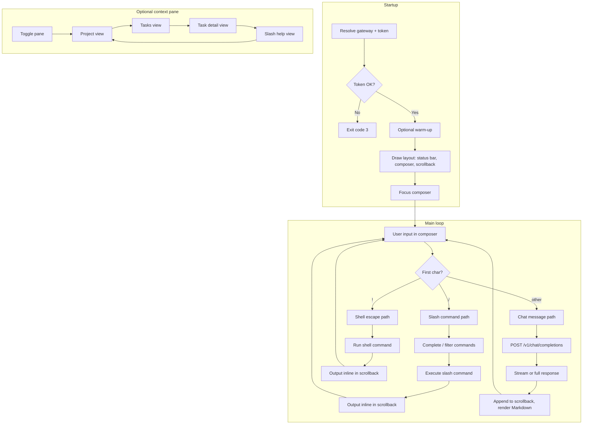
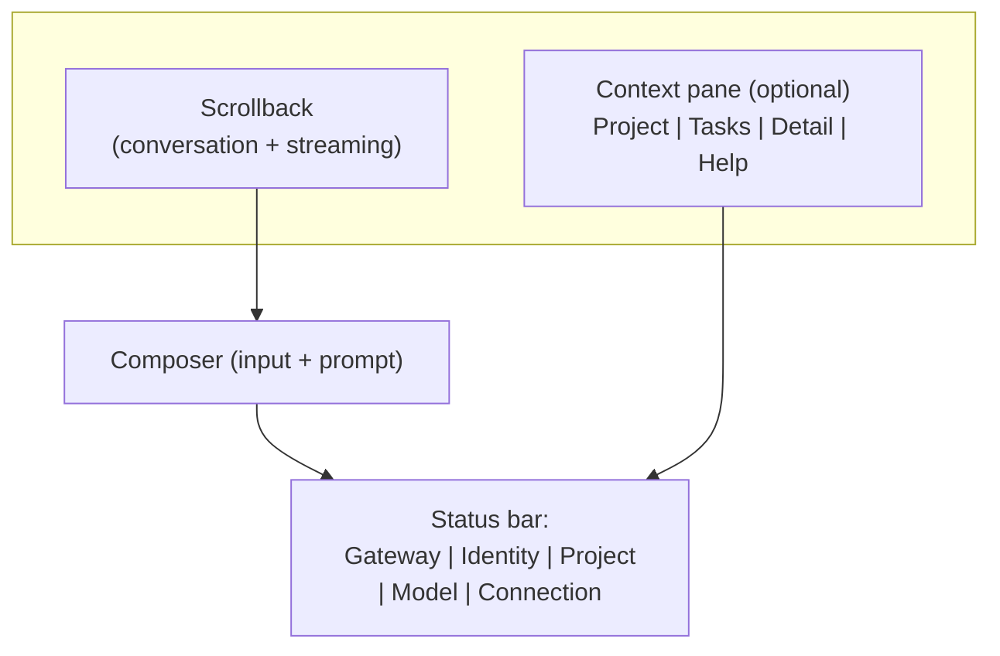

# Unified Spec Proposal: Chat QOL and Cynork Chat TUI

## 1 Summary

- **Date:** 2026-03-06
- **Purpose:** Single cohesive draft merging (1) chat quality-of-life (history, naming, summaries, archive), (2) cynork chat as the primary TUI with shell deprecation, and (3) richer modern chat conventions such as hidden thinking, tool activity, attachments, and downloadable outputs.
- **Status:** Draft only; not yet merged into `docs/requirements/` or `docs/tech_specs/`.
- **Supersedes:** Drafts dated 2026-03-02 (chat QOL) and 2026-03-05 (cynork chat TUI upgrade recommendations).

Baseline references:

- [Chat Threads and Messages](../tech_specs/chat_threads_and_messages.md) (CYNAI.USRGWY.ChatThreadsMessages), [REQ-USRGWY-0130](../requirements/usrgwy.md#req-usrgwy-0130)
- [cli_management_app_commands_chat.md](../tech_specs/cli_management_app_commands_chat.md), [cli_management_app_shell_output.md](../tech_specs/cli_management_app_shell_output.md), [REQ-CLIENT-0161](../requirements/client.md) onward
- [OpenAI-Compatible Chat API](../tech_specs/openai_compatible_chat_api.md)

This document proposes requirements and spec extensions so that:

- Clients (Web Console and cynork) offer a better chat UX: visible history, thread names, optional summaries, and list behavior.
- `cynork chat` becomes the single interactive TUI (cursor-agent-like), with shell REPL deprecated or removed.
- Richer LLM interaction conventions are handled explicitly instead of being left implicit in plain text, especially thinking blocks, tool-call activity, attachments, and file downloads.

## 2 Scope

- **Gateway and data:** Thread title updates, optional thread summary, list sort/pagination/archive, and related API behavior.
- **Gateway and data:** Structured turn metadata so tool activity, attachment refs, and download refs do not have to be scraped from prose.
- **OpenAI-compatible chat surface:** Rich message inputs and attachment handling for modern multimodal or file-aware models.
- **Client (all chat UIs):** History list, rename, summary display.
- **Cynork-specific:** Chat as the only interactive surface; TUI layout and interaction (composer, panes, completion, status bar); rendering rules for thinking, tool calls, attachments, and downloads; deprecation/removal of `cynork shell`; local config and cache for chat TUI and completion data.

## 3 Proposed Requirements

The following requirement IDs are **proposed** and would live in the indicated requirements file if accepted.
Each entry uses the canonical format: requirement line, spec reference link(s) to the proposed Spec Item in this document, then requirement anchor.

### 3.1 Gateway and Data (USRGWY)

- **REQ-USRGWY-0135 (proposed):** The Data REST API for chat threads MUST support updating a thread's user-facing title.
  Clients MUST be able to set and change the display name of a thread without creating a new thread.
  The gateway MUST derive `user_id` from authentication and MUST allow updates only for threads owned by that user.
  [CYNAI.USRGWY.ChatThreadsMessages.ThreadTitle](#spec-cynai-usrgwy-chatthreadsmessages-threadtitle)
  

- **REQ-USRGWY-0136 (proposed):** The system MAY store an optional short summary for a chat thread (e.g. for list/sidebar display).
  If supported, the summary MUST be derived or set in a way that does not require storing plaintext secrets; any summary derived from message content MUST use redacted content only.
  Summary generation MAY be best-effort or asynchronous.
  [CYNAI.USRGWY.ChatThreadsMessages.ThreadSummary](#spec-cynai-usrgwy-chatthreadsmessages-threadsummary)
  

- **REQ-USRGWY-0137 (proposed):** List chat threads endpoints MUST support sort order by `updated_at` (default: descending) and MUST support pagination so clients can implement "chat history" lists of arbitrary size.
  [CYNAI.USRGWY.ChatThreadsMessages.HistoryList](#spec-cynai-usrgwy-chatthreadsmessages-historylist)
  

- **REQ-USRGWY-0138 (proposed):** The gateway MAY support soft-delete or archive state for chat threads so that users can hide threads from the default history list without losing data.
  If supported, list endpoints MUST allow filtering by visibility (e.g. active vs archived) and retention MUST still apply per existing policy.
  [CYNAI.USRGWY.ChatThreadsMessages.Archive](#spec-cynai-usrgwy-chatthreadsmessages-archive)
  

- **REQ-USRGWY-0139 (proposed):** The gateway SHOULD support structured chat-turn data so clients can distinguish visible assistant text, tool activity, attachment references, and downloadable outputs without parsing prose.
  Internal reasoning or thinking content MUST NOT be exposed as normal transcript content and MUST NOT be used as input for thread title or summary generation.
  [CYNAI.USRGWY.ChatThreadsMessages.StructuredTurns](#spec-cynai-usrgwy-chatthreadsmessages-structuredturns)
  

- **REQ-USRGWY-0140 (proposed):** The OpenAI-compatible chat surface SHOULD define how rich message content and chat attachments are represented, validated, and persisted.
  At minimum, the canonical spec MUST state how text parts, image or file references, unsupported part types, and storage references are handled.
  [CYNAI.USRGWY.OpenAIChatApi.RichInputs](#spec-cynai-usrgwy-openaichatapi-richinputs)
  

- **REQ-USRGWY-0141 (proposed):** When chat completions or tool executions produce downloadable outputs, the gateway SHOULD expose stable authenticated references and metadata suitable for an explicit client download UX.
  Clients MUST NOT be forced to scrape assistant prose to discover downloadable files.
  [CYNAI.USRGWY.ChatThreadsMessages.DownloadRefs](#spec-cynai-usrgwy-chatthreadsmessages-downloadrefs)
  

### 3.2 Client (Chat UX and History)

- **REQ-CLIENT-0181 (proposed):** Clients that provide a chat UI (e.g. Web Console, cynork chat) MUST expose a way for the user to view chat history (list of threads for the current user and project context).
  The list MUST show thread title (or a fallback such as first message preview or "Untitled") and SHOULD show last activity time.
  [CYNAI.USRGWY.ChatThreadsMessages.HistoryList](#spec-cynai-usrgwy-chatthreadsmessages-historylist)
  

- **REQ-CLIENT-0182 (proposed):** Clients that provide a chat UI MUST allow the user to rename the current thread (set or update title) and SHOULD allow renaming from the thread list.
  [CYNAI.USRGWY.ChatThreadsMessages.ThreadTitle](#spec-cynai-usrgwy-chatthreadsmessages-threadtitle)
  

- **REQ-CLIENT-0183 (proposed):** When the gateway provides a thread summary, clients SHOULD display it in the thread list or sidebar (e.g. tooltip or subtitle) to help users identify conversations without opening them.
  [CYNAI.USRGWY.ChatThreadsMessages.ThreadSummary](#spec-cynai-usrgwy-chatthreadsmessages-threadsummary)
  

### 3.3 Client (Cynork Chat as Primary TUI)

- **REQ-CLIENT-0184 (proposed):** The cynork CLI MUST provide a single interactive UI surface for chat.
  The interactive REPL mode (`cynork shell`) SHALL be deprecated or removed in favor of `cynork chat` as the primary TUI.
  [CYNAI.CLIENT.CynorkChat.TUILayout](#spec-cynai-client-cynorkchat-tuilayout)
  

- **REQ-CLIENT-0185 (proposed):** The cynork chat TUI SHOULD support a cursor-agent-like experience: multi-line input composer, scrollback with search and copy, persistent status bar (gateway, identity, project, model), and an optional context pane (project, tasks, slash help).
  Completion and fuzzy selection SHOULD be available for task identifiers, project selection, and model selection within chat.
  [CYNAI.CLIENT.CynorkChat.TUILayout](#spec-cynai-client-cynorkchat-tuilayout)
  [CYNAI.CLIENT.CynorkChat.Completion](#spec-cynai-client-cynorkchat-completion)
  

- **REQ-CLIENT-0186 (proposed):** Slash commands in cynork chat MUST provide parity with the command surface previously available in the shell REPL (tasks, status, whoami, nodes, prefs, skills, model, project).
  Shell escape (`!`) MAY remain required by default or MAY be gated behind an explicit flag (e.g. `--enable-shell`); the chosen behavior SHALL be specified in the cynork chat tech spec.
  [CYNAI.CLIENT.CynorkChat.TUILayout](#spec-cynai-client-cynorkchat-tuilayout)
  

- **REQ-CLIENT-0187 (proposed):** The cynork chat TUI MAY persist local configuration for TUI preferences (e.g. default model, composer single vs multi-line, context pane default visibility, keybinding overrides).
  If supported, config MUST use the same config file or config directory as the rest of cynork (see [CliConfigFileLocation](../tech_specs/cynork_cli.md#spec-cynai-client-cliconfigfilelocation)); config MUST NOT store secrets (tokens, passwords, or message content).
  [CYNAI.CLIENT.CynorkChat.LocalConfig](#spec-cynai-client-cynorkchat-localconfig)
  

- **REQ-CLIENT-0188 (proposed):** The cynork chat TUI MAY use a local cache for completion and list data (e.g. task ids, project ids, model ids, thread list metadata) to improve responsiveness of Tab completion and context pane.
  If supported, cache MUST be stored under a documented cache directory (e.g. XDG_CACHE_HOME); cache MUST NOT contain secrets (no tokens, no message content); cache SHOULD have a TTL or invalidation rule so stale data is refreshed.
  [CYNAI.CLIENT.CynorkChat.LocalCache](#spec-cynai-client-cynorkchat-localcache)
  

- **REQ-CLIENT-0189 (proposed):** When the user invokes a command via the shell escape `!`, the CLI MUST be interactive-subprocess safe: the TUI MUST suspend and give the subprocess the real TTY; when the subprocess exits, the CLI MUST restore the TUI and continue the session.
  [CYNAI.CLIENT.CynorkChat.TUILayout](#spec-cynai-client-cynorkchat-tuilayout) (Shell Escape and Interactive Subprocesses)
  

- **REQ-CLIENT-0190 (proposed):** When `cynork chat` is invoked without a usable login token (missing token, expired token, or gateway returns an authentication error), the chat TUI MUST offer an in-session login path rather than requiring the user to exit and re-run a command.
  The CLI MUST show a small login box (modal or overlay) with inputs for gateway URL, username, and password; gateway URL and username MUST be prepopulated when known (e.g. from config or last successful login); password MUST NOT be prepopulated and MUST be entered with secret input (no echo).
  After successful login, the CLI MUST resume the chat session.
  [CYNAI.CLIENT.CynorkChat.AuthRecovery](#spec-cynai-client-cynorkchat-authrecovery)
  

- **REQ-CLIENT-0191 (proposed):** The CLI SHOULD support a web-based login flow suitable for SSO (for example device-code style login or browser-based authorization) in addition to username/password login.
  This flow MUST avoid printing or persisting secrets to shell history or logs and MUST integrate with the existing token storage and credential-helper model.
  [CYNAI.CLIENT.CliWebLogin](#spec-cynai-client-cliweblogin)
  

- **REQ-CLIENT-0192 (proposed):** Clients with a chat UI MUST NOT render model reasoning or thinking blocks as normal assistant transcript content.
  While a response is in progress, the UI MAY show ephemeral status such as "Thinking..." or similar progress text, but that status MUST NOT be persisted as message content.
  [CYNAI.USRGWY.ChatThreadsMessages.StructuredTurns](#spec-cynai-usrgwy-chatthreadsmessages-structuredturns)
  [CYNAI.CLIENT.CynorkChat.TUILayout](#spec-cynai-client-cynorkchat-tuilayout)
  

- **REQ-CLIENT-0193 (proposed):** Clients with a rich chat UI SHOULD render tool calls and tool results as structured transcript items distinct from assistant prose.
  Tool argument and result previews SHOULD be redacted and truncated for readability, and verbose payloads SHOULD be collapsed by default.
  [CYNAI.USRGWY.ChatThreadsMessages.StructuredTurns](#spec-cynai-usrgwy-chatthreadsmessages-structuredturns)
  [CYNAI.CLIENT.CynorkChat.TUILayout](#spec-cynai-client-cynorkchat-tuilayout)
  

- **REQ-CLIENT-0194 (proposed):** Chat UIs SHOULD support user-selected attachments and explicit authenticated download actions for assistant-provided files when the gateway exposes them.
  The UI MUST present file metadata clearly and MUST NOT auto-upload or auto-download without user action.
  [CYNAI.USRGWY.OpenAIChatApi.RichInputs](#spec-cynai-usrgwy-openaichatapi-richinputs)
  [CYNAI.USRGWY.ChatThreadsMessages.DownloadRefs](#spec-cynai-usrgwy-chatthreadsmessages-downloadrefs)
  [CYNAI.CLIENT.CynorkChat.TUILayout](#spec-cynai-client-cynorkchat-tuilayout)
  

- **REQ-CLIENT-0195 (proposed):** Rich chat UIs SHOULD provide a user-level toggle to show or hide model thinking blocks when such blocks are available.
  Thinking MUST be hidden by default; when hidden, the transcript SHOULD show a compact placeholder indicating that a thinking block exists and can be expanded.
  [CYNAI.USRGWY.ChatThreadsMessages.StructuredTurns](#spec-cynai-usrgwy-chatthreadsmessages-structuredturns)
  [CYNAI.CLIENT.CynorkChat.TUILayout](#spec-cynai-client-cynorkchat-tuilayout)
  

- **REQ-CLIENT-0196 (proposed):** The cynork TUI SHOULD support queueing one or more drafted messages for later send.
  Queued messages MUST remain editable or removable before send, and the UI MUST make the pending-send state obvious so drafts are not mistaken for already-sent messages.
  [CYNAI.CLIENT.CynorkChat.TUILayout](#spec-cynai-client-cynorkchat-tuilayout)
  [CYNAI.CLIENT.CynorkChat.LocalConfig](#spec-cynai-client-cynorkchat-localconfig)
  

- **REQ-CLIENT-0197 (proposed):** The CLI SHOULD first expose the new full-screen TUI explicitly as `cynork tui`.
  After that implementation is feature-complete for the intended initial rollout, the CLI SHOULD make the same surface the default interactive behavior when `cynork` is invoked with no subcommand, while keeping existing command paths such as `cynork chat` and other subcommands available during migration.
  [CYNAI.CLIENT.CynorkTui.EntryPoint](#spec-cynai-client-cynorktui-entrypoint)
  [CYNAI.CLIENT.CynorkChat.TUILayout](#spec-cynai-client-cynorkchat-tuilayout)
  

## 4 Proposed Spec Additions (Gateway and Chat Data)

These would extend [Chat Threads and Messages](../tech_specs/chat_threads_and_messages.md) and related specs.
Each Spec Item below follows the mandatory structure: Spec ID anchor on the first bullet line, optional metadata, then contract content and Traces To.

### 4.1 Thread Title (Naming)

- Spec ID: `CYNAI.USRGWY.ChatThreadsMessages.ThreadTitle` 
- Status: proposed
- Traces To: [REQ-USRGWY-0135](#req-usrgwy-0135), [REQ-CLIENT-0182](#req-client-0182)
- The existing thread model already recommends `title` (text, optional).
  Spec addition: the gateway MUST allow `PATCH /v1/chat/threads/{thread_id}` with a request body that includes `title` (string).
  The gateway MUST reject PATCH for threads not owned by the authenticated user.
  No other thread fields need to be mutable for MVP; only `title` and `updated_at` (server-maintained) are updated.
- Auto-title: the spec MAY define that when `title` is absent, clients display a fallback (e.g. first N characters of the first user message, or "New chat").
  Server-side auto-generation of title from first message is optional and MAY be added later; if added, it MUST use redacted content only.

### 4.2 Thread Summary

- Spec ID: `CYNAI.USRGWY.ChatThreadsMessages.ThreadSummary` 
- Status: proposed
- Traces To: [REQ-USRGWY-0136](#req-usrgwy-0136), [REQ-CLIENT-0183](#req-client-0183)
- Optional field on thread: `summary` (text, optional), max length TBD (e.g. 200-500 characters).
  If present, it is a short plaintext summary for list/sidebar display.
  Generation: MAY be set by client on create/update; MAY be generated asynchronously by the server from redacted message content; MUST NOT contain plaintext secrets.
  Storage: add `summary` to `chat_threads` if this feature is implemented; index not required for MVP.
- API: `GET /v1/chat/threads` and `GET /v1/chat/threads/{thread_id}` responses SHOULD include `summary` when present.
  Optional: `PATCH /v1/chat/threads/{thread_id}` MAY allow client to set or clear `summary`.

### 4.3 Chat History List Behavior

- Spec ID: `CYNAI.USRGWY.ChatThreadsMessages.HistoryList` 
- Status: proposed
- Traces To: [REQ-USRGWY-0137](#req-usrgwy-0137), [REQ-CLIENT-0181](#req-client-0181)
- `GET /v1/chat/threads` behavior to support "chat history" UX:
  - Query parameters: existing `project_id` filter and pagination (`limit`, `offset`).
  - Add optional `sort` (e.g. `updated_at_asc` | `updated_at_desc`); default MUST be `updated_at_desc`.
  - Add optional `archived` (boolean) if soft-delete/archive is implemented: when `false` (default), exclude archived threads; when `true`, return only archived threads.
  - Response: each thread object MUST include `id`, `title`, `updated_at`, `created_at`, and optionally `summary`, `project_id`, `message_count` (if the gateway chooses to expose it).

### 4.4 Archive / Soft-Delete (Optional)

- Spec ID: `CYNAI.USRGWY.ChatThreadsMessages.Archive` 
- Status: proposed
- Traces To: [REQ-USRGWY-0138](#req-usrgwy-0138)
- If REQ-USRGWY-0138 is accepted: add optional `archived_at` (timestamptz, nullable) to `chat_threads`.
  When non-null, the thread is considered archived.
  `PATCH /v1/chat/threads/{thread_id}` MAY allow `archived: true | false`; setting `archived: true` sets `archived_at` to current time; `false` clears it.
  List threads MUST filter by `archived_at` according to the `archived` query parameter.
  Retention and purge rules apply to archived threads the same as active ones unless a separate policy is defined.

### 4.5 Structured Chat Turns

- Spec ID: `CYNAI.USRGWY.ChatThreadsMessages.StructuredTurns` 
- Status: proposed
- Traces To: [REQ-USRGWY-0139](#req-usrgwy-0139), [REQ-CLIENT-0192](#req-client-0192), [REQ-CLIENT-0193](#req-client-0193)
- Chat messages SHOULD evolve from plain text only to a dual representation:
  - `content` remains the canonical plain-text transcript for simple clients, title fallback, list preview, search, and summary generation.
  - `parts` is an optional ordered structured array for rich clients.
- Allowed structured part kinds for the draft:
  - `text`: user-visible prose or Markdown.
  - `thinking`: optional model-emitted reasoning content that is hidden by default in clients and excluded from canonical plain-text transcript generation.
  - `tool_call`: tool invocation metadata such as `call_id`, `tool_name`, `status`, and a redacted or truncated argument preview.
  - `tool_result`: tool outcome metadata such as `call_id`, `status`, `content_type`, and a redacted or truncated result preview.
  - `attachment_ref`: input file metadata such as `attachment_id`, `filename`, `media_type`, and `size_bytes`.
  - `download_ref`: output file metadata such as `download_id`, `filename`, `media_type`, and `size_bytes`.
- Thinking or reasoning content MUST NOT be included in the canonical plain-text `content` field, thread `summary`, or thread `title`.
  If preserved at all, it SHOULD be carried only as a dedicated `thinking` part or equivalent side-channel metadata so clients can hide it by default.
- If the system needs observability for reasoning-aware models, it MAY persist bounded `thinking` parts for the originating message or a boolean marker such as `reasoning_redacted: true` in message metadata.
  Rich clients MUST treat persisted thinking as non-default display content and simple clients MUST ignore it.
- Tool-call arguments and tool-result previews stored in `parts` MUST use already-redacted data and SHOULD be bounded in size so transcript retrieval remains cheap.
- Backward compatibility: clients that ignore `parts` MUST still get a coherent transcript from `content` alone.
  Rich clients SHOULD prefer `parts` when present and fall back to `content` otherwise.
- If the separate LLM-routing draft is promoted, the canonical chat spec should reference that document as the single source of truth for model-specific thinking-block stripping behavior.

### 4.6 Rich Inputs and Attachments

- Spec ID: `CYNAI.USRGWY.OpenAIChatApi.RichInputs` 
- Status: proposed
- Traces To: [REQ-USRGWY-0140](#req-usrgwy-0140), [REQ-CLIENT-0194](#req-client-0194)
- The OpenAI-compatible request parser SHOULD accept message `content` in two forms:
  - a plain string for text-only chat, or
  - an ordered array of content parts for rich input.
- The canonical first-pass rich-input subset SHOULD cover:
  - text parts, and
  - image or file references suitable for multimodal models.
- Unsupported content-part types MUST return a validation error rather than being silently dropped.
  For the OpenAI-compatible endpoint, that validation error SHOULD use the same top-level `error` object shape as other chat errors.
- Binary attachment bytes MUST NOT be stored inline in `chat_messages`.
  Persist only safe metadata and a storage reference; the underlying bytes must live in a separate file or artifact store.
- Raw local filesystem paths are client-local only.
  A client MAY use a local path before send, but once the request crosses the gateway boundary the attachment must be represented as a gateway-owned file reference or a validated remote URL.
- Before implementation begins, the canonical spec SHOULD choose one primary upload contract for chat attachments:
  - gateway-managed upload that yields a stable `file_id`, or
  - strict URL-reference mode for already-hosted resources.
  The implementation should not try to support multiple half-specified upload paths in the first iteration.

### 4.7 Downloadable Chat Outputs

- Spec ID: `CYNAI.USRGWY.ChatThreadsMessages.DownloadRefs` 
- Status: proposed
- Traces To: [REQ-USRGWY-0141](#req-usrgwy-0141), [REQ-CLIENT-0194](#req-client-0194)
- When a completion or tool execution produces a file the user may want to keep, the gateway SHOULD surface that file as a structured `download_ref` rather than relying on prose such as "I saved a file for you."
- Minimum `download_ref` metadata:
  - `download_id`
  - `filename`
  - `media_type`
  - `size_bytes`
- Optional metadata:
  - `sha256`
  - `source_task_id`
  - `expires_at`
  - `description`
- Retrieval should use an authenticated gateway-owned contract such as `GET /v1/chat/downloads/{download_id}` or a gateway-issued signed URL.
  Authorization SHOULD match the same user, thread, and project visibility rules as the originating chat message.
- Clients MUST require explicit user action to download or open a referenced file.
  The system MUST NOT auto-download assistant files as part of normal transcript rendering.
- If a referenced download has expired or been deleted, the download operation SHOULD fail cleanly with a user-displayable `404` or `410` style result without breaking transcript retrieval.

## 5 Proposed Spec Additions (Cynork Chat TUI)

These would extend [cli_management_app_commands_chat.md](../tech_specs/cli_management_app_commands_chat.md) and related cynork specs.
Spec IDs use the CLIENT domain per [requirements_domains.md](../docs_standards/requirements_domains.md).

### 5.1 TUI Layout and Interaction

- Spec ID: `CYNAI.CLIENT.CynorkChat.TUILayout` 
- Status: proposed
- Traces To: [REQ-CLIENT-0184](#req-client-0184), [REQ-CLIENT-0185](#req-client-0185), [REQ-CLIENT-0186](#req-client-0186), [REQ-CLIENT-0189](#req-client-0189), [REQ-CLIENT-0192](#req-client-0192), [REQ-CLIENT-0193](#req-client-0193), [REQ-CLIENT-0194](#req-client-0194)
- A dedicated section in the cynork chat spec specifying the chat TUI layout and interaction rules:
  - Multi-line composer (toggle, soft wrap, explicit send key).
  - Scrollback with selection and copy; in-TUI search over the visible buffer.
  - Streaming output when the gateway supports it, with graceful fallback to non-streaming.
  - Persistent status bar: gateway URL, auth identity, project context, selected model, connection state.
  - Optional right-side context pane: current project, recent tasks and status, selected task detail (result/logs), slash command help.
  - Unified command palette including slash commands and common actions.

#### 5.1.1 Region Layout and Positioning

The TUI occupies the terminal (full-screen or current terminal size).
Regions are stacked and optionally split as follows; all coordinates are relative (percent of terminal rows/columns) so the layout works across resize.

- **Status bar (bottom, fixed):** Single line at the bottom of the terminal.
  Contains: gateway base URL (truncated if needed), identity (e.g. user handle or "anonymous"), project context (id or "default"), selected model id (truncated), connection state (e.g. "connected" / "reconnecting" / "offline").
  Separators between fields (e.g. `|`) are optional; layout MUST remain readable when `--no-color` is set.
  Height: exactly 1 row.
  Width: full terminal width.

- **Composer (above status bar, fixed):** Input area for the current message.
  Default height: 1 row (single-line mode).
  Multi-line mode: 2 to 5 rows (configurable or toggleable).
  Soft wrap: when a line exceeds terminal width, it wraps to the next composer line without inserting a newline character unless the user explicitly inserts one.
  Width: full terminal width when context pane is hidden; when context pane is visible, composer width is the remaining left region (see below).
  Cursor and prompt (e.g. `>`) are shown; placeholder text (e.g. "Type a message or / for commands") is optional.

- **Scrollback (main area, above composer):** Renders the conversation history and streaming assistant output.
  Fills all remaining vertical space above the composer (i.e. from top of terminal to composer top).
  Width: same as composer (full width or left region when context pane visible).
  Content: user messages and assistant messages in order; Markdown rendering when `--plain` is not set; streaming updates append to the last assistant message until complete.
  Scrolling: vertical scroll when content exceeds visible rows; scroll position MAY follow the latest content (auto-scroll) or stay fixed when user has scrolled up; behavior SHOULD be specified (e.g. follow by default, or "scroll to bottom" key).

- **Context pane (optional, right side):** When visible, a vertical split reserves a portion of the terminal width for the context pane.
  Recommended width: 24--32 columns or 20--30% of terminal width (whichever is smaller), with a minimum of 20 columns.
  The pane shows one of: (1) current project context (project id, title, summary), (2) recent tasks list with status, (3) selected task detail (result snippet or log tail), (4) slash command help (list of commands and short descriptions).
  Switching between these views MAY be by key (e.g. Tab or number keys) or a small inline tab strip at the top of the pane.
  When the context pane is hidden, the scrollback and composer expand to full width.

- **Command palette (overlay, optional):** When invoked (e.g. Ctrl+P or F10), a modal or overlay appears over the center of the TUI listing slash commands and common actions (e.g. "New thread", "Toggle context pane", "Search").
  User can filter by typing and select with Enter; Escape dismisses.
  This overlay does not change the underlying region layout; it is drawn on top.

#### 5.1.2 Keybindings and Input Semantics

- **Send message:** In single-line composer, Enter sends the current line (after trim) and clears the input.
  In multi-line composer, Enter inserts a newline; a dedicated "send" key (e.g. Ctrl+Enter or Alt+Enter) sends the full composer content and clears.
  The inverse (Enter to send in multi-line, Ctrl+Enter for newline) MAY be configurable; the spec SHALL pick a default and document it.
- **Queue message:** A dedicated action (for example Ctrl+Q or a command-palette action) SHOULD move the current composer content into a queued-drafts list without sending it.
  The composer is then cleared so the user can continue drafting.
  A queued item MUST remain editable, reorderable, removable, and explicitly sendable later.

- **Slash and shell:** Input starting with `/` is parsed as a slash command; input starting with `!` is shell escape (if enabled).
  Tab after `/` triggers slash-command completion; Tab in other contexts (e.g. after `/task get`) triggers context-specific completion (task id, project id, model id) per [5.2 Completion and Discovery](#spec-cynai-client-cynorkchat-completion).

- **Scrollback interaction:** Arrow keys or Page Up / Page Down scroll the scrollback when focus is in scrollback (e.g. after clicking or focusing the main area).
  Selection: mouse or shift+arrows to select text; Copy (e.g. Ctrl+C or platform copy) copies selection to system clipboard; no secrets in scrollback (per existing security rules).
  Search: Ctrl+F (or `/` when focus in scrollback) opens an inline search field; typing filters or jumps to next match; Escape closes search.

- **Context pane:** A key (e.g. Ctrl+R or F9) toggles visibility of the context pane.
  When visible, Tab or number keys switch between pane views (project / tasks / task detail / slash help) as specified.

- **Thinking visibility toggle:** A key or command-palette action SHOULD toggle whether `thinking` parts are expanded.
  The default state MUST be hidden.
  When hidden, the UI SHOULD render a compact placeholder such as `[thinking hidden]` or `[thinking block collapsed]` instead of the raw reasoning text.

- **Command palette:** Ctrl+P or F10 opens the command palette; Escape or focus-out closes it.

- **Exit:** `/exit`, `/quit`, or EOF (e.g. Ctrl+D) ends the session; behavior per existing [CliChat](../tech_specs/cli_management_app_commands_chat.md) spec.

#### 5.1.3 Shell Escape and Interactive Subprocesses

When the user runs a command via `!` (e.g. `!vim file.txt`), that command runs in the user's shell.
If the command is **interactive** (e.g. vim, less, htop) and takes over the terminal (raw mode, alternate screen, or full-screen UI), the following applies.

- **Required behavior:** The TUI MUST suspend its own rendering and give the subprocess full control of the terminal for the duration of the command.
  Concretely: before exec'ing or spawning the shell command, the CLI MUST switch the terminal to cooked/canonical mode (if the TUI uses raw mode) and MUST NOT capture or redirect stdin/stdout/stderr so the subprocess receives the real TTY.
  When the subprocess exits, the CLI MUST restore the TUI state (re-enter raw mode if used, redraw layout) and continue the chat session.
  The scrollback MAY show a single inline line such as `[ ran: vim file.txt (exit 0) ]` or MAY show nothing; the CLI MUST NOT attempt to "capture" the interactive program's output as if it were plain stdout.

- **Non-interactive commands:** For commands that do not take over the terminal (e.g. `!ls`, `!cat file`), the CLI MAY run them in a PTY or pipe and display stdout/stderr inline in the scrollback as today; that behavior remains valid.
  The requirement above applies whenever the user invokes any command via `!`; implementations MUST support interactive subprocesses (e.g. `!vim`, `!less`) by handing off the real TTY and resuming the TUI on exit.

#### 5.1.4 Interaction Flow (Mermaid)

The following diagram summarizes the main user and system flow for the chat TUI.

#### 5.1.5 Layout Structure (Mermaid)

The following diagram shows the spatial relationship of TUI regions.
Top to bottom: scrollback (flex), then composer (fixed height), then status bar (1 row).
When the context pane is visible, it occupies the right column next to scrollback and composer; status bar spans the full width.

Vertical order: row1 (scrollback left, context pane right when visible), then composer, then status bar.
Horizontal: scrollback and context pane share the top row; composer spans left column only; status bar spans full width.

#### 5.1.6 TUI Visual Mockup

The following mockup illustrates the TUI with context pane visible and a sample conversation.

#### 5.1.7 Structured Transcript Rendering

The scrollback SHOULD distinguish transcript item kinds instead of flattening everything into assistant prose.

- **User and assistant text:** Render as the main readable transcript.
  When `--plain` is not set, assistant `text` parts MAY use Markdown-aware rendering as already proposed.
- **Thinking or reasoning:** Thinking is a non-default transcript item kind.
  During generation the UI MAY show an ephemeral status row such as `Thinking...`, spinner text, or similar progress indicator.
  When the final response includes a `thinking` part and the user has not enabled expanded thinking view, the transcript SHOULD render only a compact placeholder for that block.
  When the user enables the thinking toggle, the UI MAY expand the raw block inline or in a side panel.
- **Tool calls:** Render as a distinct transcript row/card showing at least tool name and current state (`running`, `succeeded`, `failed`, or equivalent).
  Argument previews SHOULD be redacted and truncated.
- **Tool results:** Render as a distinct row/card linked to the originating tool call when a `call_id` is available.
  Large or verbose result bodies SHOULD be collapsed by default with an explicit expand action.
- **Fallback:** If the gateway provides only plain `content` and no structured `parts`, the client SHOULD fall back to text-only rendering without inventing fake tool rows.

#### 5.1.8 Queued Drafts and Deferred Send

The TUI SHOULD support an explicit outbox-like draft queue for messages the user wants to send later.

- **Queue model:** A queued draft is local client state until sent.
  It is not part of the server-side transcript and MUST NOT be shown as a sent user message.
- **Display:** Queued drafts SHOULD appear in a dedicated composer-adjacent list, context-pane view, or overlay with clear "queued" labeling.
- **Operations:** The user SHOULD be able to add the current composer to the queue, edit a queued draft, remove a queued draft, reorder queued drafts, and send one queued draft or all queued drafts.
- **Send semantics:** Sending a queued draft turns it into a normal user message at the time of actual send.
  The UI SHOULD indicate whether queued drafts will be sent sequentially and whether the client waits for each response before sending the next queued draft.
- **Safety:** Attachments associated with a queued draft SHOULD remain visible with that draft.
  If attachment paths or upload references become invalid before send, the UI SHOULD surface that clearly before attempting transmission.

#### 5.1.9 Attachments and Downloads

When chat attachments or download refs are available, the TUI SHOULD surface them explicitly in both the composer and transcript.

- **Composer attachments:** Before send, selected files SHOULD appear as removable chips or rows showing filename, media type, and size when known.
  The user MUST be able to remove an attachment before sending the message.
- **Transcript attachment refs:** A sent user turn SHOULD show attachment metadata near the message that referenced it.
  Images MAY be previewed when the terminal renderer supports it; otherwise show metadata only.
- **Download refs:** Assistant-provided files SHOULD appear as explicit download items with filename, media type, and size when known.
  The action label MAY be a keybinding, command palette action, or slash-command hint, but the interaction MUST require user intent.
- **Path handling:** Local file paths MAY be shown locally before send for user confirmation, but once uploaded the persisted transcript SHOULD use only stable attachment or download references, not machine-specific local paths.

### 5.2 Completion and Discovery

- Spec ID: `CYNAI.CLIENT.CynorkChat.Completion` 
- Status: proposed
- Traces To: [REQ-CLIENT-0185](#req-client-0185)
- Completion sources and constraints:
  - Autocomplete and fuzzy selection for: task identifiers (UUID and human-readable names) in slash commands; project selection for `/project set`; model selection for `/model`.
  - Completion data: task list, project list, model list calls as defined by existing APIs; no new gateway endpoints required.

### 5.3 Non-Interactive and Scripting

- Spec ID: `CYNAI.CLIENT.CynorkChat.NonInteractive` 
- Status: proposed
- Behavior for non-interactive or scripted use (e.g. `--plain` and optional `--once` flag), so that chat can be driven from scripts without TUI embellishments.
- In `--plain` or other script-oriented modes, stdout SHOULD contain only the final assistant text.
  Structured tool rows, progress indicators, attachment chips, and download actions SHOULD be omitted from stdout so scripts do not need to parse UI chrome.
- If the implementation chooses to surface non-text metadata in non-interactive mode, it SHOULD do so on stderr or via an explicit machine-readable output mode rather than mixing it into the assistant text stream.

### 5.4 Shell Deprecation and Doc Alignment

Doc changes (no new Spec ID; alignment of existing specs and requirements):

- In [cynork_cli.md](../tech_specs/cynork_cli.md): remove "Interactive shell mode with tab completion" from MVP scope or mark it deprecated.
- In [cli_management_app_shell_output.md](../tech_specs/cli_management_app_shell_output.md): remove the Interactive Mode (REPL) section or rewrite as "Chat UI interaction rules" if that document remains the home for output/scripting rules.
- Requirements: remove or deprecate `REQ-CLIENT-0136` through `REQ-CLIENT-0159` (and related REPL requirements) and replace with the chat-as-primary and TUI requirements proposed above.
- BDD: replace or rewrite [features/cynork/cynork_shell.feature](../../features/cynork/cynork_shell.feature) with chat-based acceptance criteria; extend [features/cynork/cynork_chat.feature](../../features/cynork/cynork_chat.feature) for TUI behaviors (e.g. multi-line send, slash completion).

### 5.5 Local Config (Chat TUI Preferences)

- Spec ID: `CYNAI.CLIENT.CynorkChat.LocalConfig` 
- Status: proposed
- Traces To: [REQ-CLIENT-0187](#req-client-0187)
- Chat-specific preferences MAY be stored in the same config file as the rest of cynork, under a dedicated key (e.g. `chat` or `tui`), or in a separate file under the same config directory (e.g. `$XDG_CONFIG_HOME/cynork/chat.yaml`).
  When using the same file, the structure MUST extend the existing [CliConfigFileLocation](../tech_specs/cynork_cli.md#spec-cynai-client-cliconfigfilelocation) YAML; unknown keys at the top level continue to be ignored; the `chat` (or `tui`) key is optional.
- Allowed keys (all optional): `default_model` (string, OpenAI model id for the session when `--model` is not set); `composer_multiline` (boolean, default false); `context_pane_visible` (boolean, default false); `context_pane_width_columns` (integer, min 20, max 48); `show_thinking_blocks` (boolean, default false); `queue_send_mode` (string, e.g. `manual` or `sequential`); `keybindings` (object mapping action names to key sequences, if overrides are supported).
  No key may hold a secret (token, password, or message content); the CLI MUST NOT write or read secrets from this config.
- Config load: the same `--config` flag and default path resolution as the rest of cynork apply; chat preferences are read after the main config load and MAY be absent (defaults apply).
- If a separate chat config file is used, it MUST live under the same config directory (e.g. `$XDG_CONFIG_HOME/cynork/chat.yaml`); file mode on write MUST be `0600`; atomic write is recommended.

### 5.6 Default Entry Point and Explicit `tui` Command

- Spec ID: `CYNAI.CLIENT.CynorkTui.EntryPoint` 
- Status: proposed
- Traces To: [REQ-CLIENT-0197](#req-client-0197)
- Rollout order:
  - First rollout: the CLI SHOULD expose the full-screen chat TUI explicitly as `cynork tui`.
  - Later rollout: once the TUI is feature-complete for the intended initial scope, invoking `cynork` with no subcommand SHOULD launch that same TUI by default instead of printing top-level help.
- Existing explicit commands and subcommands MUST remain available, including `cynork chat`, `cynork task`, `cynork project`, `cynork auth`, and other established command paths.
- Compatibility handling:
  - During the first rollout, `cynork tui` SHOULD resolve to the new TUI code path while bare `cynork` continues its existing top-level behavior.
  - In the later default-TUI rollout, `cynork tui` and bare `cynork` SHOULD resolve to the same code path.
  - `cynork chat` MUST remain available as a compatibility alias to the same TUI for the near-term migration period.
  - Obsoleting `cynork chat` SHOULD be deferred to a later dedicated compatibility review and MUST NOT be part of the first TUI-default rollout.
  - `cynork --help` and `cynork help` MUST still show command help instead of entering the TUI.
- Startup auth and model-selection behavior for bare `cynork` SHOULD match the same rules already defined for the TUI entrypoint once the later default-TUI rollout occurs.

### 5.7 Local Cache (Completion and List Data)

- Spec ID: `CYNAI.CLIENT.CynorkChat.LocalCache` 
- Status: proposed
- Traces To: [REQ-CLIENT-0188](#req-client-0188)
- The CLI MAY cache completion and list data locally to improve Tab completion and context pane responsiveness.
  Cache location: if `XDG_CACHE_HOME` is set, use `$XDG_CACHE_HOME/cynork/`; otherwise use `~/.cache/cynork/`.
  The CLI MAY create subdirectories (e.g. `completion/`, `threads/`) under that path; directory mode SHOULD be `0700`.
- Cacheable data: task list (ids, names, status); project list (ids, titles); model list (ids); thread list metadata (ids, titles, updated_at only; no message content or summaries that could contain sensitive text).
  Cache MUST NOT contain: tokens, credentials, message content, or any field that could hold user or system secrets.
- TTL and invalidation: each cache entry or cache file SHOULD have a maximum age (e.g. 60--300 seconds); after TTL, the next completion or pane refresh MUST fetch from the gateway and MAY update the cache.
  Invalidation: after a slash command that mutates state (e.g. `/task create`, `/project set`), the CLI SHOULD invalidate the relevant cache (e.g. task list, project context) so the next completion or pane view reflects fresh data.
- File mode: cache files SHOULD be written with mode `0600` (user-only read/write).
  The CLI MAY purge or rotate cache files on startup or when size exceeds a limit; purge MUST NOT delete files outside the cache directory.

### 5.8 Auth Recovery (Login Prompt in Chat)

- Spec ID: `CYNAI.CLIENT.CynorkChat.AuthRecovery` 
- Status: proposed
- Traces To: [REQ-CLIENT-0190](#req-client-0190)
- The chat TUI MUST handle both startup auth gaps and in-session auth failures by prompting for login and resuming the session when possible.
- Startup behavior:
  - If the resolved token is empty at startup, the CLI MUST prompt the user to log in.
  - After a successful login, the CLI MUST start the chat session loop and render the TUI normally.
  - If login fails or is aborted, the CLI MUST exit with an auth error exit code (consistent with [Exit Codes](../tech_specs/cynork_cli.md#spec-cynai-client-cliexitcodes)).
- In-session behavior:
  - If the gateway responds with an auth error (e.g. HTTP 401/403) to a chat completion request or a slash-command gateway call, the CLI MUST pause the session and prompt the user to re-authenticate.
  - After successful re-authentication, the CLI SHOULD offer to retry the failed operation once (default: retry), then resume normal session flow.
  - The CLI MUST NOT loop indefinitely on repeated auth failures; after N consecutive auth failures (N TBD, e.g. 2), the CLI MUST return to the composer and show a clear error telling the user to run `/auth login` or exit.
- Login box (modal/overlay):
  - When login is required (startup or in-session auth failure), the CLI MUST display a small login box over the TUI (modal or overlay), not a full-screen takeover.
  - The login box MUST contain three inputs: gateway URL, username, and password.
  - Gateway URL and username MUST be prepopulated when known (from loaded config `gateway_url`, and from config or last-known identity if available; e.g. a stored "last_username" or config key is optional but when present, prepopulate).
  - Password MUST NOT be prepopulated and MUST use secret input (no echo; e.g. masked or hidden).
  - The box MUST include a way to submit (e.g. "Login" or Enter) and to cancel/abort (e.g. Escape); on cancel at startup, the CLI exits with auth error code; on cancel in-session, the CLI returns to the composer with an error message.
  - The CLI MUST reuse the same auth and token persistence rules as the rest of cynork (same gateway login endpoint, config write, credential helper if configured).
  - The CLI MUST NOT record password or token in history and MUST NOT echo secrets.

### 5.9 Web Login (SSO-Capable Authentication)

- Spec ID: `CYNAI.CLIENT.CliWebLogin` 
- Status: proposed
- Traces To: [REQ-CLIENT-0191](#req-client-0191)
- The CLI SHOULD support a web-based login flow designed for SSO-capable deployments.
  Acceptable patterns include:
  - device-code flow (CLI prints a short code and verification URL; user completes login in browser; CLI polls for token), or
  - browser-based authorization (CLI opens browser to an auth URL, receives a callback on localhost, and exchanges for token).
- Constraints:
  - The CLI MUST NOT print tokens to stdout in normal operation.
  - The CLI MUST store the resulting token using the existing token storage model (config and/or credential helper) and MUST follow the file-permission and atomic-write rules in [CliConfigFileLocation](../tech_specs/cynork_cli.md#spec-cynai-client-cliconfigfilelocation).
  - The CLI MUST time out and fail cleanly if the user does not complete the web flow within a bounded time.

## 6 Implementation Action Plan

Assumes approval of the proposed requirements and spec changes above.

### 6.1 Phase 0: Contract Decisions

- Decide whether `cynork shell` is removed immediately or deprecated for one release.
- Decide whether `!` shell escape remains required by default or becomes opt-in (`--enable-shell`); document in spec.
- Decide minimal "cursor-agent-like" TUI scope for first iteration (e.g. layout + multi-line + completion + status bar).
- Decide the canonical structured chat-turn schema (`content` only vs. `content` plus `parts`) before implementation starts.
- Decide the first attachment transport contract (`file_id` upload flow vs. URL-reference-only) for chat messages.
- Decide the first authenticated download contract for assistant-generated files.
- Decide whether persisted `thinking` parts are retained across reloads or are session-local only after response completion.
- Decide whether queued drafts are local-memory only or optionally restored from local config or cache after restart.

### 6.2 Phase 1: Requirements, Specs, and BDD

- Update `docs/requirements/usrgwy.md` and `docs/requirements/client.md` with the proposed requirements.
- Update tech specs: Chat Threads and Messages (title, summary, history list, archive, structured turns, download refs); OpenAI-compatible chat API (rich inputs and attachment handling); cynork chat / TUI (layout, queued drafts, thinking toggle, non-interactive, default entrypoint); cynork_cli and shell_output (shell deprecation/removal).
- Update BDD: cynork_shell.feature => chat-based scenarios; extend cynork_chat.feature for TUI behavior.

### 6.3 Phase 2: Gateway and Chat Data (If Approved)

- Implement PATCH thread title, optional summary field and API, list sort/pagination/archive per spec.
- Implement structured chat-turn persistence and retrieval (`content` plus `parts` when approved).
- Implement rich chat input validation for text plus attachments, and add the chosen upload contract if attachments are in MVP.
- Implement authenticated download refs for assistant-produced files if download support is in MVP.

### 6.4 Phase 3: Cynork Chat TUI

- Implement TUI layer for `cynork chat`: composer, panes, status bar, completion (task/project/model), scrollback and search.
- Implement structured transcript rendering: thinking status, thinking placeholder plus toggle, tool call cards, tool result cards, attachment chips, queued drafts, and download actions.
- Implement local config (chat TUI preferences) and local cache (completion/list data) per [5.5 Local Config](#spec-cynai-client-cynorkchat-localconfig) and [5.6 Local Cache](#spec-cynai-client-cynorkchat-localcache).
- Implement `cynork tui` as the first explicit entrypoint for the new TUI while preserving existing subcommands and leaving `cynork chat` in place as a supported compatibility alias.
- Preserve: no secrets in local history, config, or cache; honor `--no-color`; do not print or persist tokens.

### 6.5 Phase 4: Make TUI Default After Feature Completion

- After the `cynork tui` rollout is feature-complete for the intended initial scope, switch bare `cynork` to launch the same TUI by default.
- Preserve `cynork --help` and `cynork help` behavior so help remains explicit and automation-friendly.
- Keep `cynork chat` in place as a supported compatibility alias during this default-switch phase.

### 6.6 Phase 5: Remove or Deprecate Cynork Shell

- Remove or deprecate `cynork shell` implementation and supporting packages; align help, docs, and completion.

### 6.7 Phase 6: Later Compatibility Cleanup

- Revisit whether `cynork chat` should be marked deprecated or obsoleted after the default-TUI rollout has been stable for at least one migration window.
- If obsoleted later, update help text, specs, and BDD in that later phase rather than bundling it into the initial TUI-default change.

### 6.8 Phase 7: Validation

- `just docs-check` for all updated docs.
- `just test-bdd` (or cynork-scoped suite) for chat and TUI scenarios.

## 7 Traceability (Proposed)

Canonical links to requirement anchors and Spec Item anchors in this document:

- [REQ-USRGWY-0135](#req-usrgwy-0135) => [Thread Title (4.1)](#spec-cynai-usrgwy-chatthreadsmessages-threadtitle)
- [REQ-USRGWY-0136](#req-usrgwy-0136) => [Thread Summary (4.2)](#spec-cynai-usrgwy-chatthreadsmessages-threadsummary)
- [REQ-USRGWY-0137](#req-usrgwy-0137) => [History List (4.3)](#spec-cynai-usrgwy-chatthreadsmessages-historylist)
- [REQ-USRGWY-0138](#req-usrgwy-0138) => [Archive (4.4)](#spec-cynai-usrgwy-chatthreadsmessages-archive)
- [REQ-USRGWY-0139](#req-usrgwy-0139) => [Structured Chat Turns (4.5)](#spec-cynai-usrgwy-chatthreadsmessages-structuredturns)
- [REQ-USRGWY-0140](#req-usrgwy-0140) => [Rich Inputs (4.6)](#spec-cynai-usrgwy-openaichatapi-richinputs)
- [REQ-USRGWY-0141](#req-usrgwy-0141) => [Downloadable Chat Outputs (4.7)](#spec-cynai-usrgwy-chatthreadsmessages-downloadrefs)
- [REQ-CLIENT-0181](#req-client-0181) => [History List (4.3)](#spec-cynai-usrgwy-chatthreadsmessages-historylist)
- [REQ-CLIENT-0182](#req-client-0182) => [Thread Title (4.1)](#spec-cynai-usrgwy-chatthreadsmessages-threadtitle)
- [REQ-CLIENT-0183](#req-client-0183) => [Thread Summary (4.2)](#spec-cynai-usrgwy-chatthreadsmessages-threadsummary)
- [REQ-CLIENT-0184](#req-client-0184) => [TUI Layout (5.1)](#spec-cynai-client-cynorkchat-tuilayout)
- [REQ-CLIENT-0185](#req-client-0185) => [TUI Layout (5.1)](#spec-cynai-client-cynorkchat-tuilayout), [Completion (5.2)](#spec-cynai-client-cynorkchat-completion)
- [REQ-CLIENT-0186](#req-client-0186) => [TUI Layout (5.1)](#spec-cynai-client-cynorkchat-tuilayout)
- [REQ-CLIENT-0187](#req-client-0187) => [Local Config (5.5)](#spec-cynai-client-cynorkchat-localconfig)
- [REQ-CLIENT-0188](#req-client-0188) => [Local Cache (5.6)](#spec-cynai-client-cynorkchat-localcache)
- [REQ-CLIENT-0189](#req-client-0189) => [TUI Layout (5.1)](#spec-cynai-client-cynorkchat-tuilayout), Shell Escape and Interactive Subprocesses (5.1.3)
- [REQ-CLIENT-0190](#req-client-0190) => [Auth Recovery (5.7)](#spec-cynai-client-cynorkchat-authrecovery)
- [REQ-CLIENT-0191](#req-client-0191) => [Web Login (5.8)](#spec-cynai-client-cliweblogin)
- [REQ-CLIENT-0192](#req-client-0192) => [Structured Chat Turns (4.5)](#spec-cynai-usrgwy-chatthreadsmessages-structuredturns), [TUI Layout (5.1)](#spec-cynai-client-cynorkchat-tuilayout)
- [REQ-CLIENT-0193](#req-client-0193) => [Structured Chat Turns (4.5)](#spec-cynai-usrgwy-chatthreadsmessages-structuredturns), [TUI Layout (5.1)](#spec-cynai-client-cynorkchat-tuilayout)
- [REQ-CLIENT-0194](#req-client-0194) => [Rich Inputs (4.6)](#spec-cynai-usrgwy-openaichatapi-richinputs), [Downloadable Chat Outputs (4.7)](#spec-cynai-usrgwy-chatthreadsmessages-downloadrefs), [TUI Layout (5.1)](#spec-cynai-client-cynorkchat-tuilayout)
- [REQ-CLIENT-0195](#req-client-0195) => [Structured Chat Turns (4.5)](#spec-cynai-usrgwy-chatthreadsmessages-structuredturns), [TUI Layout (5.1)](#spec-cynai-client-cynorkchat-tuilayout)
- [REQ-CLIENT-0196](#req-client-0196) => [TUI Layout (5.1)](#spec-cynai-client-cynorkchat-tuilayout), [Local Config (5.5)](#spec-cynai-client-cynorkchat-localconfig)
- [REQ-CLIENT-0197](#req-client-0197) => [Default Entry Point (5.9)](#spec-cynai-client-cynorktui-entrypoint), [TUI Layout (5.1)](#spec-cynai-client-cynorkchat-tuilayout)

## 8 Out of Scope for This Draft

- Full-text search over chat message content (future).
- Export of thread to file (e.g. Markdown/JSON); can be a later requirement.
- Per-message labels or reactions.
- Thread pinning/favorite as a separate flag (could be modeled later as tag or `pinned_at`).
- New gateway endpoints for "thread selection" or "resume arbitrary thread id" (current OpenAI-compatible contract avoids CyNodeAI-specific thread identifiers on the client).

## 9 Notes and Risks

- Removing or deprecating `cynork shell` requires coordinated changes to requirements, tech specs, and BDD.
- History and naming alone can ride on existing thread endpoints plus PATCH, but rich attachments and authenticated downloads likely require at least one additional gateway-owned file contract.
- Structured transcript items improve UX, but they also create a compatibility choice: whether to extend the chat-message schema now or overload existing metadata fields temporarily.
- Making bare `cynork` enter the TUI improves discoverability, but that switch should happen only after the explicit `cynork tui` rollout has reached feature completeness and the CLI help path remains explicit and stable.

## 10 Related Documents

- [Chat Threads and Messages](../tech_specs/chat_threads_and_messages.md)
- [OpenAI-Compatible Chat API](../tech_specs/openai_compatible_chat_api.md)
- [User API Gateway requirements](../requirements/usrgwy.md) (REQ-USRGWY-0130)
- [Client requirements](../requirements/client.md) (chat and REPL requirements)
- [cynork CLI tech spec](../tech_specs/cynork_cli.md)
- [cli_management_app_commands_chat.md](../tech_specs/cli_management_app_commands_chat.md)
- [cli_management_app_shell_output.md](../tech_specs/cli_management_app_shell_output.md)
