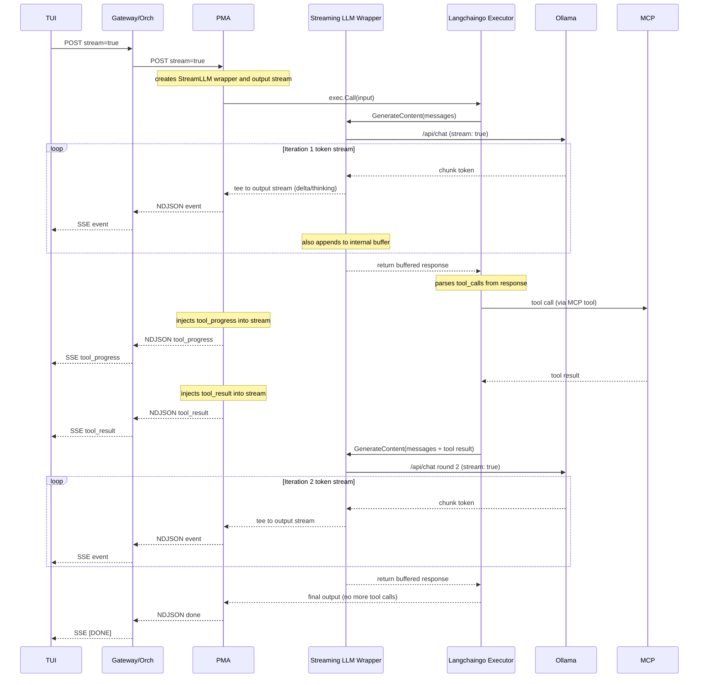

# CyNode PMA (`cynode-pma`)

- [Document Overview](#document-overview)
- [Purpose and Trust Boundary](#purpose-and-trust-boundary)
  - [Network and Routing Constraints (Normative)](#network-and-routing-constraints-normative)
- [Request Source and Orchestrator Handoff](#request-source-and-orchestrator-handoff)
  - [Handoff Transport (Normative)](#handoff-transport-normative)
  - [What is Handed off to `cynode-pma`](#what-is-handed-off-to-cynode-pma)
  - [What is Not Handed off to `cynode-pma`](#what-is-not-handed-off-to-cynode-pma)
  - [Process Boundaries and Workflow Runner](#process-boundaries-and-workflow-runner)
  - [Task Execution Handoff](#task-execution-handoff)
- [Role Modes](#role-modes)
- [Instructions Loading and Routing](#instructions-loading-and-routing)
  - [Role Separation Requirement](#role-separation-requirement)
  - [Default Layout (Required)](#default-layout-required)
- [LLM Context Composition](#llm-context-composition)
  - [LLM Context Composition Requirements Traces](#llm-context-composition-requirements-traces)
- [PMA Conversation History](#pma-conversation-history)
  - [Langchain-Capable Path](#langchain-capable-path)
  - [Executor Input](#executor-input)
- [Chat File Context](#chat-file-context)
  - [Chat File Context Requirements Traces](#chat-file-context-requirements-traces)
- [Chat Surface Mapping](#chat-surface-mapping)
  - [Responses-Surface Handoff](#responses-surface-handoff)
  - [Reference Contract](#reference-contract)
- [Thinking Content Separation](#thinking-content-separation)
  - [Thinking Content Separation Requirements Traces](#thinking-content-separation-requirements-traces)
- [Streaming Assistant Output](#streaming-assistant-output)
  - [Streaming LLM Wrapper Operation](#streaming-llm-wrapper-operation)
  - [Streaming Token State Machine Rule](#streaming-token-state-machine-rule)
  - [PMA Streaming NDJSON Format Type](#pma-streaming-ndjson-format-type)
  - [PMA Streaming Overwrite Operation](#pma-streaming-overwrite-operation)
  - [PMA Opportunistic Secret Scan Rule](#pma-opportunistic-secret-scan-rule)
  - [Streaming Assistant Output Requirements Traces](#streaming-assistant-output-requirements-traces)
- [Node-Local Inference Backend Environment](#node-local-inference-backend-environment)
  - [Node-Local Model Load and Keepalive](#node-local-model-load-and-keepalive)
  - [Node-Local Inference Backend Environment Requirements Traces](#node-local-inference-backend-environment-requirements-traces)
- [Policy and Tool Boundaries](#policy-and-tool-boundaries)
  - [See Also (PMA Overview)](#see-also-pma-overview)
- [MCP Tool Access](#mcp-tool-access)
  - [Role-Based Allowlists](#role-based-allowlists)
- [LLM via API Egress](#llm-via-api-egress)
  - [LLM via API Egress Requirements Traces](#llm-via-api-egress-requirements-traces)
- [PMA Informs Orchestrator When Online](#pma-informs-orchestrator-when-online)
  - [PMA Informs Orchestrator When Online Requirements Traces](#pma-informs-orchestrator-when-online-requirements-traces)
  - [Normative Behavior](#normative-behavior)
- [Skills and Default Skill](#skills-and-default-skill)
  - [Skills MCP Tools](#skills-mcp-tools)
- [Configuration Surface](#configuration-surface)
  - [Required Configuration Values](#required-configuration-values)
  - [Optional Configuration Values](#optional-configuration-values)
  - [Config Keys Alignment](#config-keys-alignment)

## Document Overview

- Spec ID: `CYNAI.PMAGNT.Doc.CyNodePma` 

This document defines the `cynode-pma` agent binary.
It is the concrete implementation artifact for:

- The Project Manager Agent (`project_manager` mode).
- The Project Analyst Agent (`project_analyst` mode).

This spec is implementation-oriented.
Behavioral responsibilities remain defined by:

- [`docs/tech_specs/project_manager_agent.md`](project_manager_agent.md)
- [`docs/tech_specs/project_analyst_agent.md`](project_analyst_agent.md)

## Purpose and Trust Boundary

`cynode-pma` is an orchestrator-owned agent runtime hosted as a **worker-managed service container**.
The orchestrator provisions **one PMA instance per session binding** (distinct `service_id` per instance on the worker); see [CYNAI.ORCHES.PmaInstancePerSessionBinding](orchestrator_bootstrap.md#spec-cynai-orches-pmainstancepersessionbinding).
**Project Analyst** work remains distinct: `project_analyst` mode is for **task-scoped** verification and analysis, not a substitute for a dedicated Project Manager instance per interactive or orchestrator-initiated session.
It is not a per-task sandbox container and it is not a worker agent.
It MUST NOT execute arbitrary code locally.
It delegates execution to worker nodes and sandbox containers through orchestrator-mediated mechanisms.

### Network and Routing Constraints (Normative)

- `cynode-pma` MUST NOT connect directly to orchestrator hostnames or ports.
  Agent-to-orchestrator communication (MCP tool calls and callbacks) MUST flow through the worker proxy.
  The worker exposes those proxy endpoints to PMA **only via UDS** (`http+unix://` or socket path); PMA MUST NOT receive TCP host:port for proxy or inference.
  See [Unified UDS Path](worker_node.md#spec-cynai-worker-unifiedudspath) and [`docs/tech_specs/worker_api.md`](worker_api.md#spec-cynai-worker-managedagentproxy).

## Request Source and Orchestrator Handoff

- Spec ID: `CYNAI.PMAGNT.RequestSource` 

`cynode-pma` receives all agent-responsibility work from the **orchestrator**; it MUST NOT be invoked directly by the gateway or by external clients.
The orchestrator routes to PMA whenever inference, planning, task refinement, job dispatch, or sub-agent coordination is needed, and performs sanitization, logging, and persistence at the boundary (e.g. per the [Chat completion routing path](openai_compatible_chat_api.md#spec-cynai-usrgwy-openaichatapi-routingpath) for chat).

### Handoff Transport (Normative)

- Orchestrator-to-PMA traffic MUST be worker-mediated (reverse proxy through the Worker API).
  The orchestrator MUST NOT rely on compose DNS or direct addressing to reach PMA.
  See [`docs/tech_specs/worker_api.md`](worker_api.md#spec-cynai-worker-managedagentproxy).

### What is Handed off to `cynode-pma`

The orchestrator MUST hand off to `cynode-pma` (in `project_manager` mode) at least the following.
In each case the orchestrator provides the necessary context (user, task, project, thread, etc.) and PMA performs the work, using MCP tools as needed and returning results or completions as appropriate.

- **Chat completion (user-facing).**
  When the **effective model identifier** for a chat request is exactly `cynodeai.pm`, the orchestrator sends the sanitized messages to PMA and expects the agent to return the completion.
  PMA may create or update tasks, call tools, and coordinate sub-agents in the process.
- **Planning and task refinement.**
  When the orchestrator has work that requires planning, task decomposition, or refinement of tasks/subtasks/acceptance criteria, it hands that work off to PMA.
  PMA plans, refines tasks (via MCP database tools), and updates state.
- **Job dispatch to worker nodes.**
  PMA issues jobs to worker nodes via MCP (e.g. `sandbox.*`, node selection, artifact handoff).
  The orchestrator routes those MCP calls; the decision of what to run, when, and on which node is PMA's.
  PMA is the single decision-maker for inference and sandbox job assignment in the MVP.
- **Spinning up analyst sub-agents.**
  When verification or focused analysis is needed for a task, PMA spawns or requests Project Analyst sub-agents (e.g. `cynode-pma` in `project_analyst` mode).
  The orchestrator facilitates spawning and hands off task-scoped verification work to the analyst; findings flow back via MCP and PMA applies them to task remediation.
- **Other inference-needed flows.**
  Any other flow where the orchestrator needs agent reasoning, tool use, or inference (e.g. **scheduled job interpretation**, run continuation, preference-driven decisions) MUST be routed to PMA rather than to a bare inference endpoint.
  When a fired schedule requires interpretation or planning, the orchestrator hands that work to PMA; the routing rule and payload semantics are defined in [Scheduled run routing to Project Manager Agent](orchestrator.md#spec-cynai-orches-scheduledrunrouting).

### What is Not Handed off to `cynode-pma`

- **Direct-inference chat.**
  When the client sends a `model` value other than `cynodeai.pm` (one of the inference model ids from `GET /v1/models`), the orchestrator MUST NOT invoke `cynode-pma` for that request.
  The orchestrator routes that request to direct inference (node-local or API Egress) and PMA does not receive it.
  All other handoff categories above still apply for other work.

See [`docs/tech_specs/openai_compatible_chat_api.md`](openai_compatible_chat_api.md) and [`docs/tech_specs/project_manager_agent.md`](project_manager_agent.md).

### Process Boundaries and Workflow Runner

**cynode-pma** (chat, MCP) and the **workflow runner** (LangGraph) are **separate processes**.
They share the MCP gateway and DB.
The orchestrator starts the workflow runner for a given task; chat and planning go to PMA; the workflow runner executes the graph and does not serve chat.
See [orchestrator.md](orchestrator.md) Workflow Engine section.

### Task Execution Handoff

- Spec ID: `CYNAI.PMAGNT.TaskExecutionHandoff` 

When the orchestrator sends a task for execution, PMA MUST accept it, kick off SBA to execute the task, and report back to the orchestrator that the task has been **started** (ack) before the orchestrator returns 201.

PMA MUST report task **completion** (and results) back to the orchestrator via MCP (or specified callback) after SBA has finished and PMA has aggregated the outcome.

Sequence: orchestrator sends task -> PMA -> SBA (execute) -> PMA receives SBA result -> PMA reports completion to orchestrator via MCP.

#### Task Execution Handoff Traces To

- [REQ-ORCHES-0122](../requirements/orches.md#req-orches-0122)

## Role Modes

- Spec ID: `CYNAI.PMAGNT.RoleModes` 

`cynode-pma` MUST support at least two role modes.

- `project_manager`
  - Drives task execution to completion.
  - Orchestrates sandbox work, model routing, and verification.
  - Spawns task-scoped analyst sub-agents when enabled.
- `project_analyst`
  - Performs task-scoped verification for a single task.
  - Records structured findings and remediation recommendations.

Role selection MUST be explicit at runtime.

- The implementation MUST support a command-line flag: `--role=project_manager` or `--role=project_analyst`.
  The implementation MAY also allow role to be set via config file or environment variable (e.g. `PMA_ROLE`).
- When more than one source is present, precedence MUST be: **command-line flag overrides config file, config file overrides environment variable.**
  The implementation MUST apply this order so that the effective role is deterministic.
- The runtime MUST be able to run multiple instances with different roles concurrently (each instance has a single effective role for its lifetime).

## Instructions Loading and Routing

- Spec ID: `CYNAI.PMAGNT.InstructionsLoading` 

The agent runtime MUST load an instructions bundle for the selected role.
The instructions bundle defines:

- Output and tool-use contracts.
- Role-specific responsibilities and non-goals.
- Required references to canonical requirements and tech specs.

### Role Separation Requirement

- `project_manager` and `project_analyst` MUST load distinct instruction bundles by default.
- `project_analyst` MUST NOT reuse the Project Manager instruction bundle by default.

### Default Layout (Required)

- The implementation MUST support a configurable instructions root directory and role-specific subpaths.
- The default layout MUST be: instructions root `instructions/`, Project Manager bundle `instructions/project_manager/`, Project Analyst bundle `instructions/project_analyst/`.
- The implementation MUST allow overriding the root and each role path via configuration (flag, config file, or environment variable).
  Paths MUST be deterministic and role-separated; the same role MUST always resolve to the same bundle path for a given configuration.

## LLM Context Composition

- Spec ID: `CYNAI.PMAGNT.LLMContextComposition` 

When building the system message or prompt content sent to an LLM, `cynode-pma` MUST compose context in this order:

1. **Baseline context** - Identity, role, responsibilities, and non-goals for the current role (`project_manager` or `project_analyst`).
   Sourced from the role's instructions bundle or a dedicated baseline document; MUST NOT be overridden by user preferences.
2. **Role instructions** - The remainder of the instructions bundle (output contracts, tool-use contracts, references to specs).
3. **Project-level context** - When the request has an associated `project_id` and the agent has access, include project identity (id, name, slug), scope, and relevant project metadata.
   Sourced from MCP project tools or orchestrator handoff.
4. **Task-level context** - When the request has an associated `task_id`, include task identity (id, name), acceptance criteria summary, status, and relevant task metadata.
   Sourced from MCP task tools or orchestrator handoff.
5. **User-configurable additional context** - Resolved from preferences using scope precedence (task > project > user > group > system).
   Keys: `agents.project_manager.additional_context` when role is `project_manager`, `agents.project_analyst.additional_context` when role is `project_analyst`.
   See [User preferences - Agent additional context](user_preferences.md#spec-cynai-stands-agentadditionalcontext).
6. **Request-specific messages** - Conversation turns, tool results, and other request-scoped content.

The implementation MUST resolve effective preferences for the current task/request context (including `user_id`, `project_id`, `task_id`, `group_ids`) and MUST include project-level and task-level context when available and the resolved additional context in every LLM request.

### LLM Context Composition Requirements Traces

- [REQ-AGENTS-0132](../requirements/agents.md#req-agents-0132)
- [REQ-AGENTS-0133](../requirements/agents.md#req-agents-0133)
- [REQ-AGENTS-0134](../requirements/agents.md#req-agents-0134)
- [REQ-PMAGNT-0108](../requirements/pmagnt.md#req-pmagnt-0108)

## PMA Conversation History

- Spec ID: `CYNAI.PMAGNT.ConversationHistory` 

For multi-turn chat, prior conversation turns MUST be preserved and included in context sent to the LLM so the agent can reference earlier user and assistant messages.

### Langchain-Capable Path

- When the agent uses a LangChain-capable pipeline (e.g. LangGraph or a chain that accepts message history), prior turns MUST be included in the composed context passed to the model.
- The system-context composition (baseline, role instructions, project/task context, preferences) MUST be sent as the system block or equivalent; prior user and assistant turns MUST be sent as conversation history in the prescribed order and MUST NOT be folded into the system block.

### Executor Input

- The final input to the executor (the prompt or message array used for the current inference step) MUST treat the **last user turn** as the current user message.
- The last user turn MUST NOT be merged into the system block; it MUST remain a distinct user message so that the model correctly attributes it and can respond to it.

## Chat File Context

- Spec ID: `CYNAI.PMAGNT.ChatFileContext` 

### Chat File Context Requirements Traces

- [REQ-PMAGNT-0115](../requirements/pmagnt.md#req-pmagnt-0115)

When PMA receives chat input that includes accepted user-file references or resolved file content, that file context is part of the user turn and MUST remain available to the model request builder.

- PMA MUST include accepted chat-file context in the LLM request in a representation supported by the selected model path.
- For text-capable files, PMA MAY inline extracted or normalized text content.
- For image or other multimodal files, PMA SHOULD use the provider-supported file or image part format when available.
- When the selected model path cannot support a given accepted file type, PMA SHOULD return a clear user-visible error rather than silently omitting the file.

## Chat Surface Mapping

- Spec ID: `CYNAI.PMAGNT.ChatSurfaceMapping` 

The OpenAI-compatible interactive chat surfaces exposed by the User API Gateway define a stable model id `cynodeai.pm`.
That external model id MUST map to `cynode-pma` running in `project_manager` mode for both `POST /v1/chat/completions` and `POST /v1/responses`.

This mapping is required so that:

- Open WebUI and cynork can select a stable id.
- The underlying inference model name can remain decoupled from the agent surface identity.

### Responses-Surface Handoff

- When the gateway normalizes a `POST /v1/responses` request for PMA handoff, any prior turns resolved from retained `previous_response_id` continuation state MUST be passed as conversation history in order.
- The current user input for that request MUST remain the newest user turn and MUST NOT be folded into the system block.

### Reference Contract

- [`docs/tech_specs/openai_compatible_chat_api.md`](openai_compatible_chat_api.md)

## Thinking Content Separation

- Spec ID: `CYNAI.PMAGNT.ThinkingContentSeparation` 

When `cynode-pma` receives backend output that mixes hidden reasoning with visible assistant text in the same raw payload, PMA MUST separate the two before returning the assistant turn upstream.

- Visible assistant text returned by PMA MUST exclude hidden reasoning content.
- If the backend emits literal wrappers such as `<think>...</think>`, PMA MUST treat those wrapped segments as hidden thinking content and MUST NOT pass the literal tags or wrapped text through as visible assistant text.
- When the PMA return path supports structured assistant-turn data, PMA SHOULD pass extracted hidden reasoning upstream as `thinking` data paired with visible `text` data in the original logical order.
- When the PMA return path does not support structured thinking data, PMA MUST still remove hidden reasoning from the visible assistant text instead of leaking it to the user-facing canonical plain-text path.
- PMA does not own transcript persistence.
  Any retained thinking that should survive history retrieval MUST be passed upstream in structured assistant-turn data for orchestrator or gateway persistence.

### Thinking Content Separation Requirements Traces

- [REQ-PMAGNT-0117](../requirements/pmagnt.md#req-pmagnt-0117)
- [REQ-USRGWY-0138](../requirements/usrgwy.md#req-usrgwy-0138)
- [REQ-USRGWY-0148](../requirements/usrgwy.md#req-usrgwy-0148)

## Streaming Assistant Output

- Spec ID: `CYNAI.PMAGNT.StreamingAssistantOutput` 

When `cynode-pma` is serving an interactive chat turn, the standard PMA chat path MUST support incremental assistant-output streaming upstream to the orchestrator or gateway instead of buffering all visible text until the full turn is complete.

- PMA MUST emit visible assistant text incrementally when the selected inference adapter exposes incremental output.
- PMA MUST keep hidden thinking or reasoning separate from visible text throughout the streaming path.
- PMA MUST NOT emit literal hidden-thinking wrappers such as `<think>...</think>` as visible text deltas.
- When structured progress is available, PMA SHOULD surface separate thinking or tool-progress updates instead of flattening that progress into visible assistant prose.
- If a selected inference adapter cannot provide true visible-text deltas, PMA SHOULD still emit bounded in-progress state plus a final reconciled assistant turn so the upstream interactive chat surface can degrade gracefully.

PMA achieves real-time streaming while retaining `langchaingo` as the agent orchestration layer by providing a custom `llms.Model` implementation (the streaming LLM wrapper) that tees Ollama tokens to both the output NDJSON stream and an internal buffer.
The wrapper uses a configurable streaming state machine to classify tokens in real time and route them to the correct NDJSON event type.
Between `langchaingo` iterations, PMA injects agent-side events (tool progress, tool results) into the same stream.
After each iteration, PMA runs an opportunistic secret scan on all accumulated content types and emits overwrite events if secrets are detected.

The following diagram shows the end-to-end streaming flow through all components for a multi-iteration agent turn:

The subsections below define the streaming LLM wrapper, state machine, NDJSON format, overwrite semantics, and opportunistic secret scanning.

### Streaming LLM Wrapper Operation

- Spec ID: `CYNAI.PMAGNT.StreamingLLMWrapper` 

The streaming LLM wrapper is a custom `llms.Model` implementation that provides `langchaingo` with a synchronous LLM interface while streaming tokens to the output NDJSON stream in real time.

- The wrapper opens a streaming HTTP connection to Ollama (`stream: true`) for each `GenerateContent` / `Call` invocation.
- Each arriving token is tee'd to two destinations simultaneously: the output NDJSON stream (for real-time relay to the orchestrator and TUI) and an internal `strings.Builder` buffer (for `langchaingo`'s synchronous consumption).
- Before each write to the output stream, the wrapper passes the token through the [streaming token state machine](#spec-cynai-pmagnt-streamingtokenstatemachine) to classify it as visible text, thinking content, or tool-call content and emit the correct NDJSON event type.
- When the Ollama response completes, the wrapper returns the full buffered content to `langchaingo` exactly as the current blocking path would, including any `tool_calls` data from the Ollama response.
- Ollama's `message.tool_calls` field contents go to the internal buffer (for `langchaingo` to parse) but are NOT emitted as visible-text deltas.
- The wrapper emits an `iteration_start` NDJSON event before each `langchaingo` agent iteration to signal iteration boundaries to downstream consumers.
- The wrapper propagates `context.Context` cancellation from the request to the Ollama HTTP connection, ensuring that TUI-initiated cancellation terminates the upstream LLM call.
- Secret-bearing buffer code paths inside the wrapper MUST run inside `runtime/secret` (`secret.Do`) when available, per REQ-STANDS-0133.
  The `Call()` / `GenerateContent()` method body is invoked synchronously by `langchaingo` and does not spawn goroutines, so wrapping it in `secret.Do` is permitted.
  When `runtime/secret` is not available, the wrapper MUST use best-effort secure erasure (zeroing the backing slice before dropping the reference), using the shared `runWithSecret` utility from `go_shared_libs/secretutil/` per [CYNAI.STANDS.SecretHandling](go_rest_api_standards.md#spec-cynai-stands-secrethandling).
- If the streaming Ollama connection fails, the wrapper MUST return an error to `langchaingo`; PMA SHOULD then fall back to the existing non-streaming `langchaingo` path and signal the orchestrator that the path is non-streaming (triggering heartbeat fallback at the gateway).

#### Streaming LLM Wrapper Traces To

- [REQ-PMAGNT-0118](../requirements/pmagnt.md#req-pmagnt-0118)
- [REQ-PMAGNT-0120](../requirements/pmagnt.md#req-pmagnt-0120)
- [REQ-PMAGNT-0126](../requirements/pmagnt.md#req-pmagnt-0126)

### Streaming Token State Machine Rule

- Spec ID: `CYNAI.PMAGNT.StreamingTokenStateMachine` 

The streaming token state machine classifies arriving tokens in real time as they pass through the streaming LLM wrapper.
It routes each token to the correct NDJSON event type based on the current state.

The state machine has five states:

- **Normal:** tokens are emitted to the output stream as `delta` (visible text) NDJSON events.
- **Potential-tag:** when a `<` character arrives, the state machine buffers subsequent tokens until it can determine whether a recognized tag is forming.
  Nothing is emitted to the output stream during this ambiguous window.
- **Thinking:** tokens between `<think>` and `</think>` are emitted as `thinking` NDJSON events carrying the full thinking content, not suppressed or summarized.
- **Tool-call:** tokens between tool-call markers are suppressed from the visible-text stream and emitted as `tool_call` NDJSON events.
- **Tag-rejected:** if buffered tokens in potential-tag state do not form a recognized tag, they are flushed to the visible-text stream as a batch of `delta` events.

The recognized tag set MUST be configurable (defaulting to `<think>`/`</think>` and tool-call markers such as `<tool_call>`/`</tool_call>` and JSON function-call blocks) so that new model-specific tags can be added without code changes.

Edge cases the state machine MUST handle:

- Tags split across multiple tokens (e.g., `<thi` then `nk>`).
- Nested or malformed tags (treated as unrecognized; flushed to visible text).
- Unterminated `<think>` at end of stream (drop the partial tag content from visible text).
- Tool-call format variation across models (XML-style tags, JSON function-call blocks); the configurable tag set accommodates both.
- The state machine operates only on the character stream, not on JSON structure, so it is model-agnostic.

When a partial tag has already leaked to the visible-text stream (e.g., an edge case not caught by potential-tag buffering), the [overwrite mechanism](#spec-cynai-pmagnt-pmastreamingoverwrite) corrects the visible text retroactively.

#### Streaming Token State Machine Traces To

- [REQ-PMAGNT-0121](../requirements/pmagnt.md#req-pmagnt-0121)

### PMA Streaming NDJSON Format Type

- Spec ID: `CYNAI.PMAGNT.PMAStreamingNDJSONFormat` 

The PMA streaming output uses NDJSON (newline-delimited JSON).
The struct definitions for these event types MUST be imported from `go_shared_libs/contracts/userapi/` (see [CYNAI.ORCHES.SharedStreamingContractTypes](orchestrator.md#spec-cynai-orches-sharedstreamingcontracttypes)) so PMA and the orchestrator use identical wire-format types.

The event types are:

- `{"delta": "..."}`: visible text tokens classified as normal content by the state machine.
- `{"thinking": "..."}`: thinking/reasoning tokens (full content relayed, not suppressed).
- `{"iteration_start": N}`: iteration boundary marker emitted before each `langchaingo` agent iteration, where N is the 1-based iteration number.
- `{"tool_call": {"name": "...", "arguments": "..."}}`: tool-call content detected by the state machine, suppressed from the visible-text stream.
- `{"tool_progress": {"state": "calling"|"waiting"|"result", "tool": "...", "preview": "..."}}`: tool activity injected between `langchaingo` iterations around MCP tool calls.
- `{"overwrite": {"content": "...", "reason": "...", "scope": "iteration"|"turn", "iteration": N}}`: retroactive replacement of accumulated content; see [PMA Streaming Overwrite](#spec-cynai-pmagnt-pmastreamingoverwrite).
- `{"done": true}`: stream termination signal.

All events in the stream maintain a single ordered timeline.
The orchestrator maps these events to per-endpoint SSE events; see [CYNAI.USRGWY.OpenAIChatApi.StreamingPerEndpointSSEFormat](openai_compatible_chat_api.md#spec-cynai-usrgwy-openaichatapi-streamingperendpointsseformat).

A multi-iteration agent turn produces the following event sequence:

- `iteration_start(1)` => `thinking` events => `delta` events => (optional `overwrite` targeting iteration 1).
- Injected: `tool_progress` (calling) => `tool_progress` (result).
- `iteration_start(2)` => `thinking` events => `delta` events => (optional `overwrite` targeting iteration 2).
- Injected: `tool_progress` (calling) => `tool_progress` (result) (if more tools).
- `iteration_start(N)` (final) => `thinking` events => `delta` events => `done`.

The `tool_progress` events are injected by wrapping the existing `MCPTool.Call()` implementation: PMA emits a `tool_progress` event with state `"calling"` before the MCP call and a `tool_progress` event with state `"result"` (and a truncated preview of the result) after the MCP call returns.
These injected events are interleaved with LLM token events in the same NDJSON stream, maintaining a single ordered timeline for the TUI.

#### PMA Streaming NDJSON Format Traces To

- [REQ-PMAGNT-0120](../requirements/pmagnt.md#req-pmagnt-0120)
- [REQ-PMAGNT-0122](../requirements/pmagnt.md#req-pmagnt-0122)
- [REQ-PMAGNT-0123](../requirements/pmagnt.md#req-pmagnt-0123)

### PMA Streaming Overwrite Operation

- Spec ID: `CYNAI.PMAGNT.PMAStreamingOverwrite` 

The PMA NDJSON stream supports retroactive replacement of previously-sent content through overwrite events.
Overwrite events exist at the PMA NDJSON level (not only at the gateway SSE level) because the PMA is the first component to detect leaked tokens, partial tags, and early secret patterns.

Overwrite events support two scopes:

- **Per-iteration** (`"scope": "iteration"`): replaces the visible text accumulated within the specified iteration only, identified by the `"iteration"` field matching an earlier `iteration_start` event.
  This is the default scope, used for think-tag leakage correction, tool-call marker leakage, and per-iteration secret detection.
  The overwrite payload carries only the corrected text for the targeted iteration, keeping payloads small.
- **Per-turn** (`"scope": "turn"`): replaces the entire visible text accumulated across all iterations for the current assistant turn.
  Used when `langchaingo`'s post-processing modifies the final output (e.g., `looksLikeUnexecutedToolCall` fallback rewrites the response) or when a secret spans iteration boundaries.
  The `"iteration"` field is omitted for turn-scoped overwrites.

Overwrite reasons include: `"think_tag_leaked"`, `"tool_call_leaked"`, `"secret_redaction"` (with optional `"kinds"` array), and `"agent_correction"`.

The orchestrator relays overwrite events as `cynodeai.amendment` SSE events and updates its own accumulators to match.
The TUI handles per-iteration overwrites by replacing only the targeted iteration's segment in its `streamBuf`, and per-turn overwrites by replacing the entire `streamBuf`.

#### PMA Streaming Overwrite Traces To

- [REQ-PMAGNT-0124](../requirements/pmagnt.md#req-pmagnt-0124)

### PMA Opportunistic Secret Scan Rule

- Spec ID: `CYNAI.PMAGNT.PMAOpportunisticSecretScan` 

After each `langchaingo` iteration completes (after the streaming LLM wrapper returns the buffered response), PMA runs an opportunistic secret scan on all accumulated content types: visible text, thinking content, and tool-call content.

- If the scan detects secrets in any content type, PMA emits a per-iteration overwrite event (`"scope": "iteration"`, `"reason": "secret_redaction"`) carrying the redacted content for the affected iteration.
- PMA-level secret detection is best-effort: it catches obvious patterns (e.g., `sk-` prefix, `Bearer` tokens) early and reduces the window of leaked-token visibility for the user.
- The gateway's post-stream secret scan remains the authoritative guarantee; PMA's scan is an optimization that reduces latency between token emission and redaction.
- The scan runs inside a `secret.Do` block (or best-effort fallback) per REQ-STANDS-0133 because the accumulators being scanned are secret-bearing.

#### PMA Opportunistic Secret Scan Traces To

- [REQ-PMAGNT-0125](../requirements/pmagnt.md#req-pmagnt-0125)
- [REQ-PMAGNT-0126](../requirements/pmagnt.md#req-pmagnt-0126)

### Streaming Assistant Output Requirements Traces

- [REQ-PMAGNT-0118](../requirements/pmagnt.md#req-pmagnt-0118)
- [REQ-PMAGNT-0120](../requirements/pmagnt.md#req-pmagnt-0120)
- [REQ-PMAGNT-0121](../requirements/pmagnt.md#req-pmagnt-0121)
- [REQ-PMAGNT-0122](../requirements/pmagnt.md#req-pmagnt-0122)
- [REQ-PMAGNT-0123](../requirements/pmagnt.md#req-pmagnt-0123)
- [REQ-PMAGNT-0124](../requirements/pmagnt.md#req-pmagnt-0124)
- [REQ-PMAGNT-0125](../requirements/pmagnt.md#req-pmagnt-0125)
- [REQ-PMAGNT-0126](../requirements/pmagnt.md#req-pmagnt-0126)
- [REQ-USRGWY-0149](../requirements/usrgwy.md#req-usrgwy-0149)

## Node-Local Inference Backend Environment

- Spec ID: `CYNAI.PMAGNT.NodeLocalInferenceEnv` 

When `cynode-pma` uses node-local inference through the worker-managed service contract, it MUST consume orchestrator-directed backend environment values that affect runner behavior or effective context size when those values are supplied in the managed-service inference configuration.

- Backend-derived values supplied through the managed-service inference configuration MUST be treated as authoritative runtime inputs for PMA's node-local inference path.
- PMA MUST treat those values as the orchestrator's selected effective runtime settings for the node-local backend, including context-window sizing selected to maximize the safe usable context window for the expected workload on that node.
- PMA MUST apply supported values such as `OLLAMA_NUM_CTX` to the corresponding per-request or per-runner inference options rather than ignoring them.
- When an orchestrator-directed backend environment value is not supported by the selected local inference adapter, PMA SHOULD log a bounded operator-visible warning and MUST continue using only the supported subset.
- PMA MUST NOT require direct access to worker host environment variables when the managed-service inference contract already supplies the needed backend-derived values.

### Node-Local Model Load and Keepalive

- Spec ID: `CYNAI.PMAGNT.NodeLocalModelLoadAndKeepalive` 

When PMA uses **node-local** inference (the default integration is **Ollama** behind the worker's inference proxy per [Node-Local Inference and Sandbox Workflow](worker_node.md#spec-cynai-worker-nodelocalinference)), PMA MUST:

- **Load:** On instance startup (or when the effective local model name changes), call the inference backend so the **effective Project Manager model** is **loaded** into memory (for Ollama, typically via a minimal generate/chat request or the backend's documented load behavior).
- **Keep warm:** For the **entire lifetime** of that PMA instance, **periodically** invoke the inference backend so the model **remains resident**, using minimal work (short prompt, low `num_predict`, or backend-specific keep-warm operation) compatible with the adapter.

**Default keep-warm interval:** **300 seconds** (5 minutes) between keep-warm calls unless overridden by configuration (see [Configuration Surface](#configuration-surface)); product policy MAY tighten or loosen this default.

The PMA process MUST stop keep-warm activity when the instance is shutting down.

### Node-Local Inference Backend Environment Requirements Traces

- [REQ-PMAGNT-0116](../requirements/pmagnt.md#req-pmagnt-0116)
- [REQ-PMAGNT-0129](../requirements/pmagnt.md#req-pmagnt-0129)

## Policy and Tool Boundaries

- Spec ID: `CYNAI.PMAGNT.PolicyAndTools` 

`cynode-pma` MUST comply with the Project Manager and Project Analyst tool access rules.
In particular:

- All PostgreSQL access MUST occur through MCP tools (for example `preference.*` and `task.*` per the [tool catalog](mcp_tools/README.md)); agent-facing names MUST NOT use `db.*` prefixes per [MCP Tooling](mcp/mcp_tooling.md).
- External provider calls MUST be routed through API Egress.
- Provider credentials MUST NOT be stored in the agent runtime.

### See Also (PMA Overview)

- [`docs/requirements/agents.md`](../requirements/agents.md)
- [`docs/tech_specs/mcp/mcp_tooling.md`](mcp/mcp_tooling.md)

## MCP Tool Access

- Spec ID: `CYNAI.PMAGNT.McpToolAccess` 

The **orchestrator MCP gateway** is the logical enforcement and audit point for tool calls.
In default deployments, the HTTP handler for those calls is implemented on the **orchestrator control-plane** process (see [Ports and Endpoints](ports_and_endpoints.md)).
A **standalone** gateway listener on port **12083** is **deprecated**; it is not a supported path for new work.

`cynode-pma` MUST invoke all tool operations through the orchestrator MCP gateway.
In this model, it does so via a worker-proxy URL (UDS-only, per [Unified UDS Path](worker_node.md#spec-cynai-worker-unifiedudspath)) that forwards to the orchestrator MCP gateway.
`cynode-pma` MUST NOT call orchestrator endpoints directly; the worker proxy is the single egress from the agent container.
The gateway remains the single enforcement and audit point at the orchestrator.
When making MCP requests, `cynode-pma` calls the **worker proxy** (e.g. the URL in `mcp_gateway_proxy_url`); `cynode-pma` MUST NOT receive or present an agent token.
The **worker proxy** holds **PMA MCP credentials** issued by the orchestrator **per authenticated user session** (delivered to the worker in node configuration) and attaches the credential that matches the **active session binding** and **invocation class** (interactive User API Gateway session vs orchestrator-initiated work such as schedules or task handoff) when forwarding requests to the orchestrator MCP gateway.
See [Agent-Scoped Tokens or API Keys](mcp/mcp_gateway_enforcement.md#spec-cynai-mcpgat-agentscopedtokens), [PMA Per-User Session Tokens and Rotation](mcp/mcp_gateway_enforcement.md#spec-cynai-mcpgat-pmasessiontokens), and [PMA Invocation Class](mcp/mcp_gateway_enforcement.md#spec-cynai-mcpgat-pmainvocationclass).
The gateway authenticates the credential, resolves **user identity** and **invocation class** from it, rejects cross-user tool scope, and restricts tool access to the allowlist and per-tool scope for the PM agent type.
The gateway restricts PM/PA to tools that have **PM scope** (or **both**) in the orchestrator's per-tool scope; see [Per-tool scope: Sandbox vs PM](mcp_tools/access_allowlists_and_scope.md#spec-cynai-mcpgat-pertoolscope).
Tools that are sandbox-only MUST NOT be invokable by `cynode-pma`.

### Role-Based Allowlists

- When running as **project_manager**, `cynode-pma` MUST invoke only tools permitted by the [Project Manager Agent allowlist](mcp_tools/access_allowlists_and_scope.md#spec-cynai-mcpgat-pmagentallowlist).
  The canonical namespace list (including `preference.*`, `task.*`, `sandbox.*`, and `help.*`) lives in that section; it MUST stay aligned with [MCP Tooling](mcp/mcp_tooling.md) agent-facing names (no `db.*` prefixes).
- When running as **project_analyst**, `cynode-pma` MUST invoke only tools permitted by the [Project Analyst Agent allowlist](mcp_tools/access_allowlists_and_scope.md#spec-cynai-mcpgat-paagentallowlist).
  The canonical list lives in that section and MUST stay aligned with agent-facing tool naming.

Admin-configurable per-tool enable/disable and access control rules further restrict which tools succeed; the agent MUST treat gateway rejections as hard failures.

#### See Also

- [`docs/tech_specs/mcp/mcp_gateway_enforcement.md`](mcp/mcp_gateway_enforcement.md)
- [`docs/tech_specs/mcp_tools/`](mcp_tools/README.md)

## LLM via API Egress

- Spec ID: `CYNAI.PMAGNT.LLMViaApiEgress` 

When the orchestrator provides an LLM API key (or equivalent credential) for the Project Manager Agent via the API Egress Server (e.g. configured external provider and key for PMA inference), `cynode-pma` MUST be able to use that provider for inference.
PMA MUST route such inference requests through the API Egress Server so credentials are not exposed to the agent process.
See [`docs/tech_specs/api_egress_server.md`](api_egress_server.md) and [`docs/tech_specs/external_model_routing.md`](external_model_routing.md).

### LLM via API Egress Requirements Traces

- [REQ-PMAGNT-0109](../requirements/pmagnt.md#req-pmagnt-0109)

## PMA Informs Orchestrator When Online

- Spec ID: `CYNAI.PMAGNT.PmaInformsOrchestratorOnline` 

`cynode-pma` MUST expose a health endpoint so the worker can determine readiness.
The orchestrator MUST learn that PMA is online via worker-reported managed service status (and endpoints), not by probing a PMA listen address directly.

### PMA Informs Orchestrator When Online Requirements Traces

- [REQ-PMAGNT-0110](../requirements/pmagnt.md#req-pmagnt-0110)
- [REQ-ORCHES-0151](../requirements/orches.md#req-orches-0151)

### Normative Behavior

- `cynode-pma` MUST expose `GET /healthz` that returns HTTP 200 when the agent is online.
- The worker MUST health check PMA per its managed service health contract and report `state=ready` and endpoint(s) to the orchestrator.
  See [`docs/tech_specs/worker_node_payloads.md`](worker_node_payloads.md) `managed_services_status`.
- The orchestrator MUST use the worker-reported status and endpoint(s) to determine readiness.

## Skills and Default Skill

- Spec ID: `CYNAI.PMAGNT.SkillsAndDefaultSkill` 

When the inference backend used by `cynode-pma` supports **skills**, the system MUST supply the **default CyNodeAI interaction skill** to each inference request so the agent has consistent guidance on MCP tools, gateway usage, and conventions.
See [Default CyNodeAI Interaction Skill](skills_storage_and_inference.md#spec-cynai-skills-defaultcynodeaiskill) and [REQ-SKILLS-0116](../requirements/skills.md#req-skills-0116).

### Skills MCP Tools

- When the gateway allowlist and access control permit, `cynode-pma` MAY use the MCP skills tools `skills.create`, `skills.list`, `skills.get`, `skills.update`, and `skills.delete`.
  Permission is determined by the role allowlist in [access_allowlists_and_scope.md](mcp_tools/access_allowlists_and_scope.md) and per-tool access control; the implementation MUST NOT invoke a skills tool if the gateway rejects the call.
- Authoritative **`skills.*`** tool contracts and gateway rules are in [Skills MCP Tools](mcp_tools/skills_tools.md); backend merge and store semantics are in [Skills storage and inference](skills_storage_and_inference.md).
- All skill tool invocations are audited and subject to the same scope and malicious-pattern checks as web and CLI.

#### See Also (Skills Tools)

- [`docs/tech_specs/skills_storage_and_inference.md`](skills_storage_and_inference.md)
- [Skills tools](mcp_tools/skills_tools.md)

## Configuration Surface

This section defines the minimum configuration surface for `cynode-pma`.

### Required Configuration Values

- Role mode selection (command-line flag; override via config file or environment when supported).
- Instructions bundle root and role-specific bundle paths (configurable; defaults as in [Instructions Loading and Routing](#instructions-loading-and-routing)).
- Inference connectivity configuration (how PMA obtains inference and connection details), supplied by the orchestrator in the PMA managed service start bundle.
- Worker-proxy endpoints for agent-to-orchestrator communication (UDS-only; see [Unified UDS Path](worker_node.md#spec-cynai-worker-unifiedudspath)):
  - Worker-proxy URL for MCP gateway calls.
  - Worker-proxy URL for any required callback/ready signaling.

### Optional Configuration Values

- **Node-local keep-warm interval** (seconds) for periodic inference-backend calls under [Node-Local Model Load and Keepalive](#node-local-model-load-and-keepalive); default **300** when unset.
- Feature toggles for spawning analyst sub-agents.
- Concurrency limits for analyst sub-agents.

### Config Keys Alignment

- When `cynode-pma` is run in `project_manager` role, the preference keys defined for the Project Manager in [`user_preferences.md`](user_preferences.md) and [`external_model_routing.md`](external_model_routing.md) apply (including `agents.project_manager.model_routing.prefer_local`, `agents.project_manager.model_routing.allowed_external_providers`, `agents.project_manager.model_routing.fallback_provider_order`).
- When `cynode-pma` is run in `project_analyst` role, the preference keys defined for the Project Analyst in those same specs apply (including `agents.project_analyst.model_routing.*`).
  The implementation MUST NOT apply Project Manager preference keys to an instance running as Project Analyst, and vice versa.
