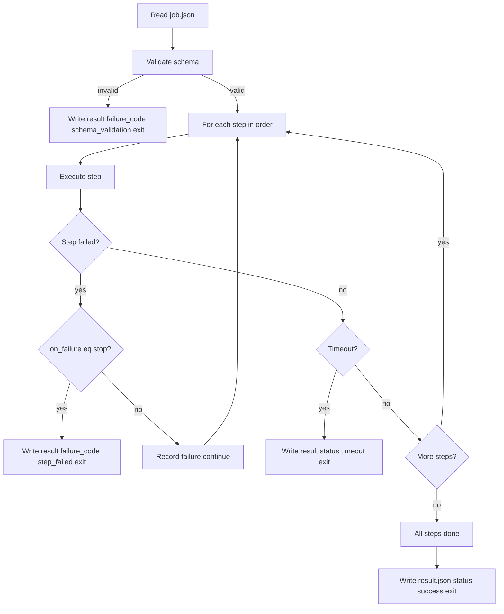

# CyNode Simple Step Executor (`cynode-sse`)

- [Document Overview](#document-overview)
- [Purpose](#purpose)
- [Design Principles](#design-principles)
- [Relation to SBA](#relation-to-sba)
- [Job Specification](#job-specification)
  - [Traces to Requirements](#traces-to-requirements)
- [Step Types](#step-types)
- [Execution Model](#execution-model)
  - [Execution Model Requirements Traces](#execution-model-requirements-traces)
- [Result Contract](#result-contract)
  - [Canonical Failure Codes](#canonical-failure-codes)
  - [Result Contract Requirements Traces](#result-contract-requirements-traces)
- [Worker API Integration](#worker-api-integration)
  - [Worker API Lifecycle](#worker-api-lifecycle)
  - [See Also (Step Executor Overview)](#see-also-step-executor-overview)
  - [Worker API Integration Requirements Traces](#worker-api-integration-requirements-traces)
- [No Inference or MCP in Loop](#no-inference-or-mcp-in-loop)
- [Sandbox Boundary](#sandbox-boundary)
  - [Sandbox Boundary Requirements Traces](#sandbox-boundary-requirements-traces)
  - [See Also (Constraints and References)](#see-also-constraints-and-references)
- [Protocol Versioning](#protocol-versioning)
  - [Protocol Versioning Requirements Traces](#protocol-versioning-requirements-traces)

## Document Overview

- Spec ID: `CYNAI.STEPEX.Doc.CyNodeStepExecutor` <a id="spec-cynai-stepex-doc-cynodestepexecutor"></a>
- Traces To: [REQ-STEPEX-0001](../requirements/stepex.md#req-stepex-0001)

This document defines the simple step-by-step executor runner binary (referred to here as `cynode-sse`, CyNode Simple Step Executor).
It runs inside a sandbox container and executes a **predefined ordered list of steps** with no LLM, no agent loop, and no MCP tool calls during execution.
It is **separate and distinct** from the SandBox Agent (`cynode-sba`), which is langchaingo-centric and uses inference and tools.

This spec aligns with:

- [`docs/tech_specs/sandbox_container.md`](sandbox_container.md)
- [`docs/tech_specs/worker_api.md`](worker_api.md)
- [`docs/tech_specs/cynode_sba.md`](cynode_sba.md) (step type semantics and result/failure-code alignment only; no inference or agent behavior).

## Purpose

The step executor runs a validated job whose `steps` array defines the exact sequence of operations to perform.
It does not decide what to do next; it executes step 1, then step 2, and so on until done or a step fails (or timeout).
It is intended for simple, deterministic jobs (e.g. run these commands, write these files, apply this diff) where no AI planning or tool use is required.

## Design Principles

- Small attack surface: no inference stack, no MCP in the execution loop.
- Strict schema adherence: unknown job fields rejected; validation before any step runs.
- Sequential execution only: no branching except optional per-step `on_failure` (stop vs continue).
- Same filesystem and security baseline as the sandbox container spec: non-root, `/workspace`, `/job/`, `/tmp`; egress only via worker proxies when policy allows (all proxy endpoints are UDS-only per [Unified UDS Path](worker_node.md#spec-cynai-worker-unifiedudspath)).
- Structured, machine-parseable results compatible with orchestrator storage (e.g. `jobs.result`).

## Relation to SBA

- **Aspect:** Decision loop
  - sba (`cynode-sba`): LLM-driven (langchaingo); decides next step/tool
  - step executor (`cynode-sse`): None; strictly sequential step list
- **Aspect:** Inference
  - sba (`cynode-sba`): Required (worker proxy or API Egress)
  - step executor (`cynode-sse`): Not used
- **Aspect:** Todo list
  - sba (`cynode-sba`): Built and updated from job context
  - step executor (`cynode-sse`): Not applicable
- **Aspect:** Step source
  - sba (`cynode-sba`): Job may include optional `steps` as recommended to-dos; agent decides what to do
  - step executor (`cynode-sse`): Job MUST include non-empty `steps` array; executor runs them exactly in order
- **Aspect:** MCP in loop
  - sba (`cynode-sba`): Yes (sandbox allowlist tools)
  - step executor (`cynode-sse`): No (optional artifact staging only)
- **Aspect:** Context
  - sba (`cynode-sba`): Rich (baseline, project, task, requirements, preferences, skills)
  - step executor (`cynode-sse`): Minimal (job_id, task_id, constraints, steps)
- **Aspect:** Implementation
  - sba (`cynode-sba`): Go + langchaingo
  - step executor (`cynode-sse`): Go or any; no LLM stack

## Job Specification

- Spec ID: `CYNAI.STEPEX.SchemaValidation` <a id="spec-cynai-stepex-schemavalidation"></a>

### Traces to Requirements

- [REQ-STEPEX-0101](../requirements/stepex.md#req-stepex-0101)

The job is a JSON object.
Unknown fields MUST be rejected.
Validation MUST occur before any step execution.

Minimum required fields

- `protocol_version`, `job_id`, `task_id`, `constraints`, `steps`.
- `steps` is **required** and MUST be non-empty for step-executor jobs.
  The step executor MUST validate this (e.g. using `ValidateStepExecutorJobSpec` in the shared sbajob contract) and MUST fail closed if `steps` is missing or empty.
  The `steps` array defines the **exact ordered sequence** of operations to perform; the step executor executes them strictly in array index order, with no inference or agent loop.
- Within `constraints`: `max_runtime_seconds` and `max_output_bytes` are required for timeout and output caps.
- No `inference` or `context` object is required; the step executor does not use them.
  The job MUST NOT require inference or MCP tool calls for execution.

Optional in `constraints`

- `ext_net_allowed` (default false): when `true`, the job is permitted to use external network access via worker proxies (e.g. for `run_command` steps that perform package installs).
  See [Sandbox Boundary](#sandbox-boundary).

Example minimal job shape

```json
{
  "protocol_version": "1.0",
  "job_id": "uuid",
  "task_id": "uuid",
  "constraints": {
    "max_runtime_seconds": 300,
    "max_output_bytes": 1048576,
    "ext_net_allowed": false
  },
  "steps": [
    { "type": "run_command", "args": ["echo", "hello"] },
    { "type": "write_file", "path": "out.txt", "content": "done" }
  ]
}
```

## Step Types

- Spec ID: `CYNAI.STEPEX.StepTypes` <a id="spec-cynai-stepex-steptypes"></a>

The step executor reuses the same **primitive step types** as the SBA for consistency.
Semantics (working directory, path rules, non-root, full `/workspace` access) are as defined in [cynode_sba.md - Local Tools (MVP)](cynode_sba.md#spec-cynai-sbagnt-enforcement).

- `run_command` - Runs a command (argv form).
  Working directory under `/workspace` or as specified in the step.
- `write_file` - Writes a file under `/workspace`.
  Rejects symlink escape outside workspace.
- `read_file` - Reads a file under `/workspace` with a hard size cap from `constraints.max_output_bytes` or step-level cap.
- `apply_unified_diff` - Applies a unified diff relative to the workspace root.
  Rejects patches that would write outside `/workspace`.
- `list_tree` - Returns a structured tree representation for paths under `/workspace`.

Execution order is the **array order** of `steps`.
Each step object MAY include an optional `on_failure` field: `stop` (default) or `continue`.
When a step fails and `on_failure` is `stop`, the executor MUST stop and report failure.
When `on_failure` is `continue`, the executor MUST record the step failure and proceed to the next step; overall job status is still failure if any step failed.

## Execution Model

- Spec ID: `CYNAI.STEPEX.ExecutionModel` <a id="spec-cynai-stepex-executionmodel"></a>

The step executor runs as the main process inside a sandbox container.

1. Read job input from the agreed location (e.g. `/job/job.json` or stdin).
2. Validate the job schema; if invalid, write a result with `status: "failure"` and `failure_code: "schema_validation"` and exit.
3. Execute steps in order.
   For each step:
   - Run the step (run_command, write_file, read_file, apply_unified_diff, or list_tree).
   - If the step fails and `on_failure` is `stop`, write the result (status failure, step results up to and including the failed step), set `failure_code` (e.g. `step_failed`), and exit.
   - If the step fails and `on_failure` is `continue`, record the failure and proceed to the next step.
   - If the job timeout is reached, write the result with `status: "timeout"` and `failure_code: "timeout"` and exit.
4. When all steps have been executed (with or without continue-on-failure), write the result to the agreed location (e.g. `/job/result.json` or stdout) and exit.

No branching is performed except the optional skip-on-failure behavior above.
Working directory per step is under `/workspace` as in the SBA spec.

Execution flow (Mermaid)



### Execution Model Requirements Traces

- [REQ-STEPEX-0001](../requirements/stepex.md#req-stepex-0001)
- [REQ-STEPEX-0102](../requirements/stepex.md#req-stepex-0102)

## Result Contract

- Spec ID: `CYNAI.STEPEX.ResultContract` <a id="spec-cynai-stepex-resultcontract"></a>

The step executor MUST emit a structured result object.
The result MUST be complete JSON even on failure.
The shape is a subset of the SBA result contract so the orchestrator can store it in `jobs.result` consistently.

Minimum result shape

```json
{
  "protocol_version": "1.0",
  "job_id": "uuid",
  "status": "success | failure | timeout",
  "steps": [],
  "failure_code": null,
  "failure_message": null
}
```

- `steps`: array of step outcome objects (e.g. step index, type, status, output or error).
- On failure, the executor MUST set `failure_code` and MAY set `failure_message`.
- The executor MAY include an empty `artifacts` array for compatibility with SBA result consumers; artifact staging under `/job/artifacts/` is optional and node-mediated only (no MCP upload in loop).

### Canonical Failure Codes

- Spec ID: `CYNAI.STEPEX.FailureCodes` <a id="spec-cynai-stepex-failurecodes"></a>

The step executor MUST set `failure_code` to one of the following when applicable (aligned with [cynode_sba.md - Canonical Failure Codes](cynode_sba.md#spec-cynai-sbagnt-failurecodes)):

- **`schema_validation`** - Job spec failed validation (unknown fields, missing required fields, invalid values).
  Validation MUST occur before any step runs.
- **`ext_net_required`** - Failure due to lack of external network access when required (e.g. a `run_command` step needed network and it was not allowed or was denied).
- **`step_failed`** - One or more steps failed during execution (non-zero exit, exception, or step-level error).
- **`timeout`** - Job or step exceeded allowed runtime.
  May coincide with `status: "timeout"`.
- **`constraint_violation`** - A job constraint was exceeded (e.g. `max_output_bytes` exceeded).

For other failure categories the implementation MAY use an implementation-defined code (documented and stable).
`failure_message` (optional) is a human-readable explanation for the failure.

### Result Contract Requirements Traces

- [REQ-STEPEX-0103](../requirements/stepex.md#req-stepex-0103)

## Worker API Integration

- Spec ID: `CYNAI.STEPEX.WorkerApiIntegration` <a id="spec-cynai-stepex-workerapiintegration"></a>

The orchestrator dispatches jobs to the node via the [Worker API](worker_api.md) (e.g. `POST /v1/worker/jobs:run`).
When the job uses an **image that runs the step-executor binary** as the main process (step-executor runner image), the node starts the container; the step executor reads the job spec from the agreed location (e.g. `/job/job.json`), executes the steps in order, and writes the [Result contract](#result-contract) (e.g. `/job/result.json`).

- The Worker API request carries `task_id`, `job_id`, and sandbox config (image, command, env, timeout).
- For step-executor-runner jobs, the job spec consumed by the step executor MUST include `job_id` and `task_id` and MUST be produced or validated by the orchestrator so that result storage and auditing can correlate with the Worker API response.
- When the job uses a step-executor runner image and the implementation uses the synchronous Run Job response, the node MAY read `/job/result.json` (and optionally `/job/artifacts/`) after the container exits and include the step-executor result in the response (e.g. a `step_executor_result` field or a generic runner result field), so the orchestrator can persist it to `jobs.result`.
  The exact response field name and shape are defined in [Worker API - Run Job](worker_api.md#spec-cynai-worker-workerapirunjobsync-v1) or a follow-on amendment; the step-executor result contract is the same as defined in this spec.

### Worker API Lifecycle

- The step executor MAY signal in-progress after validation (e.g. by writing a status file under `/job/` or by an outbound call if the node supports it).
  For MVP, if the node uses node-mediated delivery (blocking wait for container exit, then read `/job/result.json`), no outbound callback from the step executor is required.
- On completion (success, failure, or timeout), the step executor MUST write the result to the agreed location (e.g. `/job/result.json`).

### See Also (Step Executor Overview)

- [`docs/tech_specs/worker_api.md`](worker_api.md)
- [`docs/tech_specs/worker_api.md` - Job Lifecycle and Result Persistence](worker_api.md#spec-cynai-worker-joblifecycleresultpersistence)

### Worker API Integration Requirements Traces

- [REQ-STEPEX-0104](../requirements/stepex.md#req-stepex-0104)

## No Inference or MCP in Loop

- Spec ID: `CYNAI.STEPEX.NoInferenceOrMcp` <a id="spec-cynai-stepex-noinferenceormcp"></a>

The step executor MUST NOT call any LLM or inference API during step execution.
The step executor MUST NOT invoke MCP tools during step execution.
Optional: the step executor MAY allow artifact staging under `/job/artifacts/` so the node can deliver artifact files to the orchestrator after the container exits (node-mediated only; no MCP `artifact.put` in the loop).

## Sandbox Boundary

- Spec ID: `CYNAI.STEPEX.SandboxBoundary` <a id="spec-cynai-stepex-sandboxboundary"></a>

The step executor runs in the same sandbox boundary as other sandbox runners (see [sandbox_container.md](sandbox_container.md) and [cynode_sba.md - Sandbox Boundary and Security](cynode_sba.md#spec-cynai-sbagnt-sandboxboundary)).

- **Filesystem**: Writable `/workspace` (full access for steps), `/job/` for job input and result, `/tmp` for temporary files.
  The process runs as a **non-root** user.
- **Network**: No direct internet or host access.
  When `constraints.ext_net_allowed` is true and the node configures the sandbox for egress, outbound traffic is only via worker proxies (e.g. web egress proxy for `run_command` steps that perform package installs).
- **Secrets**: The step executor MUST NOT handle secrets; credentials stay outside the sandbox.

### Sandbox Boundary Requirements Traces

- [REQ-STEPEX-0105](../requirements/stepex.md#req-stepex-0105)

### See Also (Constraints and References)

- [`docs/requirements/sandbx.md`](../requirements/sandbx.md)
- [`docs/tech_specs/sandbox_container.md`](sandbox_container.md)

## Protocol Versioning

- Spec ID: `CYNAI.STEPEX.ProtocolVersioning` <a id="spec-cynai-stepex-protocolversioning"></a>

- `protocol_version` MUST be validated at startup.
- Unknown major versions MUST be refused.
- Minor versions MAY add backward-compatible fields.

### Protocol Versioning Requirements Traces

- [REQ-STEPEX-0100](../requirements/stepex.md#req-stepex-0100)
