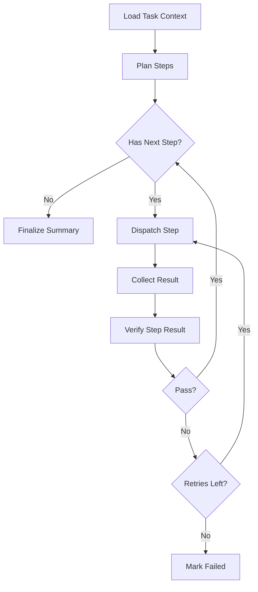
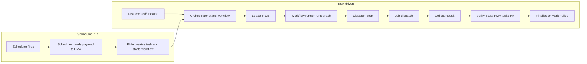

# LangGraph MVP Workflow

- [Document Overview](#document-overview)
- [MVP Goal](#mvp-goal)
- [Integration With the Orchestrator](#integration-with-the-orchestrator)
  - [Runtime and Hosting](#runtime-and-hosting)
  - [Invocation Model](#invocation-model)
  - [Checkpoint Persistence Contract](#checkpoint-persistence-contract)
  - [Graph Nodes to Orchestrator Capabilities](#graph-nodes-to-orchestrator-capabilities)
  - [Sub-Agent Invocation](#sub-agent-invocation)
- [Graph Topology](#graph-topology)
- [State Model](#state-model)
- [Node Behaviors](#node-behaviors)
  - [Load Task Context](#load-task-context)
  - [Plan Steps](#plan-steps)
  - [Dispatch Step](#dispatch-step)
  - [Collect Result](#collect-result)
  - [Verify Step Result](#verify-step-result)
  - [Finalize Summary](#finalize-summary)
  - [Mark Failed](#mark-failed)
- [Checkpointing and Resumability](#checkpointing-and-resumability)
  - [Checkpoint schema (prescriptive)](#checkpoint-schema-prescriptive)
- [Phase 2 flow summary](#phase-2-flow-summary)
- [Tooling and Security Notes](#tooling-and-security-notes)

## Document Overview

This document defines the minimum viable LangGraph workflow used by the orchestrator to drive tasks to completion.
It focuses on the Project Manager Agent happy path with retries and verification.

## MVP Goal

The MVP workflow should:

- Accept a task with acceptance criteria.
- Produce a plan that decomposes the work into executable steps.
- Dispatch steps to worker nodes and collect results.
- Verify results against acceptance criteria and preferences.
- Iterate with bounded retries.
- Produce a final summary and artifacts.

## Integration With the Orchestrator

This section defines how the LangGraph workflow is integrated with the orchestrator so that implementation choices are unambiguous.

### Runtime and Hosting

- The LangGraph workflow runs as part of the orchestrator's workflow engine.
- **Phase 2 implementation:** The workflow engine MUST be a **separate Python LangGraph process** invoked by the Go orchestrator (e.g. HTTP or RPC).
  The workflow process does not serve the orchestrator's REST APIs.
- The orchestrator MUST provide a stable contract for starting workflows, passing `task_id`, and reading/writing checkpoints so that the graph can be resumed after any restart (orchestrator or workflow process).
- The Project Manager Agent's behavior is implemented by this graph: the graph is the execution model for the agent.
  Planning, dispatch, verification, and finalization are graph nodes, not separate services.

### Invocation Model

- One workflow instance is scoped to one task (one `task_id`).
- The orchestrator starts a workflow when a task is ready to be driven (e.g. after task creation via User API or when a task is unblocked).
- The following MUST hold:
  - The workflow receives the task identifier and MUST load task context in the first node (Load Task Context).
  - Only one active workflow instance per task at a time.
  - The **single-active-workflow-per-task** guarantee is enforced by a **lease held in the orchestrator DB** (see [orchestrator.md](orchestrator.md) and [postgres_schema.md](postgres_schema.md)).
  - The workflow runner MUST acquire or check the lease via the orchestrator before running; the orchestrator is the source of truth.
- The orchestrator MAY run multiple workflow instances concurrently for different tasks.

### Checkpoint Persistence Contract

- The workflow MUST persist checkpoint data after each node transition so that state is durable and the graph can resume from the last checkpoint.
- The checkpoint store MUST be backed by PostgreSQL (or an orchestrator-owned store that uses PostgreSQL as the source of truth).
- The workflow implementation MUST support loading checkpoint state by `task_id` and continuing from the next node when the orchestrator or workflow process restarts.
- The checkpoint schema and storage are prescriptive; see [Checkpoint schema (prescriptive)](#checkpoint-schema-prescriptive) under Checkpointing and Resumability.
- The orchestrator MUST NOT run workflow steps without going through the checkpoint layer so that resumability is guaranteed.

### Graph Nodes to Orchestrator Capabilities

Each graph node performs work by calling orchestrator-owned capabilities.
The following mapping is the MVP reference mapping.

- **Load Task Context**: MCP database tools (or equivalent internal API) to read task, acceptance criteria, artifacts; preference resolution.
- **Plan Steps**: Orchestrator model routing (local or API Egress) for LLM calls; state write for the plan.
- **Dispatch Step**: Worker API (or MCP node/sandbox tools) to select node and dispatch job; job lease/record.
- **Collect Result**: Worker API or job result API to wait for and retrieve result payload and artifacts.
- **Verify Step Result**: Orchestrator model routing for verification LLM; optionally Project Analyst (see below); MCP DB tools to record verification.
- **Finalize Summary**: MCP database tools to write final summary, artifact links, and verification record.
- **Mark Failed**: MCP database tools to write failure status and verification findings.

- All database reads and writes from the workflow MUST go through MCP database tools (or an internal service that enforces the same policy).
  The workflow MUST NOT connect directly to PostgreSQL.
- Node selection and job dispatch MUST use the orchestrator's node registry, capability data, and worker API as defined in [`worker_node.md`](worker_node.md) and [`orchestrator.md`](orchestrator.md).

### Sub-Agent Invocation

- The Project Analyst Agent is a sub-agent used for focused verification.
- **MVP rule:** The **Orchestrator** kicks off work to **PMA** (e.g. when a task is ready to be driven, or when a scheduled run requires interpretation).
  In the **Verify Step Result** node, **PMA tasks the Project Analyst (or another sandbox agent)** to perform verification; the orchestrator does not call an internal verification API directly.
  Findings are written back into the main workflow state (or checkpoint) so that **Verify Step Result** can decide pass/fail and recommended actions.
- The Project Analyst MUST NOT bypass MCP or direct DB access rules.
  See [project_analyst_agent.md](project_analyst_agent.md) Handoff Model.

## Graph Topology

The MVP graph is a state machine.
It is designed to be resumable after orchestrator restarts.

## State Model

The graph maintains a task-scoped state object.

Minimum state fields

- `task_id` (uuid)
- `acceptance_criteria` (array)
- `preferences_effective` (object)
- `plan` (object)
  - `steps` (array)
  - `assumptions` (array)
- `current_step_index` (number)
- `attempts_by_step` (map)
- `last_result` (object)
- `verification` (object)
  - `status` (pass|fail)
  - `findings` (array)
  - `recommended_actions` (array)

## Node Behaviors

Each node is a bounded step that reads and writes the workflow state.

### Load Task Context

- Read task, acceptance criteria, and relevant artifacts.
- Compute effective preferences for the task and cache them in state.

### Plan Steps

- Generate a step plan that is executable by worker nodes and sandbox containers.
- Ensure each step has explicit expected outputs and evidence.

### Dispatch Step

- Select an execution target based on:
  - required sandbox capabilities
  - node load and health
  - data locality preference
  - model availability
- Dispatch a job with explicit sandbox requirements and timeouts.

### Collect Result

- Wait for the worker to return a result payload and artifacts.
- Normalize result metadata into state.

### Verify Step Result

- Evaluate the result against acceptance criteria and preferences.
- Record verification evidence and any gaps.
- If verification fails, update the next dispatch with remediation details.

### Finalize Summary

- Write final task summary, artifact links, and verification record.

### Mark Failed

- Write failure status with the final verification findings.

## Checkpointing and Resumability

This section describes persistence of workflow state so work can resume after restarts.

### Applicable Requirements

- Spec ID: `CYNAI.AGENTS.LanggraphCheckpointing` 

Traces To:

- [REQ-AGENTS-0116](../requirements/agents.md#req-agents-0116)
- [REQ-AGENTS-0117](../requirements/agents.md#req-agents-0117)
- [REQ-AGENTS-0118](../requirements/agents.md#req-agents-0118)

Recommended checkpoint points

- After planning completes.
- After each job dispatch.
- After each result collection.
- After each verification.
- On finalization or failure.

### Checkpoint Schema (Prescriptive)

The checkpoint store uses a single PostgreSQL table so that implementations are unambiguous.

- **Table name:** `workflow_checkpoints`.
- **Columns (minimum):**
  - `id` (uuid, primary key)
  - `task_id` (uuid, foreign key to `tasks.id`; one row per task for the "current" checkpoint; see constraints below)
  - `state` (jsonb) holding the full [State Model](#state-model) (task_id, acceptance_criteria, preferences_effective, plan, current_step_index, attempts_by_step, last_result, verification)
  - `last_node_id` (text) identity of the last completed graph node
  - `updated_at` (timestamptz)
- **Constraints:** Unique on `task_id` so that the latest checkpoint for a task is the single row for that task (upsert by task_id on each persist).
- The workflow engine MUST save and load by `task_id`; the orchestrator MUST NOT run workflow steps without going through this checkpoint layer.

See [postgres_schema.md](postgres_schema.md) for the full table definition and creation order.

## Phase 2 Flow Summary

End-to-end flow for task-driven execution and scheduled runs:

## Tooling and Security Notes

- Orchestrator-side agents MUST use MCP database tools for state reads and writes.
- Worker agents run in sandbox containers and MUST use MCP tools for controlled operations.

See [`docs/tech_specs/mcp_tooling.md`](mcp_tooling.md), [`docs/tech_specs/project_manager_agent.md`](project_manager_agent.md), and [`docs/tech_specs/user_preferences.md`](user_preferences.md).
