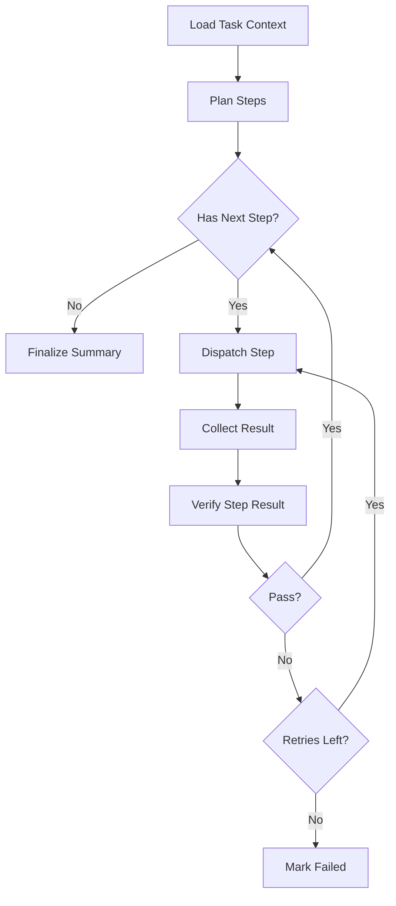

# LangGraph MVP Workflow

- [Document Overview](#document-overview)
- [MVP Goal](#mvp-goal)
- [Graph Topology](#graph-topology)
- [State Model](#state-model)
- [Node Behaviors](#node-behaviors)
  - [Load Task Context](#load-task-context)
  - [Plan Steps](#plan-steps)
  - [Dispatch Step](#dispatch-step)
  - [Collect Result](#collect-result)
  - [Verify Step Result](#verify-step-result)
  - [Finalize Summary](#finalize-summary)
  - [Mark Failed](#mark-failed)
- [Checkpointing and Resumability](#checkpointing-and-resumability)
- [Tooling and Security Notes](#tooling-and-security-notes)

## Document Overview

This document defines the minimum viable LangGraph workflow used by the orchestrator to drive tasks to completion.
It focuses on the Project Manager Agent happy path with retries and verification.

## MVP Goal

The MVP workflow should:

- Accept a task with acceptance criteria.
- Produce a plan that decomposes the work into executable steps.
- Dispatch steps to worker nodes and collect results.
- Verify results against acceptance criteria and preferences.
- Iterate with bounded retries.
- Produce a final summary and artifacts.

## Graph Topology

The MVP graph is a state machine.
It is designed to be resumable after orchestrator restarts.

## State Model

The graph maintains a task-scoped state object.

Minimum state fields

- `task_id` (uuid)
- `acceptance_criteria` (array)
- `preferences_effective` (object)
- `plan` (object)
  - `steps` (array)
  - `assumptions` (array)
- `current_step_index` (number)
- `attempts_by_step` (map)
- `last_result` (object)
- `verification` (object)
  - `status` (pass|fail)
  - `findings` (array)
  - `recommended_actions` (array)

## Node Behaviors

Each node is a bounded step that reads and writes the workflow state.

### Load Task Context

- Read task, acceptance criteria, and relevant artifacts.
- Compute effective preferences for the task and cache them in state.

### Plan Steps

- Generate a step plan that is executable by worker nodes and sandbox containers.
- Ensure each step has explicit expected outputs and evidence.

### Dispatch Step

- Select an execution target based on:
  - required sandbox capabilities
  - node load and health
  - data locality preference
  - model availability
- Dispatch a job with explicit sandbox requirements and timeouts.

### Collect Result

- Wait for the worker to return a result payload and artifacts.
- Normalize result metadata into state.

### Verify Step Result

- Evaluate the result against acceptance criteria and preferences.
- Record verification evidence and any gaps.
- If verification fails, update the next dispatch with remediation details.

### Finalize Summary

- Write final task summary, artifact links, and verification record.

### Mark Failed

- Write failure status with the final verification findings.

## Checkpointing and Resumability

Normative requirements

- The workflow MUST checkpoint progress to PostgreSQL after each node transition.
- The workflow MUST be resumable after orchestrator restarts.
- Each step attempt MUST be idempotent or have idempotency keys.

Recommended checkpoint points

- After planning completes.
- After each job dispatch.
- After each result collection.
- After each verification.
- On finalization or failure.

## Tooling and Security Notes

- Orchestrator-side agents MUST use MCP database tools for state reads and writes.
- Worker agents run in sandbox containers and MUST use MCP tools for controlled operations.

See [`docs/tech_specs/mcp_tooling.md`](mcp_tooling.md), [`docs/tech_specs/project_manager_agent.md`](project_manager_agent.md), and [`docs/tech_specs/user_preferences.md`](user_preferences.md).
