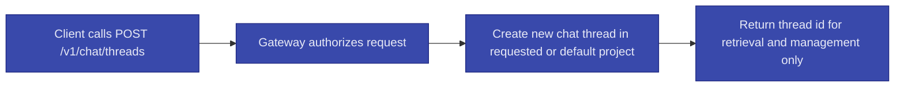

# OpenAI-Compatible Chat API

- [Document Overview](#document-overview)
  - [Traces to Requirements](#traces-to-requirements)
- [Single Chat Surface](#single-chat-surface)
  - [Single Chat Surface Requirements Traces](#single-chat-surface-requirements-traces)
- [Compatibility Goals](#compatibility-goals)
  - [Compatibility Goals Requirements Traces](#compatibility-goals-requirements-traces)
- [Endpoints](#endpoints)
  - [Provider Interoperability](#provider-interoperability)
  - [Forward Compatibility](#forward-compatibility)
  - [Project Scoping](#project-scoping)
  - [Model Identifiers](#model-identifiers)
- [Text Input and File References](#text-input-and-file-references)
  - [Text Input and File References Requirements Traces](#text-input-and-file-references-requirements-traces)
  - [At-Reference Workflow](#at-reference-workflow)
- [Chat Model Warm-Up](#chat-model-warm-up)
  - [When the Endpoint is Implemented](#when-the-endpoint-is-implemented)
- [Conversation Model](#conversation-model)
  - [State Model](#state-model)
  - [Thread Identifiers and Association](#thread-identifiers-and-association)
- [Streaming](#streaming)
  - [Streaming Event Requirements](#streaming-event-requirements)
  - [Persistence and Reconciliation Requirements](#persistence-and-reconciliation-requirements)
  - [Streaming Traces To](#streaming-traces-to)
- [Streaming Redaction Pipeline](#streaming-redaction-pipeline)
  - [Streaming Redaction Pipeline Diagram](#streaming-redaction-pipeline-diagram)
  - [`StreamingRedactionPipeline` Algorithm](#streamingredactionpipeline-algorithm)
  - [Streaming Redaction Pipeline Concurrency](#streaming-redaction-pipeline-concurrency)
  - [Amendment Event Contract](#amendment-event-contract)
  - [Streaming Redaction Pipeline Cancellation](#streaming-redaction-pipeline-cancellation)
  - [Streaming Redaction Pipeline Error Conditions](#streaming-redaction-pipeline-error-conditions)
  - [Streaming Redaction Pipeline Traces To](#streaming-redaction-pipeline-traces-to)
- [Normalized Assistant Output](#normalized-assistant-output)
  - [Normalization Rules](#normalization-rules)
  - [Normalized Assistant Output Requirements Traces](#normalized-assistant-output-requirements-traces)
- [Complete Chat Flow](#complete-chat-flow)
  - [Optional Explicit Thread Control](#optional-explicit-thread-control)
- [Chat Completion Routing Path](#chat-completion-routing-path)
  - [Effective Model Identifier](#effective-model-identifier)
  - [Orchestrator Responsibilities Before Routing](#orchestrator-responsibilities-before-routing)
  - [What is Routed to the PM Agent](#what-is-routed-to-the-pm-agent)
  - [What is Not Routed to the PM Agent](#what-is-not-routed-to-the-pm-agent)
  - [Routing Summary](#routing-summary)
- [Tasks Versus Chat (Non-Goals)](#tasks-versus-chat-non-goals)
  - [Tasks Versus Chat (Non-Goals) Requirements Traces](#tasks-versus-chat-non-goals-requirements-traces)
- [Authentication, Policy, and Auditing](#authentication-policy-and-auditing)
  - [Authentication Policy and Auditing Requirements Traces](#authentication-policy-and-auditing-requirements-traces)
- [Gateway Timeouts and Long-Running Behavior](#gateway-timeouts-and-long-running-behavior)
  - [Gateway Timeouts and Long-Running Behavior Requirements Traces](#gateway-timeouts-and-long-running-behavior-requirements-traces)
- [Reliability Requirements](#reliability-requirements)
  - [Reliability Requirements Requirements Traces](#reliability-requirements-requirements-traces)
- [Error Semantics](#error-semantics)
  - [Error Format for OpenAI-Compatible Endpoints](#error-format-for-openai-compatible-endpoints)
  - [HTTP Status Mapping](#http-status-mapping)
- [Observability](#observability)
  - [Observability Requirements Traces](#observability-requirements-traces)
- [Request Processing Pipeline](#request-processing-pipeline)
  - [Pipeline Steps (Order is Mandatory)](#pipeline-steps-order-is-mandatory)
- [Context Compaction](#context-compaction)
  - [Context Compaction Requirements Traces](#context-compaction-requirements-traces)
- [Optional: Async Chat (Deferred)](#optional-async-chat-deferred)
- [Related Documents](#related-documents)

## Document Overview

- Spec ID: `CYNAI.USRGWY.OpenAIChatApi` <a id="spec-cynai-usrgwy-openaichatapi"></a>

This spec defines the OpenAI-compatible interactive chat interfaces exposed by the User API Gateway.
It is the **only** interactive chat surface for Open WebUI, cynork, and E2E.

Compatibility contract (pinned as of 2026-03-12):

- The OpenAI-compatible surfaces in this spec are pinned to the OpenAI Chat Completions API and the OpenAI Responses API as documented in the OpenAI API Reference.
- The OpenAI REST API version header reported by the OpenAI API Overview is `openai-version: 2020-10-01` as of 2026-02-22.
- Reference: [OpenAI API Overview](https://platform.openai.com/docs/api-reference), [Chat Completions API Reference](https://platform.openai.com/docs/api-reference/chat), and [Responses API Reference](https://platform.openai.com/docs/api-reference/responses).

### Traces to Requirements

- [REQ-USRGWY-0121](../requirements/usrgwy.md#req-usrgwy-0121)
- [REQ-USRGWY-0127](../requirements/usrgwy.md#req-usrgwy-0127)
- [REQ-USRGWY-0136](../requirements/usrgwy.md#req-usrgwy-0136)
- [REQ-USRGWY-0137](../requirements/usrgwy.md#req-usrgwy-0137)
- [REQ-USRGWY-0138](../requirements/usrgwy.md#req-usrgwy-0138)
- [REQ-USRGWY-0140](../requirements/usrgwy.md#req-usrgwy-0140)
- [REQ-USRGWY-0149](../requirements/usrgwy.md#req-usrgwy-0149)

## Single Chat Surface

- Spec ID: `CYNAI.USRGWY.OpenAIChatApi.SingleSurface` <a id="spec-cynai-usrgwy-openaichatapi-singlesurface"></a>

The User API Gateway MUST expose interactive chat only through the OpenAI-compatible API surface.
There is no separate legacy chat endpoint.

### Single Chat Surface Requirements Traces

- [REQ-USRGWY-0127](../requirements/usrgwy.md#req-usrgwy-0127)

## Compatibility Goals

The gateway MUST support:

- Open WebUI as an OpenAI-compatible client.
- Cynork chat as an OpenAI-compatible client.
- E2E scenarios that exercise the same endpoints.

Compatibility layers MUST preserve orchestrator policy constraints and MUST NOT bypass auditing.

### Compatibility Goals Requirements Traces

- [REQ-USRGWY-0121](../requirements/usrgwy.md#req-usrgwy-0121)

## Endpoints

- Spec ID: `CYNAI.USRGWY.OpenAIChatApi.Endpoints` <a id="spec-cynai-usrgwy-openaichatapi-endpoints"></a>

The gateway MUST provide:

- `GET /v1/models` in OpenAI list-models format.
- `POST /v1/chat/completions` in OpenAI chat-completions format.
- `POST /v1/responses` in OpenAI responses format.
- `stream=true` support on both interactive POST endpoints as defined in [Streaming](#streaming).

The gateway MUST accept an OpenAI-format request body containing `messages: [{ role, content }, ...]`.
The gateway MUST return an OpenAI-format response containing the completion content at `choices[0].message.content`.

The gateway MUST accept the OpenAI `model` field when provided.
If `model` is omitted or empty, the gateway MUST use a default model identifier.
The default MUST correspond to the PM/PA chat surface for typical user chat.

For `POST /v1/responses`, the first-pass compatibility surface MUST support:

- `model` when provided.
- `input` as either a plain string or an ordered message-like input array sufficient for multi-turn chat continuation.
- `previous_response_id` for continuation when the referenced response belongs to the authenticated user, is within the same effective project scope, and is still retained by the gateway.
- A responses-format object in the response body, including a stable response `id` and the normal text output in the OpenAI responses shape.

The first-pass compatibility surface for both endpoints SHOULD also support normalization of provider-specific reasoning and tool-activity signals into the persisted structured turn model described in [Chat Threads and Messages](chat_threads_and_messages.md#spec-cynai-usrgwy-chatthreadsmessages-structuredturns).

### Provider Interoperability

- The underlying inference backend does not need to implement every OpenAI-compatible endpoint natively.
- The gateway MUST own the external compatibility contract and MAY translate `POST /v1/responses` requests into backend-native or `POST /v1/chat/completions`-style calls when necessary, as long as the external request and response shape remains compliant with this spec.

### Forward Compatibility

- The gateway MUST ignore unknown request fields in the OpenAI chat-completions request body.
- The gateway MUST ignore unknown fields inside message objects.
- The gateway MUST ignore unknown request fields in the OpenAI responses request body unless the field is required for the specific supported responses mode.

### Project Scoping

- If an OpenAI-standard `OpenAI-Project` request header is present, the gateway MUST treat its value as the project context for persistence.
- If the header is absent, the gateway MUST associate the thread (and any tasks created in that context) with the creating user's default project (see [REQ-PROJCT-0104](../requirements/projct.md#req-projct-0104) and [Default project](../tech_specs/projects_and_scopes.md#spec-cynai-access-defaultproject)).
- The effective project context MUST be persisted as the thread's project association when the thread is created or reused.
- The gateway MUST NOT require a CyNodeAI-specific `project_id` request-body field to preserve that association.

### Model Identifiers

- The gateway MUST expose a stable PM/PA chat surface model id `cynodeai.pm`.
- When the client omits `model` or provides an empty `model`, the gateway MUST behave as if `model` was `cynodeai.pm`.
- The internal implementation of the PM/PA chat surface is the `cynode-pma` binary (see [cynode_pma.md](cynode_pma.md)); the external id `cynodeai.pm` is stable and MUST NOT change for client compatibility.
- The gateway MUST also expose underlying inference model identifiers in `GET /v1/models`.
  These identifiers MUST be limited to the currently configured inference model(s) that the authenticated user is authorized to use.
  The gateway MUST NOT disclose model identifiers the user is not authorized to use.

## Text Input and File References

- Spec ID: `CYNAI.USRGWY.OpenAIChatApi.TextInput` <a id="spec-cynai-usrgwy-openaichatapi-textinput"></a>

User-authored chat input is text-first.

- For `POST /v1/chat/completions`, user `messages[].content` MUST accept a string containing plain text or Markdown syntax.
- For `POST /v1/responses`, user `input` MUST accept either a plain string or an ordered message-like structure whose user-authored text content follows the same text and Markdown rules.
- The gateway MUST preserve the user-visible text exactly enough for transcript rendering, subject to redaction rules.
- Unsupported user-message rich-part types MUST fail validation rather than being silently dropped.

### Text Input and File References Requirements Traces

- [REQ-USRGWY-0140](../requirements/usrgwy.md#req-usrgwy-0140)
- [REQ-CLIENT-0198](../requirements/client.md#req-client-0198)

### At-Reference Workflow

`@` file references are the only supported client-side shorthand for attaching local files to a user chat message.

- The client resolves `@` references locally before submission.
- The gateway MUST accept the resulting uploaded or inline file representation according to one documented contract.
- That contract MAY use a gateway-owned upload endpoint that returns stable file identifiers, or MAY use an inline representation accepted by the OpenAI-compatible surface.
- When the gateway accepts such a file reference, it MUST associate the uploaded file with the originating user message so that downstream components can reconstruct the same context.
- Validation for file size, file type, or malformed attachment payloads MUST return a normal OpenAI-style error object for the relevant endpoint.

## Chat Model Warm-Up

- Spec ID: `CYNAI.USRGWY.OpenAIChatApi.WarmUp` <a id="spec-cynai-usrgwy-openaichatapi-warmup"></a>

The gateway MAY expose an optional endpoint to warm the default (or a specified) chat model before the first user message, to reduce time-to-first-meaningful-response.

### When the Endpoint is Implemented

- **Endpoint:** `POST /v1/chat/warm`.
  Same authentication as `POST /v1/chat/completions` (Bearer token).
- **Request:** Optional `model` in the request body or query; when omitted, the gateway uses the default chat model (e.g. `cynodeai.pm`).
- **Behavior:** Gateway triggers backend warm-up (e.g. calls the inference backend or PMA path with a no-op or minimal prompt and discards the response).
  Warm-up is best-effort: the gateway SHOULD return 200 or 202 quickly (e.g. "warm-up started" or "already warm") and MAY perform loading asynchronously or with a short timeout.
  Failure or timeout MUST NOT affect the chat session; clients MUST NOT block the first prompt on warm-up completion.
- **Idempotency:** Multiple rapid warm-up calls for the same model (e.g. several tabs or restarts) MUST be safe; the implementation MAY debounce or ignore duplicate in-flight warm-up.
- **Observability:** The implementation SHOULD log or emit a metric when warm-up is requested and when it succeeds or fails.

#### When the Endpoint is Implemented Requirements Traces

- [REQ-USRGWY-0134](../requirements/usrgwy.md#req-usrgwy-0134)
- [REQ-CLIENT-0177](../requirements/client.md#req-client-0177)

## Conversation Model

- Spec ID: `CYNAI.USRGWY.OpenAIChatApi.ConversationModel` <a id="spec-cynai-usrgwy-openaichatapi-conversationmodel"></a>

Chat is a conversation with the PM/PA (Project Manager / Project Analyst) agent surface.
The gateway supports both the Chat Completions and Responses API styles for that conversation.

Conversation state and history are tracked separately from tasks.
Chat messages are stored as chat-thread messages (see [Chat Threads and Messages](chat_threads_and_messages.md)).
Multi-message conversation is the intended way to clarify and lay out a task (or project plan) before or as it is executed; see [REQ-AGENTS-0135](../requirements/agents.md#req-agents-0135).

### State Model

- `POST /v1/chat/completions` remains a messages-based interactive surface.
- `POST /v1/responses` adds a response-oriented interactive surface and MAY use `previous_response_id` for continuation.
- CyNodeAI chat threads and chat messages remain the canonical persisted user-visible history regardless of which interactive endpoint was used.
- OpenAI Conversations API support is deferred.
  This spec adds `POST /v1/responses`, but does not require a separate OpenAI-compatible durable conversations endpoint in the first pass.

### Thread Identifiers and Association

- The OpenAI-compatible surface MUST NOT require any CyNodeAI-specific thread or session identifiers in request bodies or headers.
- The orchestrator MUST manage chat thread association server-side.
- The orchestrator MUST maintain a single active thread per `(user_id, project_id)` scope.
  The orchestrator MUST rotate to a new active thread after 2 hours of inactivity.
- A thread associated with one effective project scope MUST NOT be silently reused for a different effective project scope.

#### Thread Identifiers and Association Requirements Traces

- [REQ-USRGWY-0130](../requirements/usrgwy.md#req-usrgwy-0130)

## Streaming

- Spec ID: `CYNAI.USRGWY.OpenAIChatApi.Streaming` <a id="spec-cynai-usrgwy-openaichatapi-streaming"></a>

The OpenAI-compatible interactive chat surface MUST support streaming mode for both `POST /v1/chat/completions` and `POST /v1/responses`.

- When the client sends `stream=true`, the gateway MUST return a streaming response instead of waiting for the final assistant turn to complete before sending bytes.
- The canonical transport for streaming mode is Server-Sent Events with `Content-Type: text/event-stream`.
- The gateway MUST deliver real token-by-token streaming: visible assistant text MUST be emitted as incremental token deltas promptly enough for interactive terminal and web UI updates.
- The gateway MUST NOT buffer the entire visible assistant answer and emit it only at completion on the standard streaming path.
- Secret redaction runs after the upstream stream terminates but before the terminal `[DONE]` event; see [Streaming Redaction Pipeline](#streaming-redaction-pipeline) for the full goroutine architecture, algorithm, synchronization model, and amendment event contract.
- The gateway MAY translate provider-native stream formats internally, but the external client contract MUST remain stable and OpenAI-compatible.
- When a selected backend path cannot produce true visible-text deltas, the gateway SHOULD treat that path as degraded mode and still emit bounded in-progress status plus a terminal completion or error event rather than silently hanging until the final payload appears.
- When the client closes or cancels the streaming request, the gateway MUST treat that request as canceled, stop or detach upstream generation work on a best-effort basis promptly, and release request-scoped resources even if the final assistant turn is incomplete.

### Streaming Event Requirements

- The stream MUST preserve event order for one logical assistant turn.
- The stream MUST distinguish visible assistant text updates from hidden thinking or reasoning updates.
- Hidden thinking or reasoning MUST NOT be emitted as canonical visible-text deltas.
- Tool-progress updates SHOULD be emitted as explicit non-prose progress events when available.
- The stream MUST end with a clear terminal completion event, terminal error event, or cancellation event so clients can reconcile the in-flight turn deterministically.
- If the client disconnect prevents sending a final cancellation event, the gateway MUST still record and handle the request internally as canceled rather than allowing the stream job to run indefinitely.

### Persistence and Reconciliation Requirements

- Stream events are transport artifacts and MUST NOT be persisted as separate transcript rows.
- The gateway MUST persist the final reconciled logical assistant turn using the same normalized structured-turn model defined elsewhere in this spec set.
- The final canonical plain-text projection MUST be derived only from visible assistant text, whether that text arrived in one final payload or as ordered deltas.

### Streaming Traces To

- [REQ-USRGWY-0149](../requirements/usrgwy.md#req-usrgwy-0149)
- [REQ-USRGWY-0150](../requirements/usrgwy.md#req-usrgwy-0150)
- [REQ-CLIENT-0209](../requirements/client.md#req-client-0209)

## Streaming Redaction Pipeline

- Spec ID: `CYNAI.USRGWY.OpenAIChatApi.StreamingRedactionPipeline` <a id="spec-cynai-usrgwy-openaichatapi-streamingredactionpipeline"></a>

This section defines how token-by-token streaming and secret redaction coexist without blocking real-time delivery to the client.
The gateway streams visible assistant text to the client immediately as tokens arrive from the upstream backend (PMA or direct inference).
Secret redaction runs synchronously after the upstream stream terminates but before the terminal `[DONE]` event is emitted to the client.
If secrets are detected, a post-stream amendment event replaces the client-side accumulated text and only the redacted version is persisted.

The design uses two goroutines, one channel, and zero shared mutable state between goroutines.
The handler goroutine is the sole writer to the HTTP response and the sole accessor of the accumulator buffer.
The reader goroutine is the sole consumer of the upstream response body.

### Streaming Redaction Pipeline Diagram

```mermaid
sequenceDiagram
    participant Client as TUI / Client
    participant Handler as Handler Goroutine
    participant Reader as Reader Goroutine
    participant Upstream as Upstream Backend
    participant Scanner as Secret Scanner
    participant DB as Database
    participant Audit as Chat Audit Log

    Client->>Handler: POST stream=true
    Handler->>Upstream: Open streaming connection
    Handler->>Reader: Launch reader goroutine (tokenCh)

    loop Real-time token delivery
        Upstream->>Reader: Token delta event
        Reader->>Handler: tokenCh <- event
        Handler->>Handler: Append delta to accumulator
        Handler->>Client: SSE visible-text delta (flush)
    end

    Upstream->>Reader: Terminal upstream event
    Reader->>Reader: Close tokenCh, close upstream body

    Handler->>Scanner: Scan accumulated text for secrets
    Scanner-->>Handler: Result (clean or redacted text + kinds)

    alt Secrets detected
        Handler->>Client: SSE amendment event (redacted content)
        Handler->>Audit: redaction_applied=true, redaction_kinds
        Handler->>DB: Persist redacted assistant message
    else No secrets
        Handler->>DB: Persist accumulated assistant message
    end

    Handler->>Client: SSE [DONE] terminal event
    Handler->>Handler: Wait for reader goroutine exit, release resources
```



### `StreamingRedactionPipeline` Algorithm

<a id="algo-cynai-usrgwy-openaichatapi-streamingredactionpipeline"></a>

1. The handler goroutine opens a streaming connection to the upstream backend (PMA endpoint or direct inference) using the request `context.Context`. <a id="algo-cynai-usrgwy-openaichatapi-streamingredactionpipeline-step-1"></a>
2. The handler goroutine creates a `tokenCh` channel (small bounded buffer, e.g. 8) carrying parsed upstream stream events and a `sync.WaitGroup` with delta 1. <a id="algo-cynai-usrgwy-openaichatapi-streamingredactionpipeline-step-2"></a>
3. The handler goroutine launches the **reader goroutine**, which: <a id="algo-cynai-usrgwy-openaichatapi-streamingredactionpipeline-step-3"></a>
   - Defers `wg.Done()` and defers closing the upstream response body.
   - Reads and parses upstream SSE events in a loop.
   - For each parsed event, selects on `tokenCh <- event` or `ctx.Done()`; if the context is canceled, the reader exits immediately.
   - When the upstream stream terminates (EOF or terminal event), the reader closes `tokenCh` and returns.
4. The handler goroutine initializes a `strings.Builder` as the **accumulator** for visible assistant text and enters a select loop over `tokenCh` and `ctx.Done()`: <a id="algo-cynai-usrgwy-openaichatapi-streamingredactionpipeline-step-4"></a>
   - **Visible-text delta**: append the delta text to the accumulator, then write the corresponding SSE `data:` event to the `http.ResponseWriter` and flush immediately.
     The SSE payload follows the OpenAI streaming format (e.g. `choices[0].delta.content`).
   - **Thinking or reasoning delta**: write the SSE event with the appropriate non-visible-text type and flush.
     Do not append to the visible-text accumulator.
   - **Tool-progress event**: write the SSE event and flush.
   - **Channel closed** (upstream done): exit the loop and proceed to step 5.
   - **`ctx.Done()`**: proceed to [Cancellation](#streaming-redaction-pipeline-cancellation).
5. After the loop exits, the handler goroutine runs the **secret scanner** on `accumulator.String()` synchronously.
   The scanner is a CPU-local operation (regex or pattern matching); it does not perform I/O. <a id="algo-cynai-usrgwy-openaichatapi-streamingredactionpipeline-step-5"></a>
6. If the scanner reports one or more detected secrets: <a id="algo-cynai-usrgwy-openaichatapi-streamingredactionpipeline-step-6"></a>
   - Build the redacted text by replacing each detected secret span with the literal `SECRET_REDACTED`.
   - Write an SSE **amendment event** to the client containing the full redacted assistant text (see [Amendment Event Contract](#amendment-event-contract)) and flush.
   - Record `redaction_applied = true` and `redaction_kinds` (e.g. `["api_key"]`) in the `chat_audit_log` row for this request.
   - Use the redacted text as the final assistant content for persistence.
7. If the scanner reports no secrets, use the accumulated text as-is for persistence. <a id="algo-cynai-usrgwy-openaichatapi-streamingredactionpipeline-step-7"></a>
8. Persist the final (possibly redacted) assistant message to the chat thread using the standard structured-turn persistence path. <a id="algo-cynai-usrgwy-openaichatapi-streamingredactionpipeline-step-8"></a>
9. Write the terminal `[DONE]` SSE event to the client and flush. <a id="algo-cynai-usrgwy-openaichatapi-streamingredactionpipeline-step-9"></a>
10. Call `wg.Wait()` to block until the reader goroutine has exited and released the upstream response body, then return from the handler. <a id="algo-cynai-usrgwy-openaichatapi-streamingredactionpipeline-step-10"></a>

### Streaming Redaction Pipeline Concurrency

The pipeline uses exactly two goroutines per streaming request.
No shared mutable state exists between them; the channel is the sole communication path.

- **Handler goroutine** (the HTTP handler's goroutine): sole writer to the `http.ResponseWriter`, sole accessor of the `strings.Builder` accumulator, sole caller of the secret scanner, sole writer of SSE events to the client.
  No other goroutine touches the ResponseWriter or the accumulator at any time.
- **Reader goroutine**: sole reader of the upstream HTTP response body, sole sender on `tokenCh`.
  Closes `tokenCh` when the upstream stream terminates (this close is the happens-before signal that all upstream data has been delivered).
  Defers closing the upstream response body.
- **`tokenCh` channel**: bounded-buffer channel (recommended capacity 8).
  The reader goroutine is the only sender; the handler goroutine is the only receiver.
  Channel close by the reader is the termination signal.
- **`sync.WaitGroup`**: used by the handler goroutine (step 10) to ensure the reader goroutine has fully exited and released the upstream body before the handler returns.
  The reader calls `wg.Done()` as a deferred operation.
- **`context.Context`**: the request context flows into both the upstream connection and the reader goroutine's select.
  When the client disconnects, `ctx.Done()` fires in both goroutines, enabling prompt cleanup.

Race condition prevention:

- The `http.ResponseWriter` is accessed by the handler goroutine only.
  Go's `http.ResponseWriter` is not safe for concurrent use; this design ensures single-goroutine access.
- The `strings.Builder` accumulator is accessed by the handler goroutine only.
  No lock is needed.
- The upstream response body is read by the reader goroutine only.
  No concurrent reads.
- The `tokenCh` close happens in the reader goroutine only.
  The handler goroutine observes closure via for-range termination or channel receive returning the zero value with `ok == false`.
- `ctx.Done()` is a read-only channel safe for concurrent select by multiple goroutines.

### Amendment Event Contract

When the secret scanner detects secrets in the accumulated assistant text (algorithm step 6), the handler emits one SSE amendment event before the terminal `[DONE]` event.

The amendment event uses a CyNodeAI-specific SSE event type so OpenAI-compatible clients that do not understand it can safely ignore it.

SSE wire format:

```text
event: cynodeai.amendment
data: {"type":"secret_redaction","content":"<full redacted assistant text>","redaction_kinds":["api_key"]}
```

- `event`: `cynodeai.amendment` (custom SSE event type; standard OpenAI clients listen only for unnamed `data:` lines and will ignore this event type).
- `type`: `secret_redaction` (identifies the amendment reason).
- `content`: the full redacted visible assistant text for this turn, with all detected secrets replaced by `SECRET_REDACTED`.
- `redaction_kinds`: array of string identifiers for the kinds of secrets that were redacted (e.g. `api_key`, `token`, `password`).

Clients that understand the amendment event (such as the cynork TUI) replace their accumulated visible assistant text for the in-flight turn with the `content` value from this event before finalizing the turn.
Clients that do not understand it (such as vanilla OpenAI client libraries) ignore the custom event type and display the unredacted streamed text; the persisted and subsequently retrieved content is still redacted.

### Streaming Redaction Pipeline Cancellation

When the client disconnects or cancels (Ctrl+C) during streaming:

1. `ctx.Done()` fires, observed by both the handler goroutine (in the select loop) and the reader goroutine (in the send select).
2. The handler goroutine exits the token loop immediately.
3. The reader goroutine stops reading from upstream and exits (deferred `wg.Done()` and upstream body close execute).
4. The handler goroutine runs the secret scanner on whatever text has been accumulated so far (partial content).
5. The handler goroutine persists the redacted partial content as an interrupted assistant turn (the message metadata should indicate the turn was interrupted/canceled).
6. The handler goroutine does NOT write further SSE events to the client because the connection is gone; writes to a closed ResponseWriter are silently discarded or return an error that the handler ignores.
7. The handler goroutine calls `wg.Wait()` to ensure the reader goroutine has exited, then returns.

This ensures that even partial assistant output that may contain secrets is never persisted in unredacted form.

### Streaming Redaction Pipeline Error Conditions

- **Upstream error mid-stream**: the reader goroutine receives an error event from upstream, sends it on `tokenCh`, and closes `tokenCh`.
  The handler goroutine processes the error event, runs redaction on accumulated text, persists the partial redacted turn, emits an SSE error event, and returns.
- **Secret scanner failure**: if the scanner itself errors (e.g. regex compilation failure at startup is a program bug, but runtime OOM on very large text is possible), the handler MUST treat the content as potentially containing secrets.
  It MUST NOT persist the unscanned content.
  The handler should emit an SSE error event indicating an internal error, persist no assistant message, and record the failure in the audit log.
- **Database persistence failure**: if the persist call (step 8) fails, the handler MUST still emit the terminal `[DONE]` or error event to the client.
  The handler should log the persistence failure and record it in the audit log.
  The client has already received the (possibly redacted) streamed text; a subsequent thread-history load will show the turn as missing until the persistence is retried or the issue is resolved.
- **ResponseWriter flush failure**: indicates a client disconnect that was not yet reflected in `ctx.Done()`.
  The handler should treat this as a cancellation and follow the cancellation path.

### Streaming Redaction Pipeline Traces To

- [REQ-USRGWY-0132](../requirements/usrgwy.md#req-usrgwy-0132)
- [REQ-USRGWY-0149](../requirements/usrgwy.md#req-usrgwy-0149)
- [REQ-USRGWY-0151](../requirements/usrgwy.md#req-usrgwy-0151)
- [REQ-CLIENT-0215](../requirements/client.md#req-client-0215)

## Normalized Assistant Output

- Spec ID: `CYNAI.USRGWY.OpenAIChatApi.NormalizedAssistantOutput` <a id="spec-cynai-usrgwy-openaichatapi-normalizedassistantoutput"></a>

The gateway MUST normalize provider-specific assistant output into one logical assistant turn for persistence and rich-client rendering.
This follows the same broad UX pattern used by open source tools such as Open WebUI and LibreChat: the main answer stays readable, reasoning is secondary rather than merged into final prose, and tool activity is surfaced as distinct transcript items instead of being implied only by text.

### Normalization Rules

- If the upstream provider returns only final visible text, the normalized assistant turn is a single `text` part and the canonical plain-text projection matches that text.
- If the upstream provider returns reasoning, tool activity, file references, or multiple ordered output items, the gateway SHOULD project them into the structured turn model defined in [Chat Threads and Messages](chat_threads_and_messages.md#spec-cynai-usrgwy-chatthreadsmessages-structuredturns).
- When one request yields multiple assistant-side output items, the gateway MUST preserve their order.
- Reasoning or thinking content MUST NOT be copied into canonical plain-text transcript content such as `choices[0].message.content` or the plain-text projection used for thread titles, summaries, and list previews.
- When the gateway retains thinking or reasoning content, it MUST keep that content only as structured assistant-turn data associated with the same logical assistant turn so authorized rich clients can reveal it later through thread history retrieval.
- For `POST /v1/chat/completions`, the response surface remains the OpenAI chat-completions shape and therefore exposes only the canonical visible assistant text in `choices[0].message.content`.
- For `POST /v1/responses`, the gateway MUST preserve the native responses-format shape while also persisting the same logical assistant turn in the normalized structured-turn model for retrieval and UI rendering.
- Clients that ignore structured turn data MUST still receive a coherent answer from the canonical visible text alone.

### Normalized Assistant Output Requirements Traces

- [REQ-USRGWY-0136](../requirements/usrgwy.md#req-usrgwy-0136)
- [REQ-USRGWY-0137](../requirements/usrgwy.md#req-usrgwy-0137)
- [REQ-USRGWY-0138](../requirements/usrgwy.md#req-usrgwy-0138)
- [REQ-USRGWY-0148](../requirements/usrgwy.md#req-usrgwy-0148)

## Complete Chat Flow

This diagram summarizes the whole chat flow across client, gateway, orchestrator, PMA or direct inference, persistence, and UI rendering.
It also shows the separate explicit-thread-create path, which remains outside the OpenAI-compatible request shape.

```mermaid
flowchart TD
  U[User in cynork TUI or other client]
  U --> C{Interactive chat surface}
  C -->|POST /v1/chat/completions| G1[Gateway receives messages-based request]
  C -->|POST /v1/responses| G2[Gateway receives responses-format request]

  G1 --> V[Authenticate, validate request, resolve project scope]
  G2 --> V

  V --> R[Redact secrets in user-visible input]
  R --> A[Associate request to active thread or explicit fresh thread state]
  A --> P1[Persist redacted user message to chat thread]

  P1 --> PR{Responses continuation?}
  PR -->|No| M[Compute effective model id]
  PR -->|Yes, valid previous_response_id| RS[Load retained response continuation state]
  RS --> M

  M --> Route{Effective model == cynodeai.pm?}
  Route -->|Yes| PMA[Hand off to PMA via worker-mediated endpoint]
  Route -->|No| INF[Route to direct inference backend]

  PMA --> OUT[Assistant output from PMA or provider]
  INF --> OUT

  OUT --> N[Normalize assistant output into one logical assistant turn]
  N --> Parts[Ordered structured parts when available:
text, thinking, tool_call, tool_result,
attachment_ref, download_ref]
  N --> Plain[Canonical plain-text projection:
visible assistant text only]

  Parts --> P2[Persist assistant turn to chat thread]
  Plain --> P2
  P2 --> RespMeta[Persist retained response metadata when needed for previous_response_id]

  RespMeta --> APIResp{Return endpoint-specific response}
  APIResp -->|chat completions| CC["choices[0].message.content = canonical visible text"]
  APIResp -->|responses| RR[Responses-format object with stable response id]

  CC --> ClientRender[Client renders response]
  RR --> ClientRender

  ClientRender --> UX1[Rich clients prefer structured parts and group ordered items into one assistant turn]
  ClientRender --> UX2[Thinking stays hidden by default unless user explicitly expands it]
  ClientRender --> UX3[Plain or one-shot output emits only canonical visible assistant text]

  classDef client fill:#1565c0,stroke:#0d47a1,color:#e3f2fd
  classDef gateway fill:#ef6c00,stroke:#e65100,color:#fff8e1
  classDef persist fill:#2e7d32,stroke:#1b5e20,color:#e8f5e9
  classDef routing fill:#7b1fa2,stroke:#4a148c,color:#f3e5f5
  classDef output fill:#00838f,stroke:#006064,color:#e0f7fa
  classDef response fill:#bf360c,stroke:#d84315,color:#fbe9e7
  class U,C,ClientRender,UX1,UX2,UX3 client
  class G1,G2,V,R,A gateway
  class P1,P2,RespMeta persist
  class PR,M,RS,Route,PMA,INF routing
  class OUT,N,Parts,Plain output
  class APIResp,CC,RR response
```



### Optional Explicit Thread Control



## Chat Completion Routing Path

- Spec ID: `CYNAI.USRGWY.OpenAIChatApi.RoutingPath` <a id="spec-cynai-usrgwy-openaichatapi-routingpath"></a>

All OpenAI-compliant interactive chat requests are processed by the **orchestrator** first.
The orchestrator is the single point of entry for request handling, policy, and routing.
The gateway MUST NOT send interactive chat requests directly to an agent or inference endpoint; every request MUST flow through the orchestrator.

### Effective Model Identifier

- The **effective model identifier** for routing is the request body `model` field if present and non-empty; otherwise it is `cynodeai.pm`.

### Orchestrator Responsibilities Before Routing

- Perform automatic **sanitization**: detect and redact secrets in message content (at least API keys), replace detected secrets with the literal `SECRET_REDACTED`, and record redaction in audit log.
- Perform **logging** and audit recording for the request.
- Persist the amended user message or equivalent user input to the chat thread.
- Then route to the backend that generates the completion using the effective model identifier.

### What is Routed to the PM Agent

- The orchestrator MUST hand off the request to the **PM agent** (`cynode-pma` in `project_manager` mode) if and only if the effective model identifier is exactly `cynodeai.pm`.
- In that case the orchestrator sends the sanitized messages to `cynode-pma`; the PM agent performs further processing (including tool use and inference) and returns the completion.
  The orchestrator does not call an inference API directly for that request.
- The orchestrator MUST reach PMA only via the **worker-mediated endpoint** reported by the worker in capability (`managed_services_status`); it MUST NOT use compose DNS or direct host-port addressing.
  Traces To: [REQ-ORCHES-0162](../requirements/orches.md#req-orches-0162), [cynode_pma.md](cynode_pma.md).

### What is Not Routed to the PM Agent

- The orchestrator MUST route the request to **direct inference** (no PM agent) if and only if the effective model identifier is not `cynodeai.pm`.
- In that case the effective model identifier MUST be one of the inference model ids returned by `GET /v1/models` for the authenticated user.
  The orchestrator MUST call the corresponding inference backend: node-local inference (e.g. Ollama on the selected worker or sidecar) or an external API via API Egress, per [External Model Routing](external_model_routing.md).
  The orchestrator MUST NOT invoke `cynode-pma` for that request.

### Routing Summary

- **Effective model `cynodeai.pm`:** Routed to PM agent (`cynode-pma`).
  Orchestrator hands off sanitized messages to the PM agent; the agent returns the completion.
  Orchestrator does not call an inference API directly.
- **Effective model any other value:** Routed to direct inference.
  Orchestrator calls the inference backend (node-local or API Egress); the orchestrator does not invoke the PM agent.

See [Request Processing Pipeline](#request-processing-pipeline) for the ordered steps and [External Model Routing](external_model_routing.md) for inference routing policy.

## Tasks Versus Chat (Non-Goals)

- Spec ID: `CYNAI.USRGWY.OpenAIChatApi.TasksVsChat` <a id="spec-cynai-usrgwy-openaichatapi-tasksvschat"></a>

These APIs MUST NOT define or imply a one-to-one mapping of chat messages to tasks.
The PM/PA MAY create zero or many tasks via MCP during a conversation.
Users MAY create tasks manually through the task API or cynork task commands.

If an implementation uses internal runs or jobs to produce a completion, that is an implementation detail.
The external contract remains an interactive chat request and response.

### Tasks Versus Chat (Non-Goals) Requirements Traces

- [REQ-USRGWY-0130](../requirements/usrgwy.md#req-usrgwy-0130)

## Authentication, Policy, and Auditing

- Spec ID: `CYNAI.USRGWY.OpenAIChatApi.AuthPolicy` <a id="spec-cynai-usrgwy-openaichatapi-authpolicy"></a>

- Authentication MUST use the same Bearer token mechanism as the rest of the User API Gateway.
- Requests MUST be subject to policy enforcement and MUST emit audit records.

### Authentication Policy and Auditing Requirements Traces

- [REQ-USRGWY-0121](../requirements/usrgwy.md#req-usrgwy-0121)
- [REQ-USRGWY-0124](../requirements/usrgwy.md#req-usrgwy-0124)
- [REQ-USRGWY-0125](../requirements/usrgwy.md#req-usrgwy-0125)

## Gateway Timeouts and Long-Running Behavior

- Spec ID: `CYNAI.USRGWY.OpenAIChatApi.Timeouts` <a id="spec-cynai-usrgwy-openaichatapi-timeouts"></a>

Chat can take 30-120 seconds or more when the model is cold or under load.
The gateway MUST support a `WriteTimeout` (and optionally `ReadTimeout`) long enough for chat to complete.
The gateway MUST support configuring these timeouts for deployments that use chat.

Documentation (dev_docs or operator docs) MUST describe the expected duration and required timeout tuning.

### Gateway Timeouts and Long-Running Behavior Requirements Traces

- [REQ-USRGWY-0128](../requirements/usrgwy.md#req-usrgwy-0128)

## Reliability Requirements

- Spec ID: `CYNAI.USRGWY.OpenAIChatApi.Reliability` <a id="spec-cynai-usrgwy-openaichatapi-reliability"></a>

The gateway handlers backing `POST /v1/chat/completions` and `POST /v1/responses` MUST implement the following reliability behavior.

- **Poll cap.**
  If the handler must wait on internal state to produce a completion, it MUST enforce a maximum total wait duration (for example 90-120 seconds).
  After the cap is reached, it MUST return a clear timeout error.
- **Retry with backoff.**
  On transient orchestrator inference failures (for example connection error, 5xx, or model loading), the handler MUST retry a small number of times (for example 2-3) with short backoff before using a fallback path.

### Reliability Requirements Requirements Traces

- [REQ-ORCHES-0131](../requirements/orches.md#req-orches-0131)
- [REQ-ORCHES-0132](../requirements/orches.md#req-orches-0132)

## Error Semantics

- Spec ID: `CYNAI.USRGWY.OpenAIChatApi.Errors` <a id="spec-cynai-usrgwy-openaichatapi-errors"></a>

The gateway MUST return errors that allow clients and operators to distinguish at least:

- Request canceled.
- Orchestrator inference failed.
- Completion did not finish before the maximum wait duration.

Errors MUST NOT leak secrets.

### Error Format for OpenAI-Compatible Endpoints

- For `GET /v1/models`, `POST /v1/chat/completions`, and `POST /v1/responses`, error responses MUST use an OpenAI-style JSON payload with a top-level `error` object.
- The gateway MUST NOT return RFC 9457 Problem Details for these OpenAI-compatible endpoints.
- The payload MUST follow this shape:

```json
{
  "error": {
    "message": "Safe, user-displayable error message.",
    "type": "cynodeai_error",
    "param": null,
    "code": "cynodeai_completion_timeout"
  }
}
```

### HTTP Status Mapping

- Request canceled: `408`.
- Orchestrator inference failed: `502` or `503` depending on whether the failure is upstream or overload.
- Completion timeout (poll cap reached): `504`.

#### HTTP Status Mapping Requirements Traces

- [REQ-USRGWY-0129](../requirements/usrgwy.md#req-usrgwy-0129)

## Observability

- Spec ID: `CYNAI.USRGWY.OpenAIChatApi.Observability` <a id="spec-cynai-usrgwy-openaichatapi-observability"></a>

The gateway MUST log which internal path was used for a completion (for example direct orchestrator inference versus fallback).
The gateway MUST log timeouts and request cancellations.

### Observability Requirements Traces

- [REQ-USRGWY-0129](../requirements/usrgwy.md#req-usrgwy-0129)

## Request Processing Pipeline

- Spec ID: `CYNAI.USRGWY.OpenAIChatApi.Pipeline` <a id="spec-cynai-usrgwy-openaichatapi-pipeline"></a>

This section defines the required request-processing steps for interactive chat requests.

### Pipeline Steps (Order is Mandatory)

1. Authenticate the caller using the standard gateway Bearer token mechanism.
2. Decode the incoming OpenAI-compatible request body.
   - For `POST /v1/chat/completions`, validate that `messages` is present and non-empty.
   - For `POST /v1/responses`, validate that `input` is present in a supported first-pass form (plain string or ordered message-like input array).
3. Determine `project_id`: from the OpenAI-standard `OpenAI-Project` header when present; when absent, use the creating user's default project.
4. Detect and redact secrets in the user-visible message content or equivalent user input.
   - API keys are the priority.
   - The gateway MUST redact secrets before any persistence or inference.
   - Detected secrets MUST be replaced with the literal string `SECRET_REDACTED` in the amended message content.
   - The gateway MUST record whether redaction was applied and the kind(s) of secrets detected in `chat_audit_log`.
5. Persist the amended (redacted) user message content to the database as a chat-thread message scoped to `(user_id, project_id)`.
   For `POST /v1/responses`, when `previous_response_id` is provided and valid, the gateway MUST treat the referenced response as continuation state for routing and persistence purposes.
6. Compute the effective context size for the next completion and apply any required context compaction before inference handoff.
   - Context-size tracking MUST use the canonical thread and request-construction rules in [Chat Threads and Messages](chat_threads_and_messages.md#spec-cynai-usrgwy-chatthreadsmessages-contextsizetracking).
   - When compaction is required, the gateway MUST compact older conversation context before the request is routed.
7. **Orchestrator routing:** Compute the effective model identifier (request `model` if present and non-empty, else `cynodeai.pm`).
   Using only the amended (redacted) messages and that identifier:
   - If the effective model identifier is exactly `cynodeai.pm`: hand off the request to the PM agent (`cynode-pma`) for processing and response generation.
     Do not call an inference API directly.
   - If the effective model identifier is not `cynodeai.pm`: route to direct inference (node-local or external API via API Egress per [External Model Routing](external_model_routing.md)).
     Do not invoke the PM agent.
8. Persist the assistant output as a chat-thread message scoped to the same `(user_id, project_id)`.
   When structured output is available, the gateway SHOULD persist the normalized ordered assistant parts for that logical turn in the structured-turn representation.
   Any canonical plain-text projection for that assistant message MUST exclude hidden thinking content.
   For `POST /v1/responses`, the gateway MUST also persist enough response metadata to resolve a retained `previous_response_id` for future continuation while it remains within retention.
9. Return the endpoint-specific OpenAI-compatible response shape.
   - For `POST /v1/chat/completions`, return a chat-completions response where the content is present at `choices[0].message.content`.
   - For `POST /v1/responses`, return a responses-format object with a stable response `id` and the final text output in the normal responses shape.

#### Pipeline Steps (Order is Mandatory) Requirements Traces

- [REQ-USRGWY-0121](../requirements/usrgwy.md#req-usrgwy-0121)
- [REQ-USRGWY-0127](../requirements/usrgwy.md#req-usrgwy-0127)
- [REQ-USRGWY-0130](../requirements/usrgwy.md#req-usrgwy-0130)

## Context Compaction

- Spec ID: `CYNAI.USRGWY.OpenAIChatApi.ContextCompaction` <a id="spec-cynai-usrgwy-openaichatapi-contextcompaction"></a>

When the effective context size for the next interactive chat completion reaches at least 95 percent of the selected model's effective context window, the gateway MUST compact older conversation context before issuing the next completion request.

- The effective context window MUST be derived from the selected model identifier and the gateway's model-capability knowledge for that model path.
- Context compaction MUST run after the current user turn is normalized and persisted, and before the request is routed to PMA or direct inference.
- The implementation MAY use deterministic summarization, deterministic truncation plus summary, or another deterministic compaction method, but the chosen method MUST be reviewable and consistent for the same inputs.
- Context compaction MUST preserve enough recent unsummarized turns for the next user turn and expected assistant response to remain coherent.
- The compacted summary artifact MUST be stored or injected in a thread-scoped derived form that is distinct from canonical raw user and assistant message content.
- Compaction MUST NOT silently drop the most recent unsummarized user turn that triggered the request.

### Context Compaction Requirements Traces

- [REQ-USRGWY-0147](../requirements/usrgwy.md#req-usrgwy-0147)
- [CYNAI.USRGWY.ChatThreadsMessages.ContextSizeTracking](chat_threads_and_messages.md#spec-cynai-usrgwy-chatthreadsmessages-contextsizetracking)

## Optional: Async Chat (Deferred)

- Spec ID: `CYNAI.USRGWY.OpenAIChatApi.AsyncDeferred` <a id="spec-cynai-usrgwy-openaichatapi-asyncdeferred"></a>

This spec defers an async chat mode.
If async chat is added, it MUST use a completion-scoped or chat-scoped identifier and poll endpoint.
Async chat MUST NOT reuse task identifiers or task-result endpoints for chat.

## Related Documents

- [User API Gateway](user_api_gateway.md)
- [Chat Threads and Messages](chat_threads_and_messages.md)
- [Runs and Sessions API](runs_and_sessions_api.md)
- [CLI management app - Chat command](cli_management_app_commands_chat.md)
- [OpenWebUI and CyNodeAI Integration](../openwebui_cynodeai_integration.md)
