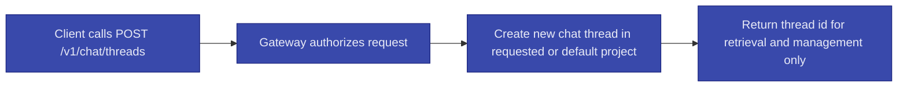

# OpenAI-Compatible Chat API

- [Document Overview](#document-overview)
- [Single Chat Surface](#single-chat-surface)
- [Compatibility Goals](#compatibility-goals)
- [Endpoints](#endpoints)
  - [Provider Interoperability](#provider-interoperability)
  - [Forward Compatibility](#forward-compatibility)
  - [Project Scoping](#project-scoping)
  - [Model Identifiers](#model-identifiers)
- [Chat Model Warm-Up](#chat-model-warm-up)
  - [When the Endpoint is Implemented](#when-the-endpoint-is-implemented)
- [Conversation Model](#conversation-model)
  - [State Model](#state-model)
  - [Thread Identifiers and Association](#thread-identifiers-and-association)
- [Normalized Assistant Output](#normalized-assistant-output)
- [Complete Chat Flow](#complete-chat-flow)
  - [Optional Explicit Thread Control](#optional-explicit-thread-control)
- [Chat Completion Routing Path](#chat-completion-routing-path)
  - [Effective Model Identifier](#effective-model-identifier)
  - [Orchestrator Responsibilities Before Routing](#orchestrator-responsibilities-before-routing)
  - [What is Routed to the PM Agent](#what-is-routed-to-the-pm-agent)
  - [What is Not Routed to the PM Agent](#what-is-not-routed-to-the-pm-agent)
  - [Routing Summary](#routing-summary)
- [Tasks Versus Chat (Non-Goals)](#tasks-versus-chat-non-goals)
- [Authentication, Policy, and Auditing](#authentication-policy-and-auditing)
- [Gateway Timeouts and Long-Running Behavior](#gateway-timeouts-and-long-running-behavior)
- [Reliability Requirements](#reliability-requirements)
- [Error Semantics](#error-semantics)
  - [Error Format for OpenAI-Compatible Endpoints](#error-format-for-openai-compatible-endpoints)
  - [HTTP Status Mapping](#http-status-mapping)
- [Observability](#observability)
- [Request Processing Pipeline](#request-processing-pipeline)
  - [Pipeline Steps (Order is Mandatory)](#pipeline-steps-order-is-mandatory)
- [Optional: Async Chat (Deferred)](#optional-async-chat-deferred)
- [Related Documents](#related-documents)

## Document Overview

- Spec ID: `CYNAI.USRGWY.OpenAIChatApi` <a id="spec-cynai-usrgwy-openaichatapi"></a>

This spec defines the OpenAI-compatible interactive chat interfaces exposed by the User API Gateway.
It is the **only** interactive chat surface for Open WebUI, cynork, and E2E.

Compatibility contract (pinned as of 2026-03-12):

- The OpenAI-compatible surfaces in this spec are pinned to the OpenAI Chat Completions API and the OpenAI Responses API as documented in the OpenAI API Reference.
- The OpenAI REST API version header reported by the OpenAI API Overview is `openai-version: 2020-10-01` as of 2026-02-22.
- Reference: [OpenAI API Overview](https://platform.openai.com/docs/api-reference), [Chat Completions API Reference](https://platform.openai.com/docs/api-reference/chat), and [Responses API Reference](https://platform.openai.com/docs/api-reference/responses).

Traces To:

- [REQ-USRGWY-0121](../requirements/usrgwy.md#req-usrgwy-0121)
- [REQ-USRGWY-0127](../requirements/usrgwy.md#req-usrgwy-0127)
- [REQ-USRGWY-0136](../requirements/usrgwy.md#req-usrgwy-0136)
- [REQ-USRGWY-0137](../requirements/usrgwy.md#req-usrgwy-0137)
- [REQ-USRGWY-0138](../requirements/usrgwy.md#req-usrgwy-0138)

## Single Chat Surface

- Spec ID: `CYNAI.USRGWY.OpenAIChatApi.SingleSurface` <a id="spec-cynai-usrgwy-openaichatapi-singlesurface"></a>

The User API Gateway MUST expose interactive chat only through the OpenAI-compatible API surface.
There is no separate legacy chat endpoint.

Traces To:

- [REQ-USRGWY-0127](../requirements/usrgwy.md#req-usrgwy-0127)

## Compatibility Goals

The gateway MUST support:

- Open WebUI as an OpenAI-compatible client.
- Cynork chat as an OpenAI-compatible client.
- E2E scenarios that exercise the same endpoints.

Compatibility layers MUST preserve orchestrator policy constraints and MUST NOT bypass auditing.

Traces To:

- [REQ-USRGWY-0121](../requirements/usrgwy.md#req-usrgwy-0121)

## Endpoints

- Spec ID: `CYNAI.USRGWY.OpenAIChatApi.Endpoints` <a id="spec-cynai-usrgwy-openaichatapi-endpoints"></a>

The gateway MUST provide:

- `GET /v1/models` in OpenAI list-models format.
- `POST /v1/chat/completions` in OpenAI chat-completions format.
- `POST /v1/responses` in OpenAI responses format.

The gateway MUST accept an OpenAI-format request body containing `messages: [{ role, content }, ...]`.
The gateway MUST return an OpenAI-format response containing the completion content at `choices[0].message.content`.

The gateway MUST accept the OpenAI `model` field when provided.
If `model` is omitted or empty, the gateway MUST use a default model identifier.
The default MUST correspond to the PM/PA chat surface for typical user chat.

For `POST /v1/responses`, the first-pass compatibility surface MUST support:

- `model` when provided.
- `input` as either a plain string or an ordered message-like input array sufficient for multi-turn chat continuation.
- `previous_response_id` for continuation when the referenced response belongs to the authenticated user, is within the same effective project scope, and is still retained by the gateway.
- A responses-format object in the response body, including a stable response `id` and the normal text output in the OpenAI responses shape.

The first-pass compatibility surface for both endpoints SHOULD also support normalization of provider-specific reasoning and tool-activity signals into the persisted structured turn model described in [Chat Threads and Messages](chat_threads_and_messages.md#spec-cynai-usrgwy-chatthreadsmessages-structuredturns).

### Provider Interoperability

- The underlying inference backend does not need to implement every OpenAI-compatible endpoint natively.
- The gateway MUST own the external compatibility contract and MAY translate `POST /v1/responses` requests into backend-native or `POST /v1/chat/completions`-style calls when necessary, as long as the external request and response shape remains compliant with this spec.

### Forward Compatibility

- The gateway MUST ignore unknown request fields in the OpenAI chat-completions request body.
- The gateway MUST ignore unknown fields inside message objects.
- The gateway MUST ignore unknown request fields in the OpenAI responses request body unless the field is required for the specific supported responses mode.

### Project Scoping

- If an OpenAI-standard `OpenAI-Project` request header is present, the gateway MUST treat its value as the project context for persistence.
- If the header is absent, the gateway MUST associate the thread (and any tasks created in that context) with the creating user's default project (see [REQ-PROJCT-0104](../requirements/projct.md#req-projct-0104) and [Default project](../tech_specs/projects_and_scopes.md#spec-cynai-access-defaultproject)).

### Model Identifiers

- The gateway MUST expose a stable PM/PA chat surface model id `cynodeai.pm`.
- When the client omits `model` or provides an empty `model`, the gateway MUST behave as if `model` was `cynodeai.pm`.
- The internal implementation of the PM/PA chat surface is the `cynode-pma` binary (see [cynode_pma.md](cynode_pma.md)); the external id `cynodeai.pm` is stable and MUST NOT change for client compatibility.
- The gateway MUST also expose underlying inference model identifiers in `GET /v1/models`.
  These identifiers MUST be limited to the currently configured inference model(s) that the authenticated user is authorized to use.
  The gateway MUST NOT disclose model identifiers the user is not authorized to use.

## Chat Model Warm-Up

- Spec ID: `CYNAI.USRGWY.OpenAIChatApi.WarmUp` <a id="spec-cynai-usrgwy-openaichatapi-warmup"></a>

The gateway MAY expose an optional endpoint to warm the default (or a specified) chat model before the first user message, to reduce time-to-first-meaningful-response.

### When the Endpoint is Implemented

- **Endpoint:** `POST /v1/chat/warm`.
  Same authentication as `POST /v1/chat/completions` (Bearer token).
- **Request:** Optional `model` in the request body or query; when omitted, the gateway uses the default chat model (e.g. `cynodeai.pm`).
- **Behavior:** Gateway triggers backend warm-up (e.g. calls the inference backend or PMA path with a no-op or minimal prompt and discards the response).
  Warm-up is best-effort: the gateway SHOULD return 200 or 202 quickly (e.g. "warm-up started" or "already warm") and MAY perform loading asynchronously or with a short timeout.
  Failure or timeout MUST NOT affect the chat session; clients MUST NOT block the first prompt on warm-up completion.
- **Idempotency:** Multiple rapid warm-up calls for the same model (e.g. several tabs or restarts) MUST be safe; the implementation MAY debounce or ignore duplicate in-flight warm-up.
- **Observability:** The implementation SHOULD log or emit a metric when warm-up is requested and when it succeeds or fails.

Traces To:

- [REQ-USRGWY-0134](../requirements/usrgwy.md#req-usrgwy-0134)
- [REQ-CLIENT-0177](../requirements/client.md#req-client-0177)

## Conversation Model

- Spec ID: `CYNAI.USRGWY.OpenAIChatApi.ConversationModel` <a id="spec-cynai-usrgwy-openaichatapi-conversationmodel"></a>

Chat is a conversation with the PM/PA (Project Manager / Project Analyst) agent surface.
The gateway supports both the Chat Completions and Responses API styles for that conversation.

Conversation state and history are tracked separately from tasks.
Chat messages are stored as chat-thread messages (see [Chat Threads and Messages](chat_threads_and_messages.md)).
Multi-message conversation is the intended way to clarify and lay out a task (or project plan) before or as it is executed; see [REQ-AGENTS-0135](../requirements/agents.md#req-agents-0135).

### State Model

- `POST /v1/chat/completions` remains a messages-based interactive surface.
- `POST /v1/responses` adds a response-oriented interactive surface and MAY use `previous_response_id` for continuation.
- CyNodeAI chat threads and chat messages remain the canonical persisted user-visible history regardless of which interactive endpoint was used.
- OpenAI Conversations API support is deferred.
  This spec adds `POST /v1/responses`, but does not require a separate OpenAI-compatible durable conversations endpoint in the first pass.

### Thread Identifiers and Association

- The OpenAI-compatible surface MUST NOT require any CyNodeAI-specific thread or session identifiers in request bodies or headers.
- The orchestrator MUST manage chat thread association server-side.
- The orchestrator MUST maintain a single active thread per `(user_id, project_id)` scope.
  The orchestrator MUST rotate to a new active thread after 2 hours of inactivity.

Traces To:

- [REQ-USRGWY-0130](../requirements/usrgwy.md#req-usrgwy-0130)

## Normalized Assistant Output

- Spec ID: `CYNAI.USRGWY.OpenAIChatApi.NormalizedAssistantOutput` <a id="spec-cynai-usrgwy-openaichatapi-normalizedassistantoutput"></a>

Traces To:

- [REQ-USRGWY-0136](../requirements/usrgwy.md#req-usrgwy-0136)
- [REQ-USRGWY-0137](../requirements/usrgwy.md#req-usrgwy-0137)
- [REQ-USRGWY-0138](../requirements/usrgwy.md#req-usrgwy-0138)

The gateway MUST normalize provider-specific assistant output into one logical assistant turn for persistence and rich-client rendering.
This follows the same broad UX pattern used by open source tools such as Open WebUI and LibreChat: the main answer stays readable, reasoning is secondary rather than merged into final prose, and tool activity is surfaced as distinct transcript items instead of being implied only by text.

Normalization rules:

- If the upstream provider returns only final visible text, the normalized assistant turn is a single `text` part and the canonical plain-text projection matches that text.
- If the upstream provider returns reasoning, tool activity, file references, or multiple ordered output items, the gateway SHOULD project them into the structured turn model defined in [Chat Threads and Messages](chat_threads_and_messages.md#spec-cynai-usrgwy-chatthreadsmessages-structuredturns).
- When one request yields multiple assistant-side output items, the gateway MUST preserve their order.
- Reasoning or thinking content MUST NOT be copied into canonical plain-text transcript content such as `choices[0].message.content` or the plain-text projection used for thread titles, summaries, and list previews.
- For `POST /v1/chat/completions`, the response surface remains the OpenAI chat-completions shape and therefore exposes only the canonical visible assistant text in `choices[0].message.content`.
- For `POST /v1/responses`, the gateway MUST preserve the native responses-format shape while also persisting the same logical assistant turn in the normalized structured-turn model for retrieval and UI rendering.
- Clients that ignore structured turn data MUST still receive a coherent answer from the canonical visible text alone.

## Complete Chat Flow

This diagram summarizes the whole chat flow across client, gateway, orchestrator, PMA or direct inference, persistence, and UI rendering.
It also shows the separate explicit-thread-create path, which remains outside the OpenAI-compatible request shape.

```mermaid
flowchart TD
  U[User in cynork TUI or other client]
  U --> C{Interactive chat surface}
  C -->|POST /v1/chat/completions| G1[Gateway receives messages-based request]
  C -->|POST /v1/responses| G2[Gateway receives responses-format request]

  G1 --> V[Authenticate, validate request, resolve project scope]
  G2 --> V

  V --> R[Redact secrets in user-visible input]
  R --> A[Associate request to active thread or explicit fresh thread state]
  A --> P1[Persist redacted user message to chat thread]

  P1 --> PR{Responses continuation?}
  PR -->|No| M[Compute effective model id]
  PR -->|Yes, valid previous_response_id| RS[Load retained response continuation state]
  RS --> M

  M --> Route{Effective model == cynodeai.pm?}
  Route -->|Yes| PMA[Hand off to PMA via worker-mediated endpoint]
  Route -->|No| INF[Route to direct inference backend]

  PMA --> OUT[Assistant output from PMA or provider]
  INF --> OUT

  OUT --> N[Normalize assistant output into one logical assistant turn]
  N --> Parts[Ordered structured parts when available:
text, thinking, tool_call, tool_result,
attachment_ref, download_ref]
  N --> Plain[Canonical plain-text projection:
visible assistant text only]

  Parts --> P2[Persist assistant turn to chat thread]
  Plain --> P2
  P2 --> RespMeta[Persist retained response metadata when needed for previous_response_id]

  RespMeta --> APIResp{Return endpoint-specific response}
  APIResp -->|chat completions| CC["choices[0].message.content = canonical visible text"]
  APIResp -->|responses| RR[Responses-format object with stable response id]

  CC --> ClientRender[Client renders response]
  RR --> ClientRender

  ClientRender --> UX1[Rich clients prefer structured parts and group ordered items into one assistant turn]
  ClientRender --> UX2[Thinking stays hidden by default unless user explicitly expands it]
  ClientRender --> UX3[Plain or one-shot output emits only canonical visible assistant text]

  classDef client fill:#1565c0,stroke:#0d47a1,color:#e3f2fd
  classDef gateway fill:#ef6c00,stroke:#e65100,color:#fff8e1
  classDef persist fill:#2e7d32,stroke:#1b5e20,color:#e8f5e9
  classDef routing fill:#7b1fa2,stroke:#4a148c,color:#f3e5f5
  classDef output fill:#00838f,stroke:#006064,color:#e0f7fa
  classDef response fill:#bf360c,stroke:#d84315,color:#fbe9e7
  class U,C,ClientRender,UX1,UX2,UX3 client
  class G1,G2,V,R,A gateway
  class P1,P2,RespMeta persist
  class PR,M,RS,Route,PMA,INF routing
  class OUT,N,Parts,Plain output
  class APIResp,CC,RR response
```



### Optional Explicit Thread Control



## Chat Completion Routing Path

- Spec ID: `CYNAI.USRGWY.OpenAIChatApi.RoutingPath` <a id="spec-cynai-usrgwy-openaichatapi-routingpath"></a>

All OpenAI-compliant interactive chat requests are processed by the **orchestrator** first.
The orchestrator is the single point of entry for request handling, policy, and routing.
The gateway MUST NOT send interactive chat requests directly to an agent or inference endpoint; every request MUST flow through the orchestrator.

### Effective Model Identifier

- The **effective model identifier** for routing is the request body `model` field if present and non-empty; otherwise it is `cynodeai.pm`.

### Orchestrator Responsibilities Before Routing

- Perform automatic **sanitization**: detect and redact secrets in message content (at least API keys), replace detected secrets with the literal `SECRET_REDACTED`, and record redaction in audit log.
- Perform **logging** and audit recording for the request.
- Persist the amended user message or equivalent user input to the chat thread.
- Then route to the backend that generates the completion using the effective model identifier.

### What is Routed to the PM Agent

- The orchestrator MUST hand off the request to the **PM agent** (`cynode-pma` in `project_manager` mode) if and only if the effective model identifier is exactly `cynodeai.pm`.
- In that case the orchestrator sends the sanitized messages to `cynode-pma`; the PM agent performs further processing (including tool use and inference) and returns the completion.
  The orchestrator does not call an inference API directly for that request.
- The orchestrator MUST reach PMA only via the **worker-mediated endpoint** reported by the worker in capability (`managed_services_status`); it MUST NOT use compose DNS or direct host-port addressing.
  Traces To: [REQ-ORCHES-0162](../requirements/orches.md#req-orches-0162), [cynode_pma.md](cynode_pma.md).

### What is Not Routed to the PM Agent

- The orchestrator MUST route the request to **direct inference** (no PM agent) if and only if the effective model identifier is not `cynodeai.pm`.
- In that case the effective model identifier MUST be one of the inference model ids returned by `GET /v1/models` for the authenticated user.
  The orchestrator MUST call the corresponding inference backend: node-local inference (e.g. Ollama on the selected worker or sidecar) or an external API via API Egress, per [External Model Routing](external_model_routing.md).
  The orchestrator MUST NOT invoke `cynode-pma` for that request.

### Routing Summary

- **Effective model `cynodeai.pm`:** Routed to PM agent (`cynode-pma`).
  Orchestrator hands off sanitized messages to the PM agent; the agent returns the completion.
  Orchestrator does not call an inference API directly.
- **Effective model any other value:** Routed to direct inference.
  Orchestrator calls the inference backend (node-local or API Egress); the orchestrator does not invoke the PM agent.

See [Request Processing Pipeline](#request-processing-pipeline) for the ordered steps and [External Model Routing](external_model_routing.md) for inference routing policy.

## Tasks Versus Chat (Non-Goals)

- Spec ID: `CYNAI.USRGWY.OpenAIChatApi.TasksVsChat` <a id="spec-cynai-usrgwy-openaichatapi-tasksvschat"></a>

These APIs MUST NOT define or imply a one-to-one mapping of chat messages to tasks.
The PM/PA MAY create zero or many tasks via MCP during a conversation.
Users MAY create tasks manually through the task API or cynork task commands.

If an implementation uses internal runs or jobs to produce a completion, that is an implementation detail.
The external contract remains an interactive chat request and response.

Traces To:

- [REQ-USRGWY-0130](../requirements/usrgwy.md#req-usrgwy-0130)

## Authentication, Policy, and Auditing

- Spec ID: `CYNAI.USRGWY.OpenAIChatApi.AuthPolicy` <a id="spec-cynai-usrgwy-openaichatapi-authpolicy"></a>

- Authentication MUST use the same Bearer token mechanism as the rest of the User API Gateway.
- Requests MUST be subject to policy enforcement and MUST emit audit records.

Traces To:

- [REQ-USRGWY-0121](../requirements/usrgwy.md#req-usrgwy-0121)
- [REQ-USRGWY-0124](../requirements/usrgwy.md#req-usrgwy-0124)
- [REQ-USRGWY-0125](../requirements/usrgwy.md#req-usrgwy-0125)

## Gateway Timeouts and Long-Running Behavior

- Spec ID: `CYNAI.USRGWY.OpenAIChatApi.Timeouts` <a id="spec-cynai-usrgwy-openaichatapi-timeouts"></a>

Chat can take 30-120 seconds or more when the model is cold or under load.
The gateway MUST support a `WriteTimeout` (and optionally `ReadTimeout`) long enough for chat to complete.
The gateway MUST support configuring these timeouts for deployments that use chat.

Documentation (dev_docs or operator docs) MUST describe the expected duration and required timeout tuning.

Traces To:

- [REQ-USRGWY-0128](../requirements/usrgwy.md#req-usrgwy-0128)

## Reliability Requirements

- Spec ID: `CYNAI.USRGWY.OpenAIChatApi.Reliability` <a id="spec-cynai-usrgwy-openaichatapi-reliability"></a>

The gateway handlers backing `POST /v1/chat/completions` and `POST /v1/responses` MUST implement the following reliability behavior.

- **Poll cap.**
  If the handler must wait on internal state to produce a completion, it MUST enforce a maximum total wait duration (for example 90-120 seconds).
  After the cap is reached, it MUST return a clear timeout error.
- **Retry with backoff.**
  On transient orchestrator inference failures (for example connection error, 5xx, or model loading), the handler MUST retry a small number of times (for example 2-3) with short backoff before using a fallback path.

Traces To:

- [REQ-ORCHES-0131](../requirements/orches.md#req-orches-0131)
- [REQ-ORCHES-0132](../requirements/orches.md#req-orches-0132)

## Error Semantics

- Spec ID: `CYNAI.USRGWY.OpenAIChatApi.Errors` <a id="spec-cynai-usrgwy-openaichatapi-errors"></a>

The gateway MUST return errors that allow clients and operators to distinguish at least:

- Request canceled.
- Orchestrator inference failed.
- Completion did not finish before the maximum wait duration.

Errors MUST NOT leak secrets.

### Error Format for OpenAI-Compatible Endpoints

- For `GET /v1/models`, `POST /v1/chat/completions`, and `POST /v1/responses`, error responses MUST use an OpenAI-style JSON payload with a top-level `error` object.
- The gateway MUST NOT return RFC 9457 Problem Details for these OpenAI-compatible endpoints.
- The payload MUST follow this shape:

```json
{
  "error": {
    "message": "Safe, user-displayable error message.",
    "type": "cynodeai_error",
    "param": null,
    "code": "cynodeai_completion_timeout"
  }
}
```

### HTTP Status Mapping

- Request canceled: `408`.
- Orchestrator inference failed: `502` or `503` depending on whether the failure is upstream or overload.
- Completion timeout (poll cap reached): `504`.

Traces To:

- [REQ-USRGWY-0129](../requirements/usrgwy.md#req-usrgwy-0129)

## Observability

- Spec ID: `CYNAI.USRGWY.OpenAIChatApi.Observability` <a id="spec-cynai-usrgwy-openaichatapi-observability"></a>

The gateway MUST log which internal path was used for a completion (for example direct orchestrator inference versus fallback).
The gateway MUST log timeouts and request cancellations.

Traces To:

- [REQ-USRGWY-0129](../requirements/usrgwy.md#req-usrgwy-0129)

## Request Processing Pipeline

- Spec ID: `CYNAI.USRGWY.OpenAIChatApi.Pipeline` <a id="spec-cynai-usrgwy-openaichatapi-pipeline"></a>

This section defines the required request-processing steps for interactive chat requests.

### Pipeline Steps (Order is Mandatory)

1. Authenticate the caller using the standard gateway Bearer token mechanism.
2. Decode the incoming OpenAI-compatible request body.
   - For `POST /v1/chat/completions`, validate that `messages` is present and non-empty.
   - For `POST /v1/responses`, validate that `input` is present in a supported first-pass form (plain string or ordered message-like input array).
3. Determine `project_id`: from the OpenAI-standard `OpenAI-Project` header when present; when absent, use the creating user's default project.
4. Detect and redact secrets in the user-visible message content or equivalent user input.
   - API keys are the priority.
   - The gateway MUST redact secrets before any persistence or inference.
   - Detected secrets MUST be replaced with the literal string `SECRET_REDACTED` in the amended message content.
   - The gateway MUST record whether redaction was applied and the kind(s) of secrets detected in `chat_audit_log`.
5. Persist the amended (redacted) user message content to the database as a chat-thread message scoped to `(user_id, project_id)`.
   For `POST /v1/responses`, when `previous_response_id` is provided and valid, the gateway MUST treat the referenced response as continuation state for routing and persistence purposes.
6. **Orchestrator routing:** Compute the effective model identifier (request `model` if present and non-empty, else `cynodeai.pm`).
   Using only the amended (redacted) messages and that identifier:
   - If the effective model identifier is exactly `cynodeai.pm`: hand off the request to the PM agent (`cynode-pma`) for processing and response generation.
     Do not call an inference API directly.
   - If the effective model identifier is not `cynodeai.pm`: route to direct inference (node-local or external API via API Egress per [External Model Routing](external_model_routing.md)).
     Do not invoke the PM agent.
7. Persist the assistant output as a chat-thread message scoped to the same `(user_id, project_id)`.
   When structured output is available, the gateway SHOULD persist the normalized ordered assistant parts for that logical turn in the structured-turn representation.
   Any canonical plain-text projection for that assistant message MUST exclude hidden thinking content.
   For `POST /v1/responses`, the gateway MUST also persist enough response metadata to resolve a retained `previous_response_id` for future continuation while it remains within retention.
8. Return the endpoint-specific OpenAI-compatible response shape.
   - For `POST /v1/chat/completions`, return a chat-completions response where the content is present at `choices[0].message.content`.
   - For `POST /v1/responses`, return a responses-format object with a stable response `id` and the final text output in the normal responses shape.

Traces To:

- [REQ-USRGWY-0121](../requirements/usrgwy.md#req-usrgwy-0121)
- [REQ-USRGWY-0127](../requirements/usrgwy.md#req-usrgwy-0127)
- [REQ-USRGWY-0130](../requirements/usrgwy.md#req-usrgwy-0130)

## Optional: Async Chat (Deferred)

- Spec ID: `CYNAI.USRGWY.OpenAIChatApi.AsyncDeferred` <a id="spec-cynai-usrgwy-openaichatapi-asyncdeferred"></a>

This spec defers an async chat mode to a later phase.
If async chat is added, it MUST use a completion-scoped or chat-scoped identifier and poll endpoint.
Async chat MUST NOT reuse task identifiers or task-result endpoints for chat.

## Related Documents

- [User API Gateway](user_api_gateway.md)
- [Chat Threads and Messages](chat_threads_and_messages.md)
- [Runs and Sessions API](runs_and_sessions_api.md)
- [CLI management app - Chat command](cli_management_app_commands_chat.md)
- [OpenWebUI and CyNodeAI Integration](../openwebui_cynodeai_integration.md)
