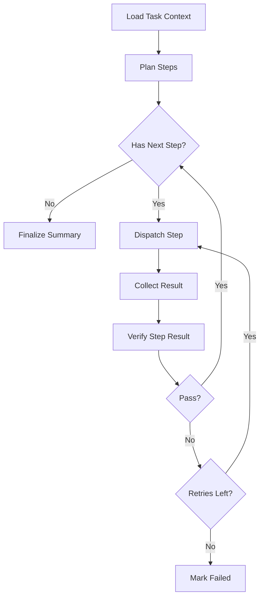
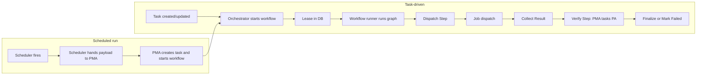

# Workflow MVP

- [Document Overview](#document-overview)
- [MVP Goal](#mvp-goal)
- [Integration With the Orchestrator](#integration-with-the-orchestrator)
  - [Runtime and Hosting](#runtime-and-hosting)
  - [Invocation Model](#invocation-model)
  - [Workflow Start/Resume API Contract](#workflow-startresume-api-contract)
  - [Workflow Start Triggers](#workflow-start-triggers)
  - [Project Plan and Task Order](#project-plan-and-task-order)
  - [Workflow Start Gate (Plan Approved)](#workflow-start-gate-plan-approved)
  - [Checkpoint Persistence Contract](#checkpoint-persistence-contract)
  - [Graph Nodes to Orchestrator Capabilities](#graph-nodes-to-orchestrator-capabilities)
  - [Sub-Agent Invocation](#sub-agent-invocation)
  - [Plan Completion Validation (Sign-Off)](#plan-completion-validation-sign-off)
- [Graph Topology](#graph-topology)
- [State Model](#state-model)
- [Node Behaviors](#node-behaviors)
  - [Load Task Context](#load-task-context)
  - [Plan Steps](#plan-steps)
  - [Dispatch Step](#dispatch-step)
  - [Collect Result](#collect-result)
  - [Verify Step Result](#verify-step-result)
  - [Finalize Summary](#finalize-summary)
  - [Mark Failed](#mark-failed)
- [Checkpointing and Resumability](#checkpointing-and-resumability)
  - [Applicable Requirements](#applicable-requirements)
  - [Checkpoint Schema (Prescriptive)](#checkpoint-schema-prescriptive)
- [Postgres Schema](#postgres-schema)
  - [Workflow Checkpoints Table](#workflow-checkpoints-table)
  - [Task Workflow Leases Table](#task-workflow-leases-table)
- [Workflow Flow Summary](#workflow-flow-summary)
- [Tooling and Security Notes](#tooling-and-security-notes)

## Document Overview

This document defines the minimum viable workflow used by the orchestrator to drive tasks to completion.
It focuses on the Project Manager Agent happy path with retries and verification.

## MVP Goal

The MVP workflow should:

- Accept a task with acceptance criteria.
- Produce a plan that decomposes the work into executable steps.
- Dispatch steps to worker nodes and collect results.
- Verify results against acceptance criteria and preferences.
- Iterate with bounded retries.
- Produce a final summary and artifacts.

## Integration With the Orchestrator

This section defines how the workflow is integrated with the orchestrator so that implementation choices are unambiguous.

### Runtime and Hosting

- The workflow runs as part of the orchestrator's workflow engine.
- The workflow engine is a **Go-native workflow runner** (state machine) within the orchestrator process.
  The runner implements the graph topology and node transitions; it does not serve the orchestrator's REST APIs.
- The orchestrator MUST provide a stable contract for starting workflows, passing `task_id`, and reading/writing checkpoints so that the graph can be resumed after any restart.
- The Project Manager Agent's behavior is implemented by this graph: the graph is the execution model for the agent.
  Planning, dispatch, verification, and finalization are graph nodes, not separate services.

### Invocation Model

- One workflow instance is scoped to one **task** (one `task_id`); for task vs **job** terminology, see [Task vs Job (Terminology)](orchestrator.md#spec-cynai-schema-taskvsjob).
- The orchestrator starts a workflow when a task is ready to be driven (e.g. after task creation via User API or when a task is unblocked).
- The following MUST hold:
  - The workflow receives the task identifier and MUST load task context in the first node (Load Task Context).
  - Only one active workflow instance per task at a time.
  - The **single-active-workflow-per-task** guarantee is enforced by a **lease held in the orchestrator DB** (see [orchestrator.md](orchestrator.md) and [Task Workflow Leases Table](#task-workflow-leases-table)).
  - The workflow runner MUST acquire or check the lease via the orchestrator before running; the orchestrator is the source of truth.
- The orchestrator MAY run multiple workflow instances concurrently for different tasks.
- When and how the orchestrator starts a workflow for a task is defined in [Workflow Start Triggers](#workflow-start-triggers) below.

### Workflow Start/Resume API Contract

- Spec ID: `CYNAI.ORCHES.WorkflowStartResumeAPI` 

#### Traces to Requirements

- [REQ-ORCHES-0144](../requirements/orches.md#req-orches-0144)
- [REQ-ORCHES-0145](../requirements/orches.md#req-orches-0145)

The orchestrator exposes a stable API to the workflow runner for starting and resuming workflows.
The implementation uses HTTP; the contract is defined below.

#### Workflow Start/Resume API Operations

- **StartWorkflow:** Request includes `task_id` (uuid) and optional `idempotency_key` (string).
  Response: 200 with run identifier or status; or 409 Conflict when the lease for the task is already held by another holder; or 200 with body indicating "already running" when the same holder re-requests (idempotent).
  The start operation must not start a second workflow instance when the lease is already held.
- **ResumeWorkflow:** Request includes `task_id`.
  Response: 200 with current checkpoint pointer or status so the workflow runner can continue from the last node.

The workflow runner acquires or validates the task workflow lease via this API (or a dedicated lease step that is part of start) before running graph steps.
If the lease is already held for the task, the start call returns the defined response (409 or 200 already-running) and does not start a second instance.

**Transport:** The API is exposed over HTTP by the orchestrator; the workflow runner is the client.

### Workflow Start Triggers

- Spec ID: `CYNAI.ORCHES.WorkflowStartTriggers` 

#### Workflow Start Triggers Requirements Traces

- [REQ-ORCHES-0147](../requirements/orches.md#req-orches-0147)

The conditions under which the orchestrator starts a workflow for a task are:

#### Task Created via User API

When a task is created via the User API Gateway (e.g. POST that creates a task), the task is persisted with `planning_state=draft` and is routed to the Project Manager Agent for review first; the orchestrator MUST NOT start a workflow for that task until `planning_state=ready` (see [REQ-ORCHES-0176](../requirements/orches.md#req-orches-0176), [REQ-ORCHES-0177](../requirements/orches.md#req-orches-0177), [REQ-ORCHES-0178](../requirements/orches.md#req-orches-0178)).
Workflow execution starts only after the PMA (or an authorized path) transitions the task to `planning_state=ready`; then the orchestrator invokes the workflow start contract for that `task_id` as defined in [Workflow Start/Resume API Contract](#workflow-startresume-api-contract).
The planning state gate is applied before other workflow start gates (plan state, dependencies, lease).

#### Task Created via Chat (PMA/MCP)

When PMA creates a task via MCP during a chat turn, PMA invokes an MCP tool or internal request to "start workflow for task_id" (or equivalent); the orchestrator performs the start for that `task_id` in response.
The orchestrator does not infer workflow start from task-state subscription; the trigger is the explicit request from PMA.

#### Scheduled Run

When a scheduled run requires interpretation, the scheduler hands the run payload to PMA; PMA creates the task and starts the workflow internally.
See [orchestrator.md](orchestrator.md) Scheduled Run Routing to Project Manager Agent.

### Project Plan and Task Order

- Spec ID: `CYNAI.ORCHES.WorkflowPlanOrder` 

#### Project Plan and Task Order Requirements Traces

- [REQ-ORCHES-0153](../requirements/orches.md#req-orches-0153)

When a task is associated with a plan (`task.plan_id` set; see [Project plan](projects_and_scopes.md#spec-cynai-access-projectplan)), execution order and runnability are determined solely by **task dependencies** ([`task_dependencies`](orchestrator.md#spec-cynai-schema-taskdependenciestable) table).

**Runnable:** A task in a plan is **runnable** when: (0) the task's `planning_state` is `ready`, (1) the plan's state is `active`, (2) the task is not closed, and (3) every task it depends on (each `depends_on_task_id` in `task_dependencies` for this `task_id`) has `status = 'completed'`.
A task with no dependencies in `task_dependencies` is runnable once `planning_state=ready`, the plan is active, and the task is not closed (subject to the workflow start gate).

**Blocking on failed dependencies:** Tasks that depend on a task with status `failed`, `canceled`, or `superseded` MUST NOT have their workflow started until that dependency is retried and reaches `status = 'completed'`.
The orchestrator MUST enforce this in the workflow start gate (see [Workflow start gate: dependency check](#workflow-start-gate-plan-approved)).

**Parallel execution:** Multiple tasks MAY be started in parallel when each is runnable (no unsatisfied dependencies).
The orchestrator or PMA when selecting which task(s) to run next MUST consider all runnable tasks in the plan and MAY start any subset of them subject to resource and policy constraints.

Tasks with no rows in `task_dependencies` for that plan are runnable once the plan is active and the task is not closed (no prerequisites).

#### Cancel Cascades to Dependents

- Spec ID: `CYNAI.ORCHES.CancelCascadesToDependents` 

##### Cancel Cascades to Dependents Requirements Traces

- [REQ-ORCHES-0154](../requirements/orches.md#req-orches-0154)

When a task is set to status `canceled`, the system MUST automatically set to `canceled` every task that depends on it (each `task_id` that has this task as `depends_on_task_id` in `task_dependencies`).
This MUST be applied **transitively**: any task that depends on a task that was just canceled is also canceled, and so on, so that the entire downstream dependency graph from the canceled task is canceled.
Each cascaded task MUST have its `status` set to `canceled` and `closed` set to `true`.
The gateway and orchestrator MUST enforce this when processing a cancel request or when any component sets a task's status to `canceled`.

### Workflow Start Gate (Plan Approved)

- Spec ID: `CYNAI.ORCHES.WorkflowStartGatePlanApproved` 

#### Workflow Start Gate (Plan Approved) Requirements Traces

- [REQ-ORCHES-0152](../requirements/orches.md#req-orches-0152)
- [REQ-ORCHES-0153](../requirements/orches.md#req-orches-0153)
- [REQ-ORCHES-0178](../requirements/orches.md#req-orches-0178)
- [REQ-ORCHES-0180](../requirements/orches.md#req-orches-0180)
- [REQ-PROJCT-0124](../requirements/projct.md#req-projct-0124)

Before the orchestrator starts a workflow for a task, it MUST apply the following gate.

#### `WorkflowStartGatePlanApproved` Scope

- Applies to every workflow start request (whether triggered by User API task create, PMA/MCP "start workflow for task_id", or scheduled run handed to PMA).
- The gate is evaluated after the trigger is recognized and before the workflow start API is invoked (or before the lease is acquired).

#### `WorkflowStartGatePlanApproved` Algorithm

1. **Planning state check:** If the task's `planning_state` is not `ready`, deny workflow start and return a defined error (e.g. 409 with reason "task not ready"). 
2. Resolve the task's plan: `plan_id` from the task row. 
3. If `plan_id` is null, allow workflow start (no plan gate). 
4. Load the plan row (`project_plans`).
   If the plan's `archived` flag is true, deny workflow start and return a defined error (e.g. 409 or 403 with reason "plan is archived").
   If the plan's `state` is not `active` (e.g. `draft`, `ready`, `suspended`, `completed`, `canceled`): if the workflow start was requested explicitly by the PMA (e.g. MCP tool or internal "start workflow for task_id" from PMA), continue to step 6 (PMA handoff); otherwise deny workflow start and return a defined error (e.g. 409 or 403 with reason "plan not active"). 
5. If the plan's `state` is `active`, continue to step 6. 
6. **Dependency check** (whenever `plan_id` is set): Load all rows from `task_dependencies` where `task_id` = this task.
   For each such row, load the dependency task (`depends_on_task_id`).
   If any dependency task has `status != 'completed'`, deny workflow start and return a defined error (e.g. 409 with reason "dependencies not satisfied" or "dependency not completed").
   If there are no dependency rows, or every dependency has `status = 'completed'`, allow workflow start. 

Implementations MUST set the plan's state to `draft` whenever that plan's document, task list, or task dependencies are updated while the plan is active (see [Project plan auto un-approve on edit](projects_and_scopes.md#spec-cynai-access-projectplanautounapprove)).

### Checkpoint Persistence Contract

- The workflow MUST persist checkpoint data after each node transition so that state is durable and the graph can resume from the last checkpoint.
- The checkpoint store MUST be backed by PostgreSQL (or an orchestrator-owned store that uses PostgreSQL as the source of truth).
- The workflow implementation MUST support loading checkpoint state by `task_id` and continuing from the next node when the orchestrator restarts.
- The checkpoint schema and storage are prescriptive; see [Checkpoint schema (prescriptive)](#checkpoint-schema-prescriptive) under Checkpointing and Resumability.
- The orchestrator MUST NOT run workflow steps without going through the checkpoint layer so that resumability is guaranteed.

### Graph Nodes to Orchestrator Capabilities

Each graph node performs work by calling orchestrator-owned capabilities.
The following mapping is the MVP reference mapping.

- **Load Task Context**: MCP database tools (or equivalent internal API) to read task, acceptance criteria, artifacts; preference resolution.
- **Plan Steps**: Orchestrator model routing (local or API Egress) for LLM calls; state write for the plan.
- **Dispatch Step**: Worker API (or MCP node/sandbox tools) to select node and dispatch job; job lease/record.
- **Collect Result**: Worker API or job result API to wait for and retrieve result payload and artifacts.
- **Verify Step Result**: Orchestrator model routing for verification LLM; optionally Project Analyst (see below); MCP DB tools to record verification.
- **Finalize Summary**: MCP database tools to write final summary, artifact links, and verification record.
- **Mark Failed**: MCP database tools to write failure status and verification findings.

- All database reads and writes from the workflow MUST go through MCP database tools (or an internal service that enforces the same policy).
  The workflow MUST NOT connect directly to PostgreSQL.
- Node selection and job dispatch MUST use the orchestrator's node registry, capability data, and worker API as defined in [`worker_node.md`](worker_node.md) and [`orchestrator.md`](orchestrator.md).

#### LLM and Tool Execution (Implementation)

- The LLM and tool execution performed within graph nodes (e.g. Plan Steps, Verify Step Result) are implemented using **langchaingo** (Go), including **multiple simultaneous tool calls** where supported by the model and MCP gateway.
- The workflow engine is the graph runner and checkpoint owner; see [Runtime and Hosting](#runtime-and-hosting) and [Checkpoint Persistence Contract](#checkpoint-persistence-contract).
- See [Project Manager Agent - LLM and Tool Execution (Implementation)](project_manager_agent.md#spec-cynai-agents-pmllmtoolimplementation).

### Sub-Agent Invocation

- The Project Analyst Agent is a sub-agent used for focused verification.
- **MVP rule:** The **Orchestrator** kicks off work to **PMA** (e.g. when a task is ready to be driven, or when a scheduled run requires interpretation).
  In the **Verify Step Result** node, **PMA tasks the Project Analyst (or another sandbox agent)** to perform verification; the orchestrator does not call an internal verification API directly.
  Findings are written back into the main workflow state (or checkpoint) so that **Verify Step Result** can decide pass/fail and recommended actions.
- The Project Analyst MUST NOT bypass MCP or direct DB access rules.
  See [project_analyst_agent.md](project_analyst_agent.md) Handoff Model.

### Plan Completion Validation (Sign-Off)

- Spec ID: `CYNAI.ORCHES.PlanCompletionValidation` 

Before the system signs off on plan completion (sets the plan to state `completed`), a **second round of checks** MUST be supported: validate that all tasks in the plan were not only closed but **completed to standard** (meet the acceptance criteria and requirements laid out in each task), and issue **re-work** for any task that does not meet standard.

#### Validation Purpose

- The gateway today allows setting a plan to `completed` when all tasks are closed (per [REQ-PROJCT-0121](../requirements/projct.md#req-projct-0121)).
- This validation adds a quality gate: each task must be verified against its own acceptance criteria and requirements before the plan is considered done.
- Tasks that fail this check receive re-work (see below); the plan is not set to `completed` until validation passes or re-work is completed and re-validated.

#### Validation Workflow (Capability)

- The system MUST support a **plan completion validation** workflow (or equivalent phase) that:
  1. Runs when sign-off is requested (e.g. user or PMA requests "set plan to completed") or when all tasks in the plan have become closed.
  2. For each task in the plan with `closed = true`, validates that the task's outcome meets the standards laid out in that task (acceptance criteria, requirements, and any verification evidence from the task workflow).
  3. For any task that does not meet standard: **issue re-work** - e.g. re-open the task with feedback and remediation details, or create a follow-up task that depends on it; the re-work MUST be driven so the task (or its follow-up) can be re-executed and re-validated.
  4. Does not set the plan to `completed` until every task in the plan has passed this validation (or the validation is explicitly skipped per policy, e.g. override for operators).
- Validation MAY be implemented as a **plan-scoped workflow** (separate from the per-task workflow) or as a dedicated phase invoked by the gateway or PMA before allowing the "set plan to completed" operation.
- The Project Analyst Agent (PAA) MAY be invoked to perform or assist the validation (e.g. per-task verification against acceptance criteria); findings feed into the re-work decision.

#### Re-Work Handling

- **Re-work** means: ensure the task (or a follow-up) is executed again with clear remediation input.
  - Option A: Re-open the same task (reset status to pending, add feedback to description or post_execution_notes, and re-run its workflow).
  - Option B: Create a new follow-up task that depends on the failed task, with acceptance criteria that reflect the gap; the original task remains closed; the follow-up is run and validated.
- The system MUST record why re-work was issued (e.g. verification findings, failed acceptance criteria) so that the next run or follow-up task has the necessary context.

#### Traces To

- [REQ-PROJCT-0121](../requirements/projct.md#req-projct-0121) (plan completed only when all tasks closed; this spec adds that validation-to-standard and re-work MUST be supported before sign-off).

## Graph Topology

The MVP graph is a state machine.
It is designed to be resumable after orchestrator restarts.

## State Model

The graph maintains a task-scoped state object.

Minimum state fields

- `task_id` (uuid)
- `acceptance_criteria` (array)
- `preferences_effective` (object)
- `plan` (object)
  - `steps` (array)
  - `assumptions` (array)
- `current_step_index` (number)
- `attempts_by_step` (map)
- `last_result` (object)
- `verification` (object)
  - `status` (pass|fail)
  - `findings` (array)
  - `recommended_actions` (array)

## Node Behaviors

Each node is a bounded step that reads and writes the workflow state.

### Load Task Context

- Read task, acceptance criteria, and relevant artifacts.
- Compute effective preferences for the task and cache them in state.

### Plan Steps

- Generate a step plan that is executable by worker nodes and sandbox containers.
- Ensure each step has explicit expected outputs and evidence.

### Dispatch Step

- Select an execution target based on:
  - required sandbox capabilities
  - node load and health
  - data locality preference
  - model availability
- Dispatch a job with explicit sandbox requirements and timeouts.

### Collect Result

- Wait for the worker to return a result payload and artifacts.
- Normalize result metadata into state.

### Verify Step Result

- Evaluate the result against acceptance criteria and preferences.
- Record verification evidence and any gaps.
- If verification fails, update the next dispatch with remediation details.

### Finalize Summary

- Write final task summary, artifact links, and verification record.

### Mark Failed

- Write failure status with the final verification findings.

## Checkpointing and Resumability

This section describes persistence of workflow state so work can resume after restarts.

### Applicable Requirements

- Spec ID: `CYNAI.AGENTS.WorkflowCheckpointing` 

#### Applicable Requirements Requirements Traces

- [REQ-AGENTS-0116](../requirements/agents.md#req-agents-0116)
- [REQ-AGENTS-0117](../requirements/agents.md#req-agents-0117)
- [REQ-AGENTS-0118](../requirements/agents.md#req-agents-0118)

Recommended checkpoint points

- After planning completes.
- After each job dispatch.
- After each result collection.
- After each verification.
- On finalization or failure.

### Checkpoint Schema (Prescriptive)

The checkpoint store uses a single PostgreSQL table (`workflow_checkpoints`) so that implementations are unambiguous.
The workflow engine saves and loads by `task_id`; the orchestrator does not run workflow steps without going through this checkpoint layer.

Full column list, constraints, and the companion `task_workflow_leases` table are defined in [Postgres Schema](#postgres-schema).

## Postgres Schema

- Spec ID: `CYNAI.SCHEMA.WorkflowCheckpoints` 

The workflow engine persists checkpoint state and per-task workflow leases in PostgreSQL so workflows can resume after restarts and only one active workflow runs per task.

**Schema definitions (index):** See [Workflow Checkpoints](postgres_schema.md#spec-cynai-schema-workflowcheckpoints) in [`postgres_schema.md`](postgres_schema.md).

### Workflow Checkpoints Table

- Spec ID: `CYNAI.SCHEMA.WorkflowCheckpointsTable` 

Table name: `workflow_checkpoints`.

The workflow engine persists checkpoint state to PostgreSQL so that workflows can resume after restarts.
The orchestrator does not run workflow steps without going through this checkpoint layer.

- `id` (uuid, pk)
- `task_id` (uuid, fk to `tasks.id`, unique)
  - one row per task for the current checkpoint; upsert by task_id on each persist
- `state` (jsonb)
  - full state model: task_id, acceptance_criteria, preferences_effective, plan, current_step_index, attempts_by_step, last_result, verification (see [State Model](#state-model))
- `last_node_id` (text)
  - identity of the last completed graph node
- `updated_at` (timestamptz)

#### Workflow Checkpoints Table Constraints

- Unique: (`task_id`)
- Index: (`task_id`)
- Index: (`updated_at`)

### Task Workflow Leases Table

- Spec ID: `CYNAI.SCHEMA.TaskWorkflowLeasesTable` 

Table name: `task_workflow_leases`.

The orchestrator grants and releases this lease; the workflow runner acquires or checks it via the orchestrator API.
Only one active workflow per task is allowed; the lease enforces that.

- `id` (uuid, pk)
- `task_id` (uuid, fk to `tasks.id`, unique)
  - one lease row per task
- `lease_id` (uuid)
  - idempotency/identity for the lease
- `holder_id` (text, nullable)
  - workflow runner instance identifier holding the lease
- `expires_at` (timestamptz, nullable)
- `created_at` (timestamptz)
- `updated_at` (timestamptz)

#### Task Workflow Leases Table Constraints

- Unique: (`task_id`)
- Index: (`task_id`)
- Index: (`expires_at`) where not null

## Workflow Flow Summary

End-to-end flow for task-driven execution and scheduled runs:

## Tooling and Security Notes

- Orchestrator-side agents MUST use MCP database tools for state reads and writes.
- Worker agents run in sandbox containers and MUST use MCP tools for controlled operations.
- **Contract reference runner:** [`scripts/workflow_runner_stub/minimal_runner.py`](../../scripts/workflow_runner_stub/minimal_runner.py) is a stdlib-only client that acquires a workflow lease, writes a `verify_step_result` checkpoint with PMA-to-PAA review fields in `state`, resumes, and releases the lease.
  It illustrates the HTTP contract for an external workflow client.

See [`docs/tech_specs/mcp/mcp_tooling.md`](mcp/mcp_tooling.md), [`docs/tech_specs/project_manager_agent.md`](project_manager_agent.md), and [`docs/tech_specs/user_preferences.md`](user_preferences.md).
